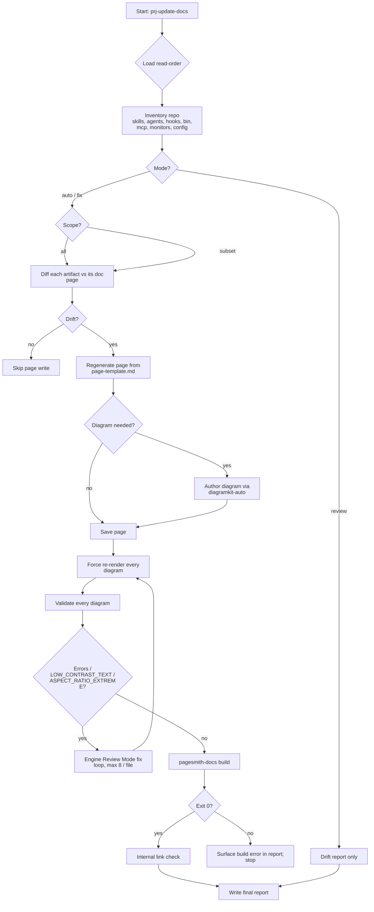

# How it works — prj-update-docs

A single-pass, idempotent refresh of `docs/` that walks every artifact in this repo,
regenerates one canonical page per artifact, then proves the site builds and every diagram
still renders cleanly.

## Decision tree (high level)



The Mermaid source lives at `diagrams/decision-tree.mermaid` next to this reference (the
diagram above is inlined as the canonical embed; the source is reusable in future doc
pages).

## Phase-by-phase detail

### Phase 0 — Confirm intent + load read-order

- Restate scope (`all` / `skills` / etc.), mode, and any `--auto` or `--no-diagrams` flags.
- Read everything in [`read-order.md`](read-order.md) sections 1-3. Sections 4-5 are read
  on demand inside later phases.
- Approval gate unless `--auto` (per
  [interaction-contract.md](../../../../bin/canonical/interaction-contract.md)).

### Phase 1 — Inventory

Use [`inventory-rules.md`](inventory-rules.md) to enumerate:

| Artifact kind | Source                                  | Per-artifact doc path                         |
| ------------- | --------------------------------------- | --------------------------------------------- |
| skill         | `skills/<name>/SKILL.md`                | `docs/reference/skill-<name>.md`              |
| agent         | `agents/<role>.md`                      | `docs/reference/agents/<role>.md`             |
| hook          | `hooks/hooks.json`                      | `docs/reference/config/hooks.md`              |
| bin script    | `bin/<script>`                          | `docs/reference/config/bin-<script>.md`       |
| MCP server    | `.mcp.json` entries                     | `docs/reference/config/mcp-<server>.md`       |
| monitor       | `monitors/monitors.json` entries        | `docs/reference/config/monitor-<name>.md`     |
| config        | top-level `*.json5`, `settings.json`    | `docs/reference/config/<basename>.md`         |
| memory        | `CLAUDE.md`                             | `docs/concepts/memory-files.md` (single page) |

Skip anything matched by [`drift-rules.md`](drift-rules.md) "ignore" list.

### Phase 2 — Brainstorm scope + audience

Skipped under `--auto`. See [`inputs-and-brainstorming.md`](inputs-and-brainstorming.md)
for the question set + safe defaults.

### Phase 3 — Drift detection

For each artifact, compute the SHA-256 of the source file(s) and compare against a
`drift-manifest.json` in `.temp/prj-update-docs/state/`. New files → must-write. Changed
files → must-regenerate. Missing source + existing doc → propose deletion. Unchanged
files + unchanged doc → skip.

### Phase 4 — Per-artifact page generation

Use [`page-template.md`](page-template.md) for the exact section ordering. Prose is
authored by delegating to `adk-docs-write` (or inline when delegation isn't available)
with the artifact's source file as the only source-of-truth.

Cross-links between pages follow the dual-form convention from `AGENTS.md`:

> `@adk:plan-spec` (a.k.a. `adk-plan-spec`)

on first mention, then plain backticks for the rest of the page.

### Phase 5 — Diagram authoring (only where needed)

Trigger the diagram only when a flow / lifecycle / dependency / architecture reading would
be unclear without one. See [`diagram-policy.md`](diagram-policy.md).

Per the upstream `diagramkit-auto` workflow:

1. Resolve the local install (`./node_modules/.bin/diagramkit`).
2. Read `node_modules/diagramkit/REFERENCE.md` first.
3. Pick an engine via `diagramkit-auto` selection table (default Mermaid).
4. Author the source under `<page-dir>/diagrams/<slug>.<ext>`.
5. Render with `npx diagramkit render <page-dir>/diagrams --force`.
6. Embed with the theme-aware `<picture>` pattern.

### Phase 6 — Cross-engine diagram audit

Delegated **wholesale** to `node_modules/diagramkit/skills/diagramkit-review/SKILL.md`:

```bash
npx diagramkit render . --force --json
npx diagramkit validate . --recursive --json
```

Loop until clean (cap 8 iterations / file). Always-fix codes:

- every `severity: "error"` from `diagramkit validate`
- `LOW_CONTRAST_TEXT` (WCAG 2.2 AA)
- `ASPECT_RATIO_EXTREME` (readability)

Residuals are recorded in the report under "Diagrams → Residuals", never silently dropped.

### Phase 7 — Site build smoke test

```bash
npx pagesmith-docs build       # production build, must exit 0
```

When the run is interactive, also start `npx pagesmith-docs dev`, curl `/` and one
freshly-generated section index page, expect `200`, then stop the server.

### Phase 8 — Report

Write `.temp/prj-update-docs/<timestamp>/report.md` per
[`output-format.md`](output-format.md). Surface any drift the user must resolve manually
(e.g. an artifact whose source genuinely needs a behaviour change before the doc can
follow it).

## Idempotence guarantees

Every phase is safe to re-run. The drift manifest in `.temp/prj-update-docs/state/` makes
unchanged artifacts a no-op. Pages are written byte-stably (sorted keys, deterministic
ordering of cross-links) so re-runs that find no drift produce a zero-diff working tree.

## Stop-loss

| Condition                                           | Behaviour                                              |
| --------------------------------------------------- | ------------------------------------------------------ |
| Diagram fix loop exceeds 8 iterations on one source | Mark as residual, continue with the next source.       |
| `pagesmith-docs build` fails                        | Stop; report the build error verbatim, do **not** retry blindly. |
| `npm install` is required                            | Run it once, surface the exit code in the report.     |
| User answers "no" to an approval gate (interactive) | Skip the affected artifact, continue with the rest.   |
