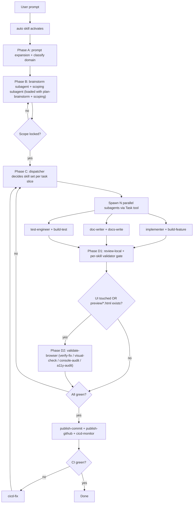
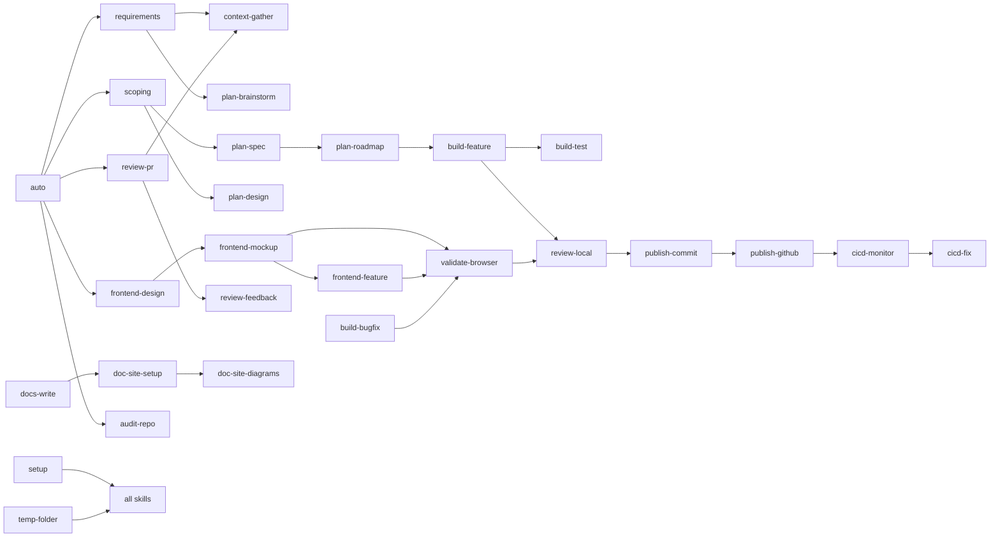

# ADK Claude Plugin Restructure

## 1. End-state architecture

The whole repo is the `adk` Claude plugin. Skills inside `skills/` use bare names (e.g., `plan-brainstorm`); Claude invokes them as `/adk:plan-brainstorm`. A parallel `agents-skills/adk-<name>/` tree of symlinks exposes the same content under `adk-` prefixed names for `npx skills` and non-Claude agents (Cursor, Codex, Gemini, Antigravity).

```
agents-devkit/                            # === THIS REPO IS THE adk PLUGIN ===
├── .claude-plugin/
│   ├── plugin.json                       # name: "adk"
│   └── marketplace.json                  # for distribution
├── skills/                               # ~55 skills, NO adk- prefix
│   ├── auto/                             # NEW: prompt-routing meta-skill
│   ├── setup/                            # NEW: deps + MCP + CLI bootstrap
│   ├── temp-folder/                      # NEW: .temp/task-<slug>/ enforcer
│   ├── plan-brainstorm/                  # MIGRATED from adk-plan-brainstorm
│   │   ├── SKILL.md                      #   frontmatter name: plan-brainstorm
│   │   └── references/
│   │       ├── how-it-works.md           # NEW required: decision-flow diagrams
│   │       ├── modes.md                  # NEW required: fix | review | auto
│   │       ├── persona.md, workflow.md, clarifying-questions.md, output-format.md,
│   │       ├── artifact-format.md, validator.md, anti-patterns.md, examples.md
│   │       └── interaction-contract.md   # PHYSICAL COPY (not symlink) — synced from bin/canonical/
│   └── ... (all other skills, see catalog below)
├── agents/                               # collapsed from 3 dirs to one
│   ├── brainstorm-facilitator.md
│   ├── implementer.md, code-reviewer.md, debugger.md, test-engineer.md,
│   ├── doc-writer.md, plan-reviewer.md, research-agent.md, security-reviewer.md
│   └── (Claude-only frontmatter — Cursor/Codex variants dropped per user note 1)
├── commands/                             # OPTIONAL flat slash-commands (lighter than skills)
├── hooks/
│   └── hooks.json                        # canonical Claude plugin hook config
├── .mcp.json                             # plugin-bundled MCP servers (template)
├── .lsp.json                             # OMITTED unless we have LSPs to ship
├── monitors/monitors.json                # background watchers (e.g., gh PR status)
├── settings.json                         # plugin defaults
├── bin/                                  # in PATH when plugin enabled
│   ├── canonical/
│   │   └── interaction-contract.md       # SINGLE SOURCE OF TRUTH (not shipped to skills folders directly)
│   ├── adk-install                       # local symlink installer for non-Claude agents
│   ├── adk-mcp-install                   # reads .mcp.json + ~/.zshenv → claude mcp add
│   ├── adk-setup                         # brew installs + cli configs (macOS only)
│   ├── adk-sync-contracts                # propagates bin/canonical/* into every skill's references/ (run by validator)
│   ├── adk-validate                      # validator (incl. drift check on interaction-contract copies)
│   └── adk-doctor                        # validates everything is wired
├── agents-skills/                        # NEW: parallel tree for non-Claude agents
│   └── adk-<name>                        # FOLDER-LEVEL symlink → ../../skills/<name>
│                                         #   so references/interaction-contract.md travels along
├── package.json                          # keeps `npx skills` compatibility
├── README.md, CONTRIBUTING.md, LICENSE
├── AGENTS.md, CLAUDE.md, GEMINI.md       # repo-as-plugin author guidance
├── .temp/                                # untracked working artifacts
└── docs/, gh-pages/                      # UNTOUCHED per user
```

Reference for the plugin layout: [Claude plugins](https://docs.claude.com/en/docs/claude-code/plugins) and [plugins reference](https://docs.claude.com/en/docs/claude-code/plugins-reference) (`.claude-plugin/plugin.json`, root-level `skills/`, `agents/`, `hooks/`, `.mcp.json`, `bin/`, etc.).

### Skill folder rules

Per Claude plugins reference, when `skills` field in `plugin.json` points to a directory whose `SKILL.md` files set frontmatter `name`, that name is used for invocation regardless of the directory basename. We rely on this so the source-of-truth folder name (`plan-brainstorm/`) is what humans see; the invocation `/adk:plan-brainstorm` is enforced by frontmatter.

Each skill's `SKILL.md` cross-references other skills using BOTH forms on first mention so the same file works in Claude (`@adk:plan-brainstorm`) and in plain-agent contexts (`adk-plan-brainstorm`):

```
Hand off to @adk:plan-spec (a.k.a. `adk-plan-spec`).
```

A skill may only depend on:

1. Files inside its own `references/` (every skill is fully self-contained; no symlinks out of the skill folder)
2. Other skills (referenced by name, both forms)
3. Subagents in `agents/<name>.md` (referenced by name)

No relative paths into another skill folder. The single piece of boilerplate that must be byte-identical across every skill — `references/interaction-contract.md` — is a **physical copy in every skill folder**, kept in sync by `bin/adk-sync-contracts` from the canonical source at `bin/canonical/interaction-contract.md`. The validator (`bin/adk-validate`) FAILS if any copy drifts. This makes every skill folder portable to any install path: Claude plugin install, `npx skills add`, folder-level symlink to `~/.cursor/skills/`, or copy-pasted into a project.

### Why no `shared/` directory

Considered and rejected. The `shared/interaction-contract.md → symlink` model only resolves for the Claude plugin install (where the whole plugin tree lands on disk). It breaks for: `npx skills add` (copies skill folders only), `bin/adk-install` symlinking individual skill folders into `~/.cursor/skills/`, and any "copy this skill folder into another repo" workflow. The inline-copy + propagation script model preserves portability and matches what the existing repo already does (`global-prompts/interaction-contract.md` propagated into every skill).

## 2. Skill catalog (target ~55 skills)

Migrated and renamed from existing 39 (drop `adk-` prefix), plus new skills. **Bold = new skill.** *Italic = restructured/split from existing.*

### Layer 0 — Meta / orchestration

- `**auto`** — Reads the prompt, expands it, picks initial skill set, runs brainstorm subagent for scope, then dispatches per-task subagents loaded with specific skills.
- `**setup`** — Verifies & installs deps (Homebrew on macOS), CLI tools (gh, jq, fd, ripgrep, fzf, claude), MCP servers, env vars from `~/.zshenv`. Idempotent.
- `**temp-folder**` — Enforces `.temp/task-<slug>/{plan.md, spec.md, design.md, requirements.md, scope.md, preview/*.html, validation.md}` layout. Every other skill writes through this contract.
- `**mode-contract**` — Documents the universal `--mode fix | review | auto` switch every applicable skill must support. (Reference-only skill, model-invocation disabled.)

### Layer 1 — Discovery & context

- `**context-gather**` — Follows links in a prompt/PR/doc to Jira / Confluence / Google Docs / Slack / Gmail (via MCP), pulls relevant snippets, summarizes, dedupes, attaches to current `.temp/task-<slug>/context.md`.
- `*plan-research`* (migrated) — Web + repo research with Verified / Inferred / Open buckets.
- `**requirements*`* — Iterative requirement-gathering session (brainstorm-style continuous Q&A) → `requirements.md`.
- `**scoping**` — After requirements, decides in/out of scope, blast radius, success criteria, milestones → `scope.md`.

### Layer 2 — Plan / spec / design

- `*plan-brainstorm`* (migrated)
- `*plan-spec`* (migrated)
- *`plan-design`* (migrated)
- *`plan-roadmap`* (migrated)
- *`plan-proposal`* (NEW, split from existing brainstorm) — formal proposal artifact for stakeholder review.

### Layer 3 — Frontend & UI

- *`frontend-design`* (migrated, **enhanced**) — During plan mode, generates 5 UI sample variants (HTML mockups in `.temp/task-<slug>/preview/sample-{1..5}.html`) before code.
- *`frontend-feature`* (migrated)
- *`frontend-react-csr`* (migrated)
- `**frontend-mockup`** — Standalone UI mockup generator (5-sample preview), reusable from any other skill.

### Layer 4 — Build (code-changing)

- *`build-feature`*, *`build-refactor`*, *`build-migrate`*, *`build-test`*, *`build-deps`* (all migrated)
- `**build-bugfix`** — Split out from `build-feature` (root-cause + minimal patch flow).

### Layer 5 — Review

- *`review-pr`* (migrated; **fix mode** added — auto-applies its own findings)
- *`review-local`* (migrated; fix mode added)
- *`review-feedback`* (migrated)
- *`review-handoff`* (migrated)
- `**review-doc`** — Migrated/renamed from `adk-docs-review`; supports passing supporting docs (Confluence, Google Doc, Slack channel, Gmail thread) for added context. Modes: review (post comments) | fix (apply edits).
- `**validate-browser*`* — Drives a real browser via the `cursor-ide-browser` MCP server (or playwright fallback) to validate any UI work end-to-end. Run automatically by `frontend-feature`, `frontend-mockup`, `build-bugfix` (when the bug is UI-affecting), `review-pr --mode fix` (when changes touch frontend), and `audit-site`. Modes:
  - `verify-fix` — Reproduce the original bug repro steps; assert the fix holds (no console errors of the prior signature, expected DOM state present, screenshot diff against pre-fix baseline).
  - `visual-check` — Capture viewport screenshots at 360 / 768 / 1280 widths; diff against approved baseline in `.temp/task-<slug>/browser-validation/baseline/`.
  - `console-audit` — Navigate target URLs; collect all console errors / warnings / network failures into a severity-tiered report.
  - `interaction-test` — Walk through user-defined interaction scripts (click, type, hover); assert state transitions and accessibility (focus, aria, keyboard).
  - `a11y-audit` — Run an axe-core scan per page; report violations with WCAG references.
  - All output (screenshots, console logs, network HAR, axe results) lands under `.temp/task-<slug>/browser-validation/<mode>/`. Non-zero exit fails the parent skill's validator phase.

### Layer 6 — Docs

- `*docs-write`* (migrated)
- `**doc-site-setup*`* — Replaces `adk-doc-site-setup`; wraps the LOCAL `~/personal/pagesmith` skills (`pagesmith-docs-setup`, `pagesmith-docs-add-page`, `pagesmith-docs-configure-nav`, `pagesmith-docs-customize-theme`, `pagesmith-docs-add-search`, `pagesmith-docs-deploy-gh-pages`, `pagesmith-generate-docs`).
- `**doc-site-diagrams**` — Wraps the LOCAL `~/personal/diagramkit` (mermaid / graphviz / drawio / excalidraw rendering).
- `*visualize-diagram`* (migrated)
- `*visualize-chart`* (migrated)

### Layer 7 — Audit

- *`audit-repo`* (migrated; fix mode added)
- *`audit-site`* (migrated)
- `**audit-pr`** — Optional thinner audit scoped to a single PR (different from `review-pr`).

### Layer 8 — Publish & ship

- *`publish-commit`* (migrated; uses `gh` CLI exclusively)
- *`publish-github`* (migrated; **all ops via `gh` CLI**, MCP fallback removed)
- *`publish-bitbucket`* (migrated)
- *`publish-confluence`* (migrated)
- *`publish-gdrive`* (migrated)
- `**cicd-monitor`** — Watches GitHub Actions on the current PR (`gh run watch`), reports failures, hands off to `cicd-fix`.
- `**cicd-fix*`* — Pulls failing job logs, identifies root cause, applies fix, pushes.

### Layer 9 — Observability & analytics

- `**observability-datadog**` — Query Datadog (logs, metrics, monitors, traces) via the `plugin-datadog-datadog` MCP server; modes: investigate | dashboard-summary | alert-triage.
- `**analytics-mixpanel**` — Query Mixpanel via MCP (or REST fallback); modes: funnel | cohort | usage-summary.
- `**observability-incident**` — Combines Datadog + recent deploys + Slack channel scrape for an incident summary.

### Layer 10 — Repo bootstrap

- `*adopt-ai-in-repo`* (migrated)
- `**personal-skill-create`** — Templates a user's own skill that composes existing `adk` skills (so users can build their own workflows).

### Top-level routers (kept for human discoverability, NOT for auto-invocation)

- `adk` (root router, points at `auto`)
- `plan`, `build`, `review`, `docs`, `audit`, `publish`, `visualize`, `frontend`, `observability` (one router per layer)

## 3. Auto-skill orchestration flow




## 4. Skill dependency graph (high level)




## 5. Mode contract (every applicable skill)

```
--mode auto      # default — runs brainstorm + plan + execute end-to-end
--mode review    # produces findings only; writes review.md or posts comments; never edits source
--mode fix       # auto-applies its own findings, then validates
--auto           # skip approval gates (orthogonal to --mode)
```

Documented once in `skills/mode-contract/SKILL.md`; each skill that supports modes states which subset it supports in its frontmatter.

## 6. .temp/ task-folder convention

Every task creates `.temp/task-<slug>/` with the same canonical sub-paths:

```
.temp/task-<slug>/
├── context.md                              # gathered from links / Jira / Confluence / Slack
├── requirements.md                         # output of `requirements` skill
├── scope.md                                # output of `scoping` skill
├── brainstorm.md                           # output of `plan-brainstorm`
├── spec.md, design.md, roadmap.md
├── preview/sample-{1..5}.html              # frontend-mockup output
├── plan.md                                 # final implementation plan
├── validation/<phase>.md                   # per-phase validator logs
├── browser-validation/                     # output of `validate-browser` skill
│   ├── verify-fix/{screenshots,console,network,report.md}
│   ├── visual-check/{baseline,actual,diff}/<viewport>.png
│   ├── console-audit/report.md + raw.json
│   ├── interaction-test/{trace.md, screenshots/}
│   └── a11y-audit/report.md + axe.json
└── report.md                               # final deliverable report
```

Enforced by the `temp-folder` skill (which any other skill calls into for path resolution).

## 7. Cross-reference convention inside SKILL.md

```
After this, hand off to @adk:plan-spec (a.k.a. `adk-plan-spec`).
Spawn the implementer subagent (`agents/implementer.md`) loaded with @adk:build-feature.
See `references/workflow.md` for the full step list.
```

Both forms appear on first mention in any cross-reference; subsequent mentions can use either form.

## 8. Install paths

- **Primary — Claude plugin install:** `claude /plugin install adk` from a marketplace, OR `claude --plugin-dir ./agents-devkit` for dev. Plugin root contains everything (`.claude-plugin/plugin.json`, `skills/`, `agents/`, `hooks/`, `.mcp.json`, `bin/`).
- `**npx skills add sujeet-pro/agents-devkit`:** Picks up the parallel `agents-skills/` tree (folders prefixed `adk-<name>/`, each with a `SKILL.md` symlink → `skills/<name>/SKILL.md`).
- **Local symlink for multi-agent (`bin/adk-install`):** Symlinks `skills/` into `~/.claude/plugins/adk/skills/` AND `agents-skills/adk-<name>/` into `~/.cursor/skills/`, `~/.codex/skills/`, `~/.agents/skills/`, `~/.gemini/skills/`. macOS only (per user). ~150 LOC, replaces today's 18-file `cli/` tree.
- **MCP setup:** `bin/adk-mcp-install` reads `.mcp.json`, expands `${ENV_VAR}` from `~/.zshenv`, runs `claude mcp add ...` (or writes to `~/.claude/settings.json`).

## 9. MCP defaults (env vars from `~/.zshenv`)

Bundled in `.mcp.json` (commented-out by default; `adk-mcp-install` toggles on per user choice):

- `github` — already standard
- `bitbucket`, `jira`, `confluence` — Atlassian
- `google-drive` — for Google Doc context-gather
- `slack` — for Slack channel scrape
- `gmail` — for thread context
- `datadog` — for `observability-datadog`
- `mixpanel` — for `analytics-mixpanel`
- `brainstorming` — optional state store
- `cursor-ide-browser` — for `validate-browser` (preferred). Fallback: `playwright` MCP, then bare `npx playwright` if neither MCP is configured.

## 10. Phase-0 reference work (deep-read everything before any code)

Clone or refresh into `.temp/reference-repos/` and write per-repo findings to `.temp/plans/restructure-references-<repo>.md`:

- `https://github.com/buildermethods/agent-os` — for the `commands/` flat-skill model, `profiles/default/`, standards-injection pattern, and `scripts/project-install.sh` install model.
- `https://github.com/buildermethods/design-os` — for the structured product-design conversation model and `data-shape` / `design-tokens` / `design-screen` / `screenshot-design` flow.
- `https://github.com/anthropics/skills` (and any other repos referenced under existing reference materials) — to recheck the canonical SKILL.md format.
- Local: `~/personal/pagesmith` (read every `packages/docs/skills/pagesmith-*/SKILL.md` and `packages/docs/REFERENCE.md`) — these are wrapped by `doc-site-setup`.
- Local: `~/personal/diagramkit` (read every skill / CLI doc) — wrapped by `doc-site-diagrams`.
- The CURRENT `agents-devkit` repo itself — every existing `skills/adk-*/SKILL.md` and every `references/`* file, so the migration can be verbatim where appropriate (preserve language, update pointers, drop obsolete sections).

Findings consolidated into `.temp/plans/restructure-architecture.md` before any source change.

## 11. Files to remove (made obsolete)

- `agents-cursor/`, `agents-codex/` — collapsed into `agents/` (Claude-only per user note 1)
- `cli/` (18 files) — replaced by ~6 scripts in `bin/` (install, mcp-install, setup, sync-contracts, validate, doctor)
- `mcp-config/servers/*.json` — replaced by single `.mcp.json` at plugin root
- `global-prompts/interaction-contract.md` — moves to `bin/canonical/interaction-contract.md` (single source, propagated into every skill by `bin/adk-sync-contracts`); `temp-folder.md` becomes the `temp-folder` skill
- `workflows/*.yaml` — replaced by composable subagent dispatch from `auto`
- `hooks/cursor.json`, `hooks/codex.json` — kept only `claude.json` → renamed `hooks/hooks.json`
- `skills-manifest.json` — auto-regenerated by validator from `skills/` (still emitted for `npx skills`)

## 12. Files to keep untouched

- `docs/` and `gh-pages/` (per user)
- `.git/`, `LICENSE`, `package.json` (modified, not removed)
- `cli/lib/generate-skill-docs.mjs` and `cli/lib/validate-content.mjs` are kept as `bin/` helpers that the docs build uses

## 13. Phased execution

Even though delivery is "all-in-one", I will work through phases sequentially and write everything to `.temp/plans/restructure-*.md` first, then commit in one large PR.

- Phase 0: deep-read CURRENT repo + clone-and-read agent-os, design-os, plus inventory ~/personal/pagesmith and ~/personal/diagramkit. Lock the final skill catalog and dependency graph in `.temp/plans/restructure-architecture.md`.
- Phase 1: scaffold the new layout — `.claude-plugin/plugin.json`, empty `skills/`, `agents/`, `hooks/hooks.json`, `.mcp.json`, `bin/`* (incl. `bin/canonical/interaction-contract.md` + `bin/adk-sync-contracts`), `agents-skills/`, `package.json`, `README.md`. (No skill content yet, just structure.)
- Phase 2: write the 4 meta skills (`auto`, `setup`, `temp-folder`, `mode-contract`) — these set conventions every other skill follows.
- Phase 3: migrate the 39 existing skills — rename folders, rewrite `SKILL.md` frontmatter (`name:` field), update cross-references to dual form, add the new required `references/how-it-works.md` (with mermaid decision diagram) and `references/modes.md`. Run `bin/adk-sync-contracts` to seed every skill's `references/interaction-contract.md`. Create folder-level symlinks under `agents-skills/adk-<name>/`.
- Phase 4: write the new domain skills (`requirements`, `scoping`, `context-gather`, `frontend-mockup`, `build-bugfix`, `review-doc`, `validate-browser`, `doc-site-setup`, `doc-site-diagrams`, `observability-datadog`, `analytics-mixpanel`, `observability-incident`, `cicd-monitor`, `cicd-fix`, `audit-pr`, `publish-commit` `gh`-only rewrite, `personal-skill-create`, `plan-proposal`). Wire `validate-browser` into `frontend-feature`, `frontend-mockup`, `build-bugfix`, `review-pr --mode fix`, `audit-site` as their final validation step.
- Phase 5: write the subagent files in `agents/` (Claude format only).
- Phase 6: write the bin scripts (`adk-install`, `adk-mcp-install`, `adk-setup`, `adk-sync-contracts`, `adk-validate`, `adk-doctor`).
- Phase 7: validator enforces: every skill has `SKILL.md`, frontmatter `name` matches folder, dual-form cross-refs, required reference files present (`how-it-works.md`, `modes.md`, `validator.md`, `interaction-contract.md` byte-identical to canonical), `agents-skills/` symlinks intact. Run validator.
- Phase 8: regenerate `skills-manifest.json`, update `AGENTS.md` / `CLAUDE.md` to describe the new repo-as-plugin model.

## 14. Out of scope (explicit)

- Any change to `docs/` or `gh-pages/`.
- Windows support.
- Authoring inside the user's home directory (only the install script touches `~/`).
- Submitting the plugin to the official Anthropic marketplace (we ship a private `marketplace.json`, but the user runs the submit form themselves).

