# Concepts

ADK is an opinionated [Claude Code plugin](https://code.claude.com/docs/en/plugins) your Claude session can use to work on real repositories. The surface you install is small. The ideas behind it are what make it consistent.

Read these pages in order if you are new. Each one answers a single question.

| Page | Question it answers |
| --- | --- |
| [Philosophy](./philosophy.md) | What values does every ADK skill and agent follow? |
| [Skill Anatomy](./skill-anatomy.md) | What is a skill, what is inside one, and what workflow does every skill run? |
| [Subagents](./agents.md) | What subagents ship with the plugin, and how does a skill dispatch them? |
| [Hooks](./hooks.md) | What automatic safety and lifecycle checks run around agent sessions? |
| [MCP Servers](./mcp.md) | When should a skill use an MCP server, and what falls back to manual work? |
| [Memory files](./memory-files.md) | The single `CLAUDE.md` repo memory file and how it composes with the plugin. |

## One-paragraph summary

ADK treats a Claude session as a junior teammate. A **skill** is the playbook for one kind of job (plan, build, review, document, audit). Every skill follows the same six-phase workflow, dispatches focused **subagents** when the work is non-trivial, and stays self-contained so it keeps working even if a helper is missing. **Hooks** add non-negotiable safety rails around every session. **MCP servers** are optional power-ups — if they are installed ADK uses them, if not ADK falls back to manual behavior. Everything ships in one Claude Code plugin loaded via `.claude-plugin/plugin.json`.

<figure>
  <picture>
    <source media="(prefers-color-scheme: dark)" srcset="./diagrams/.diagramkit/plugin-architecture-dark.svg" />
    <source media="(prefers-color-scheme: light)" srcset="./diagrams/.diagramkit/plugin-architecture-light.svg" />
    
  </picture>
  <figcaption><i>Claude Code loads <code>.claude-plugin/plugin.json</code> once; every other ADK component (skills, agents, hooks, MCP servers, monitors, bin scripts) is wired in from there.</i></figcaption>
</figure>

## Where to go next

- If you just want to use ADK in your repo, read [Philosophy](./philosophy.md) and then the [Public Skills reference](../reference/skills/).
- If you want to extend ADK (add a skill, add a subagent, edit the canonical contract), read [Skill Anatomy](./skill-anatomy.md) and [`CLAUDE.md`](https://github.com/sujeet-pro/agents-devkit/blob/main/CLAUDE.md).
- If you want to understand the safety rails, read [Hooks](./hooks.md).
