# Adopting AI in a Repo

Bootstrap the canonical "AI scaffolding" inside an existing repo — `ai-guidelines/` for shared knowledge, `AGENTS.md` and `CLAUDE.md` as thin entrypoints, per-agent skill wrappers under `.claude/skills/` and `.cursor/skills/`, and Python-based maintenance hooks. The output is layered so any agent (Claude, Cursor, Codex, Gemini, plain `AGENTS.md` reader) can pick up the repo without re-discovery.

## Use this when

- Onboarding AI to an existing repository for the first time.
- Refreshing existing AI scaffolding after a stack change, framework migration, or major refactor.
- Standardizing AI guidance across a fleet of repos (run once per repo).
- Fixing inconsistent / drifted AI files (`.cursorrules` + `AGENTS.md` + a hand-written `CLAUDE.md` that no longer agree).

## Do NOT use when

- Greenfield project scaffolding — use the repo's own `create-*` templates first; run this skill after the project exists.
- Adding a single skill to a repo that already has the scaffolding — just write the skill file directly.
- Auditing existing scaffolding — use `/adk:audit-repo` with focus on docs / conventions.

## Quick start

```text
/adk:adopt-ai-in-repo                       # interactive bootstrap, current repo
/adk:adopt-ai-in-repo --refresh             # update existing scaffolding
/adk:adopt-ai-in-repo --no-hooks            # skip writing hooks; document them only
/adk:adopt-ai-in-repo --scope <stack>       # limit research to one detected stack
/adk:adopt-ai-in-repo --auto                # skip approval gates
```

## Included Skills

| Skill | Purpose | Reference |
| --- | --- | --- |
| `/adk:adopt-ai-in-repo` | Standalone bootstrap skill. Detects stack, researches conventions, writes layered scaffolding, runs the validator. | [Details](../../reference/skill-adopt-ai-in-repo.md) |

## How it works internally

`adopt-ai-in-repo` is a **standalone task skill** (no router above it). It runs end-to-end in one pass, but every phase is interactive by default and short-circuits cleanly under `--auto`. The workflow:

1. **Detect** — read `package.json`, lockfiles, framework configs, lint/format setup, CI config; classify the stack(s) in use.
2. **Research** — pull stack-specific best practices (frameworks, testing conventions, common pitfalls). Falls back to a manual checklist if no MCP research backend is configured.
3. **Bootstrap `ai-guidelines/`** — the canonical knowledge directory. Every other file (root entrypoints, per-agent skills) points back here.
4. **Write root entrypoints** — `AGENTS.md` (neutral router for all agents), `CLAUDE.md` (Claude-specific delta and hooks reference).
5. **Per-agent skill wrappers** — thin `SKILL.md` pointers under `.claude/skills/<name>/` and `.cursor/skills/<name>/` that defer to `ai-guidelines/`.
6. **Hooks** — under `--no-hooks` writes only documentation; otherwise drops Python-based maintenance hooks (lint-on-save, doc-on-commit, etc.).
7. **Validate** — runs the bundled `adopt-ai-validator.md` checklist; surfaces every failure in the final report.

<figure>
  <picture>
    <source media="(prefers-color-scheme: dark)" srcset="./diagrams/.diagramkit/adoption-flow-dark.svg" />
    <source media="(prefers-color-scheme: light)" srcset="./diagrams/.diagramkit/adoption-flow-light.svg" />
    
  </picture>
  <figcaption><i>End-to-end workflow for <code>/adk:adopt-ai-in-repo</code>. The branch on <code>--no-hooks</code> only changes whether hook configs are written; everything else is shared.</i></figcaption>
</figure>

## Outputs

A bootstrapped repo with:

- `ai-guidelines/` populated with stack-specific guidance (one file per concern).
- `AGENTS.md` (neutral) and `CLAUDE.md` (Claude-specific) at the repo root, both pointing into `ai-guidelines/`.
- `.claude/skills/<name>/SKILL.md` and `.cursor/skills/<name>/SKILL.md` thin wrappers per detected stack.
- `.claude/hooks.json` (or documented commands under `--no-hooks`).
- A validator report under `.temp/adopt-ai-in-repo/<timestamp>/validator.md`.

## How To Use This Guide

Start with `/adk:adopt-ai-in-repo` on the target repo. Read the validator report at the end and act on any failures before letting agents loose on the codebase.
