# Code Reviews

Review PRs, address reviewer feedback, self-review local changes before pushing, capture clean handoffs, and audit documentation — all routed through the `@adk:review` category router.

> **Quick start:** `/adk:review-pr <url>` for a remote PR (ownership auto-detected — review-and-post if it's not yours, validate-and-reply if it is); `/adk:review-local` for branch / uncommitted changes.

## Included Skills

| Skill | Purpose | Reference |
| --- | --- | --- |
| `/adk:review` | Category router. Picks one of the task skills below based on what you are reviewing. | [Details](../../reference/skill-review.md) |
| `/adk:review-pr` | Review a remote PR (GitHub, Bitbucket). Auto-detects ownership: posts review comments on someone else's PR; validates + drafts replies on your own PR (with `--fix`, locally applies fixes via the `adk-build` family). | [Details](../../reference/skill-review-pr.md) |
| `/adk:review-local` | Self-review uncommitted or branch changes before push / commit. | [Details](../../reference/skill-review-local.md) |
| `/adk:review-feedback` | Address reviewer comments on your own PR with traceable code replies. | [Details](../../reference/skill-review-feedback.md) |
| `/adk:review-handoff` | Pause a long task or hand off to another reviewer / session without losing context. | [Details](../../reference/skill-review-handoff.md) |
| `/adk:review-doc` | Critique an individual documentation artifact (delegates structure-of-docs to `/adk:docs-review`). | [Details](../../reference/skill-review-doc.md) |

## How it works internally

`@adk:review` is a **category router**, not a worker — it never runs a review itself. Its job is to read the user intent and dispatch to the right task skill in one hop. The branching key is **what you are reviewing** (a remote PR URL, a local diff, threads on your own PR, etc.).

Each downstream task skill is self-contained:

- It reads the canonical interaction contract (`bin/canonical/interaction-contract.md`) and runs interactively by default with `--auto` for unattended runs.
- It respects `--mode review | fix | auto` (most tasks support all three).
- It writes one report under `.temp/task-<slug>/review.md` and, when applicable, posts findings back to the source provider (GitHub PR comments, Bitbucket inline comments, etc.).
- It hands off to the next-best skill when the work crosses a boundary (e.g. `review-feedback` may call `/adk:build-bugfix` if a comment requires a code change).

<figure>
  <picture>
    <source media="(prefers-color-scheme: dark)" srcset="./diagrams/.diagramkit/review-routing-dark.svg" />
    <source media="(prefers-color-scheme: light)" srcset="./diagrams/.diagramkit/review-routing-light.svg" />
    
  </picture>
  <figcaption><i>How <code>@adk:review</code> routes by target. Hand off to <code>/adk:docs-review</code> when the deliverable is doc-only.</i></figcaption>
</figure>

## Example invocations

```text
/adk:review                                          # interactive — router asks what you're reviewing
/adk:review-pr https://github.com/o/r/pull/42        # ownership auto-detected
/adk:review-pr https://github.com/o/my-repo/pull/19 --fix   # YOUR PR → also locally fix Apply'd comments via adk-build-*
/adk:review-local                                    # self-review branch + uncommitted
/adk:review-feedback                                 # address comments on my own PR (called directly)
/adk:review-handoff                                  # save state, write a handoff brief
```

## Outputs

- `.temp/task-<slug>/review.md` — severity-tiered findings (critical / error / warn / info) with file-anchored evidence per finding.
- For `/adk:review-pr`: optional posted-back comments via the matching MCP (`github`, `bitbucket`) or the `gh` / `bb` CLI fallback.
- For `/adk:review-handoff`: a `handoff.md` in `.temp/notes/` with the next-step recommendation.

## How To Use This Guide

Start with the skill whose primary job matches the outcome you want. Use the linked reference page for the exact flag surface, workflow contract, and validation expectations.
