# Visuals & Design

Generate structural diagrams, data charts, UI mockups, and design direction. Two related routers cover the surface: `@adk:visualize` handles diagrams + charts, `@adk:frontend-design` (and `frontend-mockup`) handles UI / interaction surfaces.

> **Quick start:** `/adk:visualize-diagram` for a sequence / flow / architecture diagram; `/adk:visualize-chart` for a data plot; `/adk:frontend-design` for a UI mockup.

## Use cases this guide covers

- **Generating diagrams** — sequence, flow, state, ER, architecture, dependency, class, deployment. Backed by [`diagramkit`](https://github.com/sujeet-pro/diagramkit) (mermaid / excalidraw / drawio / graphviz engines).
- **Visuals and design** — UI mockups, mid-fi screen designs, data charts (bar / line / pie / scatter), and the design direction that goes with them.

## Included Skills

| Skill | Purpose | Reference |
| --- | --- | --- |
| `/adk:visualize` | Category router. Picks `visualize-diagram` or `visualize-chart` based on type. | [Details](../../reference/skill-visualize.md) |
| `/adk:visualize-diagram` | Author + render a structural diagram (mermaid / excalidraw / drawio / graphviz). | [Details](../../reference/skill-visualize-diagram.md) |
| `/adk:visualize-chart` | Author + render a data chart (bar / line / pie / scatter / heatmap) from CSV / JSON / inline data. | [Details](../../reference/skill-visualize-chart.md) |
| `/adk:diagram-mermaid` | Engine skill. Author Mermaid sources directly. | [Details](../../reference/skill-diagram-mermaid.md) |
| `/adk:diagram-excalidraw` | Engine skill. Author Excalidraw freeform / hand-drawn diagrams. | [Details](../../reference/skill-diagram-excalidraw.md) |
| `/adk:diagram-drawio` | Engine skill. Author Draw.io diagrams (cloud icons, BPMN, swimlanes). | [Details](../../reference/skill-diagram-drawio.md) |
| `/adk:diagram-graphviz` | Engine skill. Author Graphviz DOT diagrams (algorithmic layout). | [Details](../../reference/skill-diagram-graphviz.md) |
| `/adk:diagram-review` | Audit + repair every diagram (structure, embed-safety, WCAG 2.2 AA contrast). | [Details](../../reference/skill-diagram-review.md) |
| `/adk:frontend-design` | UI mockup / component design with interaction-state surfaces. | [Details](../../reference/skill-frontend-design.md) |
| `/adk:frontend-mockup` | Mid-fi screen mockup (bridges design exploration and implementation). | [Details](../../reference/skill-frontend-mockup.md) |

## How it works internally

Two layers of routing:

1. **`@adk:visualize` (router)** — first cut: structural diagram vs. data chart. Routes to `visualize-diagram` or `visualize-chart`.
2. **Engine selection inside `visualize-diagram`** — picks Mermaid / Excalidraw / Draw.io / Graphviz per the [`diagramkit-auto`](https://github.com/sujeet-pro/diagramkit) tie-break table. Default is Mermaid; Excalidraw for hand-drawn overviews; Draw.io for vendor icons / BPMN / multi-page; Graphviz for pure DAGs.

UI work runs through a parallel router (`@adk:frontend-design` is itself a top-level skill, not under `visualize`). Mockups go to `frontend-mockup` for mid-fidelity screens; `frontend-design` produces design direction + a component-level spec.

After authoring, every diagram **must** pass through `@adk:diagram-review` (or directly via `npx diagramkit validate`) before it lands in docs:

- Structural validity (no broken `<g>` references, valid XML).
- ``-embed safety (no `<foreignObject>`; Mermaid sources start with `%%{init: {'htmlLabels': false}}%%`).
- WCAG 2.2 AA contrast on every text node (light + dark themes).
- Aspect-ratio sanity (within `[1:1.88, 3.33:1]` of the configured 4:3 target by default).

<figure>
  <picture>
    <source media="(prefers-color-scheme: dark)" srcset="./diagrams/.diagramkit/visualize-routing-dark.svg" />
    <source media="(prefers-color-scheme: light)" srcset="./diagrams/.diagramkit/visualize-routing-light.svg" />
    
  </picture>
  <figcaption><i>How visuals and design intents are routed. The diagram engine choice happens inside <code>visualize-diagram</code> — not at the top router — so users can ask for "a sequence diagram" without naming the engine.</i></figcaption>
</figure>

## Example invocations

```text
/adk:visualize                                       # router — asks type
/adk:visualize-diagram "ingest pipeline architecture"
/adk:visualize-chart "monthly active users from data.csv"
/adk:frontend-design "settings panel, dark mode toggle"
/adk:diagram-mermaid                                 # author a mermaid source directly
/adk:diagram-review --mode fix                       # WCAG + embed audit, auto-fix
```

## Outputs

- Diagram source under `<page-dir>/diagrams/<slug>.<ext>` (committed, editable).
- Rendered SVGs (light + dark) under `<page-dir>/diagrams/.diagramkit/`.
- Embed snippet using the theme-aware `<picture>` pattern (so the doc switches with the user's color-scheme preference).
- For charts: PNG / SVG output + the source data file.
- For UI mockups: a markdown artifact + linked image / Figma frame as per the design surface.

## How To Use This Guide

Start with the skill whose primary job matches the outcome you want. The diagram-review pass is mandatory before any visual lands in `docs/` or a published page.
