# Documentation

Author new docs (READMEs, runbooks, ADRs, API references, onboarding guides) or critique existing ones for accuracy, freshness, and structure. Every "produce or improve a doc artifact" intent flows through the `@adk:docs` category router.

> **Quick start:** `/adk:docs-write` to author or update; `/adk:docs-review` to critique.

## Use cases this guide covers

- **Writing a doc** — author a fresh README, runbook, ADR, API reference, onboarding guide, migration guide, or RFC follow-up.
- **Reviewing a doc** — critique an existing doc for accuracy, freshness, structure, and readability against its source code.

## Included Skills

| Skill | Purpose | Reference |
| --- | --- | --- |
| `/adk:docs` | Category router. Picks `docs-write` or `docs-review` based on direction. | [Details](../../reference/skill-docs.md) |
| `/adk:docs-write` | Author or update a single documentation artifact (any markdown shape). | [Details](../../reference/skill-docs-write.md) |
| `/adk:docs-review` | Critique an existing doc against its source code; produces severity-tiered findings. | [Details](../../reference/skill-docs-review.md) |

## How it works internally

`@adk:docs` is a **category router** with two task skills underneath. The branching key is **direction** — are you producing a new artifact, or judging an existing one?

**Writing path** (`docs-write`):

1. Pick the target shape (README / ADR / runbook / API ref / migration guide / onboarding / RFC follow-up). Each shape has a template under the skill's `references/`.
2. Outline against the source (code, schema, ticket).
3. Draft section by section.
4. Validate every claim against the source — broken claims are surfaced as drift before publish.

**Reviewing path** (`docs-review`):

1. Read the existing doc + the source it claims to describe.
2. Run a claim audit — every assertion in the doc must be backed by a source line, command, or schema.
3. Emit severity-tiered findings (critical / error / warn / info).
4. Under `--mode fix`, hand off the auto-fixable findings to `/adk:docs-write`. Under `--mode review` (or `auto` without `--mode fix`), produce only `review.md` and stop.

Both paths share the same `docs-write` engine for actual prose generation, so style and validation rules are identical across writing and fix-mode reviewing.

<figure>
  <picture>
    <source media="(prefers-color-scheme: dark)" srcset="./diagrams/.diagramkit/docs-routing-dark.svg" />
    <source media="(prefers-color-scheme: light)" srcset="./diagrams/.diagramkit/docs-routing-light.svg" />
    
  </picture>
  <figcaption><i>How <code>@adk:docs</code> routes by direction. The <code>docs-review --mode fix</code> path loops back into <code>docs-write</code> so structure stays consistent.</i></figcaption>
</figure>

## Example invocations

```text
/adk:docs                                  # router — asks direction
/adk:docs-write "README for @scope/foo"    # author / update
/adk:docs-review docs/runbooks/oncall.md   # critique an existing doc
/adk:docs-review --mode fix docs/api.md    # critique + auto-apply fixes
```

## Outputs

- `/adk:docs-write` — a markdown artifact at the target path (or in `.temp/drafts/<slug>.md` until promoted).
- `/adk:docs-review` (review mode) — `.temp/task-<slug>/review.md` with severity-tiered findings.
- `/adk:docs-review --mode fix` — applies auto-fixable findings to the source doc + writes the residual report.

## How To Use This Guide

Start with the skill whose primary job matches the outcome you want. Use the linked reference page for the exact flag surface, workflow contract, and validation expectations.
