# Research & Planning

Close ambiguity, gather facts, write specs, design architectures, break goals into phased roadmaps. Every "think and write before you touch code" intent flows through the `@adk:plan` category router.

> **Quick start:** `/adk:plan-brainstorm` if direction is still ambiguous; `/adk:plan-spec` if direction is set and you need a written spec.

## Included Skills

| Skill | Purpose | Reference |
| --- | --- | --- |
| `/adk:plan` | Category router. Picks one of the task skills below based on planning stage. | [Details](../../reference/skill-plan.md) |
| `/adk:plan-brainstorm` | Iteratively narrow ambiguous goals into a recommended path with explicit trade-offs. | [Details](../../reference/skill-plan-brainstorm.md) |
| `/adk:plan-research` | Run focused research with citations; produces a `research.md` artifact. | [Details](../../reference/skill-plan-research.md) |
| `/adk:plan-proposal` | Write a short proposal (problem, options, recommendation) before deeper planning. | [Details](../../reference/skill-plan-proposal.md) |
| `/adk:plan-spec` | Author a full specification (PRD, RFC, technical spec). | [Details](../../reference/skill-plan-spec.md) |
| `/adk:plan-design` | Author an architecture / design document (HLD / LLD / TDD). | [Details](../../reference/skill-plan-design.md) |
| `/adk:plan-roadmap` | Break a goal into phased milestones with explicit dependencies. | [Details](../../reference/skill-plan-roadmap.md) |

## How it works internally

`@adk:plan` is a **category router**, not a worker — it never plans directly. The branching key is **stage**: where in the planning lifecycle is the request? Ambiguous → brainstorm. Need facts → research. Direction set → spec / design / roadmap. Need a quick proposal first → proposal.

Each task skill produces exactly one canonical artifact under `.temp/task-<slug>/`:

| Stage | Skill | Artifact | Hands off to |
| --- | --- | --- | --- |
| Ambiguity reduction | `plan-brainstorm` | `brainstorm.md` | next-best `plan-*` or `@adk:build` |
| Fact-finding | `plan-research` | `research.md` (with citations) | `plan-spec` / `plan-design` |
| Short proposal | `plan-proposal` | `proposal.md` | `plan-spec` / direct `@adk:build` |
| Detailed spec | `plan-spec` | `spec.md` | `plan-roadmap` / `@adk:build-feature` |
| Architecture / design | `plan-design` | `design.md` | `plan-roadmap` / `@adk:build-feature` |
| Phased roadmap | `plan-roadmap` | `roadmap.md` | `@adk:build-feature` per phase |

Skills can chain back into the router — e.g. `plan-brainstorm` finishes by recommending one of "go to plan-spec", "go to plan-design", "go straight to build". The `@adk:auto` top router will invoke `@adk:plan` whenever the user prompt is ambiguous about scope or approach.

<figure>
  <picture>
    <source media="(prefers-color-scheme: dark)" srcset="./diagrams/.diagramkit/plan-routing-dark.svg" />
    <source media="(prefers-color-scheme: light)" srcset="./diagrams/.diagramkit/plan-routing-light.svg" />
    
  </picture>
  <figcaption><i>How <code>@adk:plan</code> routes by stage. The "More planning" loop is common: a brainstorm often hands off to a spec, which then hands off to a roadmap, before any implementation begins.</i></figcaption>
</figure>

## Example invocations

```text
/adk:plan                                # router — asks stage
/adk:plan-brainstorm "auth model"        # close ambiguity
/adk:plan-research "options for vector DBs" --auto
/adk:plan-spec "checkout v2 PRD"
/adk:plan-design "ingest pipeline HLD"
/adk:plan-roadmap "migrate to React 19"
```

## Outputs

A single `.temp/task-<slug>/<stage>.md` per planning skill, plus an explicit "next route" recommendation at the bottom of every artifact (so chaining is deterministic).

## How To Use This Guide

Start with the skill whose primary job matches the planning stage you're in. Use the linked reference page for the exact flag surface, workflow contract, and validation expectations.
