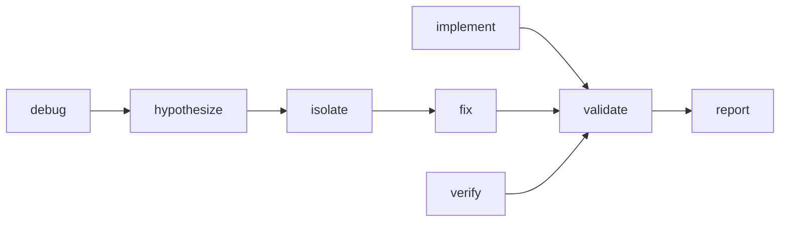

# adk-build-feature

Implement a new feature, fix a bug with root-cause analysis, or enhance existing behavior - with a short plan, scoped reads, smallest correct change, and repo-native validation. Use when the deliverable is a code change that adds, changes, or fixes behavior. Do not use for restructuring without behavior change (use adk-build-refactor), framework upgrades (use adk-build-migrate), or test-only work (use adk-build-test).

## Skill body

# ADK Build / Feature

Standalone task skill under the `adk-build` category router. Delivers the smallest correct implementation that satisfies the requirement, backed by evidence and validation.

## When to use

- Build a new feature or component.
- Fix a bug after root-cause analysis.
- Enhance or extend existing behavior.
- Validate whether a prior change is actually complete (verify mode).
- Debug a reported failure with systematic hypothesis testing (debug mode).

## When NOT to use

- Behavior unchanged, structure changes -> `adk-build-refactor`
- Framework / library version migration -> `adk-build-migrate`
- Test authoring only -> `adk-build-test`
- Dependency hygiene -> `adk-build-deps`
- UI / frontend feature -> `adk-frontend-feature`
- Reviewing existing changes -> `adk-review-local`

## Inputs

| Input | Required | Notes |
| --- | --- | --- |
| `<task>` | yes | What to build, fix, or verify |
| `<mode>` | optional | `implement` (default) / `debug` / `verify` |
| `<plan>` | optional | Path to a roadmap or plan to follow |
| `<scope>` | optional | Path to limit reads and changes |
| `--auto` | optional | Skip approval gates (still validates) |

## Workflow

1. **Confirm intent** - clarify task, mode, scope, validation target. Approval gate unless `--auto`.
2. **Scope** - read only the relevant code:
   - `implement`: target code + immediate dependencies.
   - `debug`: error context, stack trace, recent `git log`, related tests.
   - `verify`: validation targets and existing test coverage.
3. **Plan** - write or refine a short ordered plan. Approval gate unless `--auto` or change is trivial single-file. In `debug`, list 2-3 hypotheses ranked by likelihood. In `verify`, skip this phase.
4. **Implement** - apply the smallest correct change in the smallest readable diff. Stay inside scope; flag any necessary out-of-scope work.
5. **Validate** - run the smallest relevant repo-native checks first (target test, lint on changed files, type-check on touched module). Never claim success without command output.
6. **Report** - changed files with one-line diff summary; validation evidence; remaining risk; offer depth on request.

## Mode flows



### Debug mode (additional discipline)

1. Capture the failure: error message, stack trace, repro steps, expected vs. actual.
2. Hypothesize: 2-3 plausible root causes ranked by likelihood; check recent commits.
3. Test hypotheses: trace execution flow, add strategic logs, check edge cases (null, empty, boundary).
4. Isolate root cause: distinguish trigger from cause; verify it explains all symptoms.
5. Fix: minimal change targeting the root cause; add regression test.
6. Verify: reproduce the original failure first, then confirm fix removes it.

Common bug patterns to keep in mind:

- Logic: off-by-one, boolean inversion, missing null check, encoding.
- Concurrency: race, deadlock, shared mutable state, unhandled rejection.
- Resources: memory / file-handle / connection leak; unbounded growth.
- Integration: API contract drift, serialization, timezone, timeout.

### Verify mode

No code changes. Run the validations that prove the prior change is complete and correct. Report gaps if found and recommend the next action.

## Slicing discipline

- Implement in thin vertical slices: one logical change, validated, then expand.
- Never write more than ~100 lines without running validation.
- Each slice leaves the codebase buildable and testable.
- Commit (or stage) after each verified slice with a descriptive message.
- For multi-slice features, gate incomplete UI behind a feature flag.

## Output format

```
## Summary
<1-2 sentence result>

## Mode
<implement | debug | verify>

## Changed Files
- `path/to/file.ts` - <one-line description>

## Validation
<command output, or explicit "not verified" with reason>

## Remaining Risk
- <open item>

Need more detail on any section?
```

## Hard rules

- Plan before non-trivial code changes.
- Read the code before proposing a change to it.
- Preserve user work in progress.
- Use repo-native validation; do not invent commands.
- Never say "tests pass" or "bug fixed" without fresh evidence.
- Prefer simple, readable solutions over clever ones.
- If a claim cannot be verified, say so explicitly.

## Anti-patterns

- Implementing without reading the relevant code first.
- Skipping the plan for multi-file changes.
- Claiming validation passed without running it.
- Fixing symptoms instead of root causes in debug mode.
- Over-engineering: abstractions, config layers, extensibility the task did not require.
- Mixing feature work with unrelated refactoring in the same change.
- Writing 200+ lines before any validation runs.

## Examples

```
adk-build-feature "Add retry logic to the HTTP client" --scope src/http/
```

```
adk-build-feature "Users report 500s on /api/health" --mode debug
```

```
adk-build-feature "Confirm the pagination fix works" --mode verify --scope src/api/pagination.ts
```

<!-- adk:references:start -->

## References shipped with this skill

These files live in `references/` next to this `SKILL.md`. Read them when the skill activates; they are inlined here so the skill is fully self-contained (no cross-skill or shared sources).

| File | Purpose |
| --- | --- |
| `references/anti-patterns.md` | Things to avoid when running this skill. |
| `references/constitution.md` | Non-negotiable rules and working/communication discipline. |
| `references/examples.md` | Example trigger phrases, invocation, and report shape. |
| `references/output-format.md` | Verbosity modes, result shape, severity labels. |
| `references/persona.md` | The agent persona that drives this skill. |
| `references/working-artifacts.md` | The .temp/ rule for intermediate artifacts. |

<!-- adk:references:end -->

## References shipped with this skill

- `references/anti-patterns.md`
- `references/constitution.md`
- `references/examples.md`
- `references/output-format.md`
- `references/persona.md`
- `references/working-artifacts.md`
