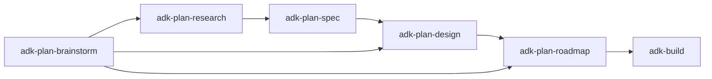

# adk-plan

Category router for planning, research, spec authoring, design, and roadmap work. Use when the next step is to close ambiguity, gather facts, write a spec, design an architecture, or break a goal into an implementation roadmap - any case where thinking and writing must finish before code is touched. Picks one of adk-plan-brainstorm, adk-plan-research, adk-plan-spec, adk-plan-design, adk-plan-roadmap.

## Skill body

# ADK Plan (Category Router)

Routes any "think before you build" intent to the right planning task. Activate one of the listed task skills below; do not plan directly from this router.

## When to use this category

- A request still has real ambiguity about goal, scope, or approach.
- Multiple valid approaches exist and the choice has trade-offs.
- A spec, design doc, ADR, or implementation plan is the deliverable.
- Research must precede a decision because facts are not yet known.

## When NOT to use this category

- Implementation after the direction is settled -> `adk-build`
- Reviewing existing code or PRs -> `adk-review`
- Writing user-facing or maintenance docs -> `adk-docs`
- Auditing an existing repo or site -> `adk-audit`

## Shared workflow

Every task in this category honors the same five steps. The task skills tailor the content of each step.

1. **Confirm intent** - restate the question or goal, the desired confidence, the acceptable blast radius (`surgical` / `bounded` / `transformative`), and the deliverable. Approval gate unless `--auto`.
2. **Gather** - pull repo evidence first, then primary external sources. Mark each finding `Verified` / `Inferred` / `Open`.
3. **Synthesize** - draft options or the chosen direction in concise markdown.
4. **Validate** - check the artifact against the success criteria; fix gaps.
5. **Report** - lead with the recommendation; show evidence, open questions, and the recommended next skill (often `adk-build`).

## Task selection

| Task skill | Use when | Do NOT use when |
| --- | --- | --- |
| `adk-plan-brainstorm` | Ambiguity to close, blast radius to choose, 2-3 options to weigh, direction not yet locked | The decision is already made - skip to spec or roadmap |
| `adk-plan-research` | A factual question must be answered (framework behavior, upstream API, library comparison) | The answer is in this repo or already obvious - skip research |
| `adk-plan-spec` | Need a written spec (PRD, RFC, functional or technical spec) before implementation | A short plan is enough - use roadmap |
| `adk-plan-design` | Need an architecture / system design / ADR / data model write-up | The work is feature-scale and needs only an implementation plan |
| `adk-plan-roadmap` | Direction and design are settled; need an ordered, scoped implementation plan with milestones | Direction is still unresolved - brainstorm first |

## Common chains

You almost never need every task. Common chains:

- Quick fix with one open question: `brainstorm -> roadmap -> adk-build`.
- New feature with unknown library behavior: `research -> spec -> roadmap -> adk-build`.
- New subsystem: `brainstorm -> design -> roadmap -> adk-build`.

## Activation

Once you have picked a task, load `adk-plan-<task>` and follow it. Each task skill is fully standalone - everything it needs is in its own folder.

## Anti-patterns

- Brainstorming when the user already chose - just write the spec or roadmap.
- Researching forever - cap evidence gathering by the confidence target.
- Skipping straight to a roadmap when there is real ambiguity.
- Writing implementation steps inside this router. Always hand off to a task skill.

<!-- adk:references:start -->

## References shipped with this skill

These files live in `references/` next to this `SKILL.md`. Read them when the skill activates; they are inlined here so the skill is fully self-contained (no cross-skill or shared sources).

| File | Purpose |
| --- | --- |
| `references/anti-patterns.md` | Things to avoid when running this skill. |
| `references/constitution.md` | Non-negotiable rules and working/communication discipline. |

<!-- adk:references:end -->

## References shipped with this skill

- `references/anti-patterns.md`
- `references/constitution.md`
