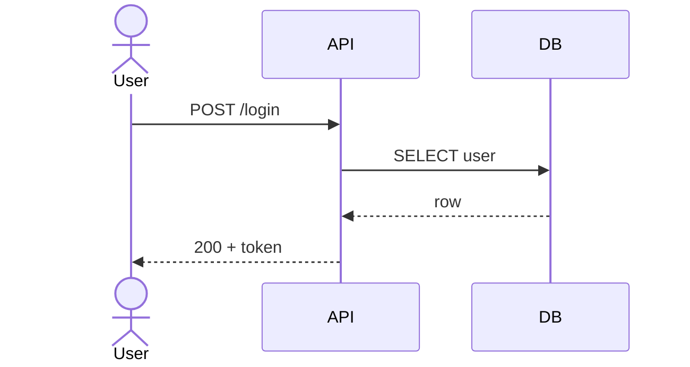
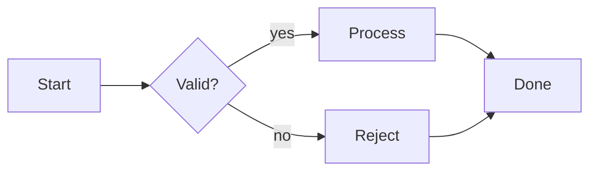
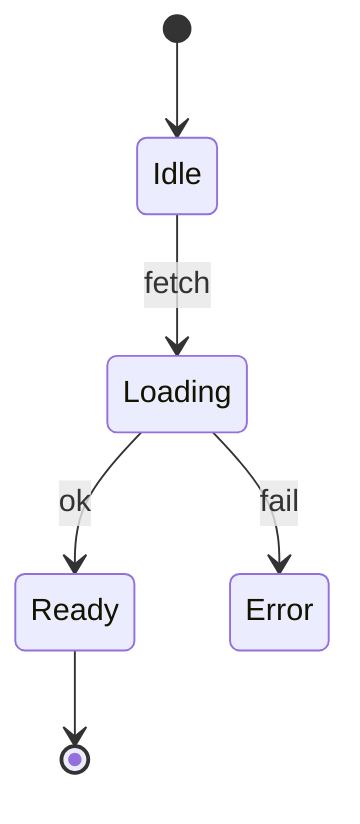
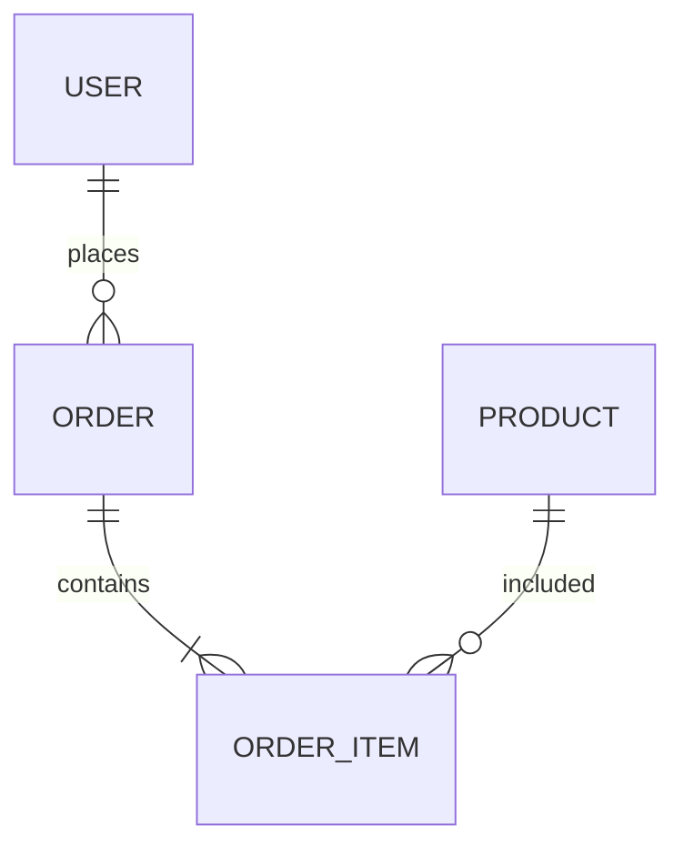
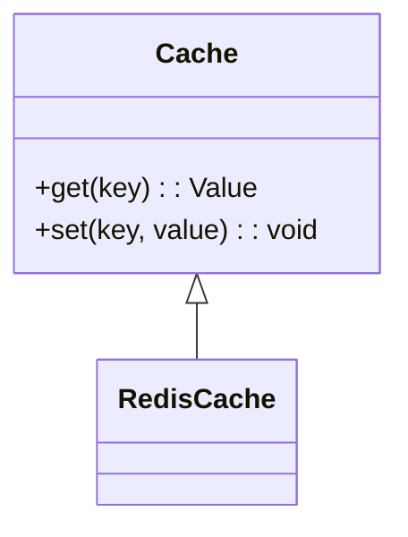

# adk-visualize-diagram

Produce a structural diagram - sequence, flow, state, ER, architecture, dependency, class, deployment - by drafting an editable source file (mermaid, drawio, excalidraw, graphviz dot) and then rendering to the destination format. Use when the deliverable is a structural picture, not a data chart. Do not use for numeric/categorical plots (use adk-visualize-chart) or UI mockups (use adk-frontend-design).

## Skill body

# ADK Visualize / Diagram

Standalone task skill under the `adk-visualize` category router. Produces an editable diagram source first, then renders to the destination format. Editable source is always kept alongside the rendered output.

## When to use

- Sequence, flow, state, ER, architecture, dependency, class, or deployment diagrams.
- Existing diagram needs regeneration, restyling, or format conversion.
- Diagram must be embedded in a markdown doc, a wiki page, or a slide.

## When NOT to use

- Numeric / categorical data plot -> `adk-visualize-chart`
- UI mockup or component design -> `adk-frontend-design`
- Architecture write-up (text + one diagram) -> `adk-plan-design`, which can call this skill for the diagram

## Inputs

| Input | Required | Notes |
| --- | --- | --- |
| `<diagram type>` | yes | `sequence` / `flow` / `state` / `er` / `architecture` / `dependency` / `class` / `deployment` |
| `<source description or data>` | yes | Free-text description, code paths to diagram, or a structured spec |
| `<format>` | optional | `mermaid` (default for markdown) / `drawio` / `excalidraw` / `graphviz` |
| `<render>` | optional | `none` (default - just source) / `svg` / `png` |
| `<output path>` | optional | Defaults to `.temp/drafts/diagram-<slug>.<ext>` |
| `--auto` | optional | Skip approval gates |

## Workflow

1. **Confirm intent** - restate diagram type, source, format, render target, destination. Approval gate unless `--auto`.
2. **Gather** - read the source-of-truth: code, schema, sequence of API calls, deployment manifest. For conceptual diagrams, capture the user's mental model in a short list of nodes + edges.
3. **Draft source** - write the editable source first (mermaid `.mmd`, drawio `.drawio`, excalidraw `.excalidraw`, graphviz `.dot`).
4. **Sanity check** - count nodes (cap ~12 per single-view diagram); verify every edge has both endpoints; confirm no node names collide.
5. **Render** - if `<render>` is requested, produce the SVG / PNG and place it next to the source file with the same basename.
6. **Validate** - visually scan: no overlapping nodes, no disconnected fragments unless intentional, legend / labels present.
7. **Report** - editable source path, render path (if any), node/edge counts; offer to tweak.

## Format defaults

| Destination | Default format |
| --- | --- |
| Markdown (README, PR) | mermaid (embedded fenced block) |
| GitHub wiki / Confluence | mermaid (both render natively in 2026) |
| drawio canvas / advanced layouts | drawio |
| Hand-drawn aesthetic / brainstorm | excalidraw |
| Complex graph layout | graphviz |
| Slide deck or print | render to SVG (vector) or PNG @ 300dpi |

## Mermaid quick reference

This skill produces mermaid by default for markdown destinations. Honor the syntax constraints below to avoid breakage.

- Do NOT use spaces in node ids; use camelCase or snake_case (`userService` / `user_service`).
- Quote labels with parentheses, brackets, colons, or commas: `A["Process (main)"]`.
- Avoid reserved keywords as ids (`end`, `subgraph`, `graph`, `flowchart`).
- For subgraphs, use explicit ids with bracketed labels: `subgraph auth [Authentication Flow]`.
- Do not set explicit colors or `classDef fill:` - let the renderer apply theme colors.
- Click events are disabled in many renderers; do not use `click`.

## Diagram-type templates

### Sequence



### Flow



### State



### ER



### Class



## Output format

```
## Diagram: <type>
- Source: `<path>`
- Render: `<path or none>`
- Format: <mermaid | drawio | excalidraw | graphviz>
- Nodes: <N>
- Edges: <M>

## Preview
<embed the rendered diagram inline if mermaid + markdown destination>

## Notes
- <any layering / readability tradeoffs>

Want a tweak (split, restyle, alternate layout)?
```

## Hard rules

- Always keep the editable source file alongside any binary render.
- Cap a single-view diagram at ~12 nodes; split into layered diagrams beyond that.
- Sequence diagrams: 1 actor / participant per swim lane; do not stack roles.
- Flow / state diagrams: every decision node has labeled edges.
- ER diagrams: every relationship has a cardinality.

## Anti-patterns

- Producing a binary without the source ("source of truth lives in the .png").
- Cramming 30 nodes into one view; nobody reads it.
- Mermaid syntax errors from spaces in node ids - they are silent failures in some renderers.
- Color-coding that breaks in dark mode (do not set explicit colors).
- Using `click` syntax that is disabled in your destination.

## Examples

```
adk-visualize-diagram sequence "user login flow with API and Redis"
```

```
adk-visualize-diagram architecture --format drawio --render svg --output docs/diagrams/system.drawio
```

<!-- adk:references:start -->

## References shipped with this skill

These files live in `references/` next to this `SKILL.md`. Read them when the skill activates; they are inlined here so the skill is fully self-contained (no cross-skill or shared sources).

| File | Purpose |
| --- | --- |
| `references/anti-patterns.md` | Things to avoid when running this skill. |
| `references/constitution.md` | Non-negotiable rules and working/communication discipline. |
| `references/examples.md` | Example trigger phrases, invocation, and report shape. |
| `references/output-format.md` | Verbosity modes, result shape, severity labels. |
| `references/persona.md` | The agent persona that drives this skill. |

<!-- adk:references:end -->

## References shipped with this skill

- `references/anti-patterns.md`
- `references/constitution.md`
- `references/examples.md`
- `references/output-format.md`
- `references/persona.md`
