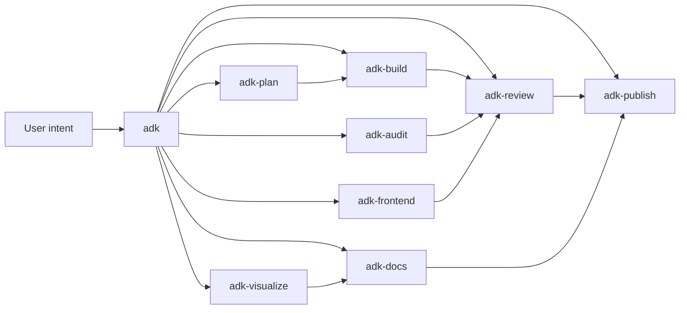

# ADK Router

The ADK family is organized into eight self-contained categories. Every category and every task is its own standalone skill - nothing is shared, nothing is copied at runtime. This top-level router exists to map an intent onto the right category, then onto the right task skill.

## When to use this skill

Use `adk` first whenever the user asks for any of these and has not already named the precise skill:

- planning, designing, researching, brainstorming, or writing a spec
- building, refactoring, migrating, testing, or analyzing dependencies
- reviewing a PR, local changes, addressing review feedback, or capturing a session handoff
- writing or reviewing documentation
- auditing a repository or a website
- committing, pushing to GitHub or Bitbucket, publishing to Confluence or Google Drive
- creating diagrams or charts
- frontend / UI design or implementation, including React client-side work

Do not use `adk` for trivial single-step requests with an obvious tool answer (read this file, run this command, format this snippet). Those should be answered directly.

## Routing protocol

1. Read the user's intent in plain language. Match it against the categories in the table below.
2. Activate the matching category router skill (`adk-plan`, `adk-build`, `adk-review`, `adk-docs`, `adk-audit`, `adk-publish`, `adk-visualize`, or `adk-frontend`).
3. The category router will present its task list and select one specific `adk-[category]-[task]` skill to load.
4. Follow that task skill end to end. Do not implement directly from this router or from the category router.

If the intent spans multiple categories (e.g. "plan and build a feature"), pick the earliest stage in the lifecycle (plan first, then build) and let each category hand off to the next.

## Category map

| Category router | Use when the task is about | Out of scope (use instead) |
| --- | --- | --- |
| `adk-plan` | Closing ambiguity, researching a question, writing a spec or design, drafting an implementation roadmap | Implementation -> `adk-build`; review -> `adk-review` |
| `adk-build` | Implementing a feature or fix, refactoring, migrating, writing tests, analyzing dependencies | Code review -> `adk-review`; UI work -> `adk-frontend` |
| `adk-review` | Reviewing a PR, reviewing local changes, addressing review feedback, capturing a handoff | Doc review -> `adk-docs`; repo/site audit -> `adk-audit` |
| `adk-docs` | Writing or reviewing technical documentation, runbooks, ADRs, READMEs | Spec authoring -> `adk-plan`; commit/PR text -> `adk-publish` |
| `adk-audit` | Systematic audit of a repo or a public website (security, performance, quality, accessibility) | Single PR/local review -> `adk-review` |
| `adk-publish` | Commit messages, PR descriptions, changelogs, GitHub/Bitbucket/Confluence/Google Drive publishing | Drafting docs -> `adk-docs`; building code -> `adk-build` |
| `adk-visualize` | Producing diagrams (mermaid, drawio, excalidraw, graphviz) or charts from data | UI / component design -> `adk-frontend-design` |
| `adk-frontend` | UI/UX design, frontend component work, React 19 client-side sample apps | Backend or non-UI code -> `adk-build` |

## Lifecycle picture

## Standard ADK workflow

Every category router enforces the same five-step shape so behaviour stays predictable across categories:

1. **Confirm intent** - restate the task, scope, and success criteria; ask before proceeding unless the user passed `--auto`.
2. **Plan** - lay out a short ordered plan and surface it for approval (skip for trivial single-step work).
3. **Execute** - run the chosen task skill's workflow.
4. **Validate** - run repo-native checks (tests, lint, type-check, link-check, etc. as relevant).
5. **Report** - lead with the answer; show changed scope, validation evidence, remaining risk; offer deeper detail.

Task skills tailor each step to their domain but do not skip any.

## Core ADK rules

- **Accuracy over speed.** Verify before claiming. Do not present inference as fact.
- **Plan before non-trivial change.** Approval gate before code or destructive ops, except in `--auto`.
- **Standalone skills.** Every ADK skill lives in its own folder with everything it needs. Do not look for shared content.
- **Concise output.** Lead with the answer; bullets over prose; offer depth on request.
- **Smallest correct change.** Challenge scope before accepting it.
- **Working artifacts to `.temp/`.** Plans, drafts, audit reports, and cloned reference repos go under `.temp/` unless they are the final deliverable.

## Selection examples

| User says | Route to | Then to task |
| --- | --- | --- |
| "Help me decide whether to switch to TanStack Router" | `adk-plan` | `adk-plan-brainstorm` |
| "How does Postgres LISTEN/NOTIFY work?" | `adk-plan` | `adk-plan-research` |
| "Add retry logic to the HTTP client" | `adk-build` | `adk-build-feature` |
| "Move us off Webpack to Vite" | `adk-build` | `adk-build-migrate` |
| "Review PR #842" | `adk-review` | `adk-review-pr` |
| "Look at my unstaged changes before I commit" | `adk-review` | `adk-review-local` |
| "Write a runbook for the deploy script" | `adk-docs` | `adk-docs-write` |
| "Audit this repo's security and dep health" | `adk-audit` | `adk-audit-repo` |
| "Draft a commit message for these changes" | `adk-publish` | `adk-publish-commit` |
| "Open a PR on GitHub for this branch" | `adk-publish` | `adk-publish-github` |
| "Make a sequence diagram of the auth flow" | `adk-visualize` | `adk-visualize-diagram` |
| "Design a settings page UI" | `adk-frontend` | `adk-frontend-design` |

## Anti-patterns

- Skipping the router and implementing directly from this skill. Always activate a task skill.
- Routing to two task skills at once. Pick the earliest in the lifecycle and chain.
- Using ADK for a one-line answer the agent already knows. Skip the router.
- Looking for `_shared/`, `common/`, or cross-skill references. There are none.

## Clarifying questions (default-ask)

When running without `--auto`, the skill asks these questions in order, one at a time. Under `--auto`, the skill picks the safest option for each (see `references/adk-clarifying-questions.md`) and reports the choices.

1. **Which lifecycle stage are you in: planning, building, reviewing, documenting, auditing, publishing, visualizing, or frontend?** — _How to pick:_ Pick the earliest stage that still applies. If the direction is locked → skip planning. If code is already written → reviewing/auditing. If you want to ship something out of the repo → publishing.
2. **Is this a one-off question or a multi-step task?** — _How to pick:_ One-off → skip the router and answer directly. Multi-step → continue routing.

**Default report:** One line: chosen category + task skill, plus a one-sentence why.

**Detailed report (on request or `--verbose`):** Lifecycle table, evidence for the routing choice, and the recommended chain (e.g. plan → roadmap → build).

**Artifact:** `routing-decision` — Inline message; no file written. The downstream task skill produces the actual artifact.

**Artifact path:** (none — router does not write files)

## Clarifying questions (default-ask)

When running without `--auto`, the skill asks these questions in order, one at a time. Under `--auto`, the skill picks the safest option for each (see `references/adk-clarifying-questions.md`) and reports the choices.

1. **Which lifecycle stage are you in: planning, building, reviewing, documenting, auditing, publishing, visualizing, or frontend?** — _How to pick:_ Pick the earliest stage that still applies. If the direction is locked → skip planning. If code is already written → reviewing/auditing. If you want to ship something out of the repo → publishing.
2. **Is this a one-off question or a multi-step task?** — _How to pick:_ One-off → skip the router and answer directly. Multi-step → continue routing.

## Default vs detailed output

**Default report:** One line: chosen category + task skill, plus a one-sentence why.

**Detailed report (on request or `--verbose`):** Lifecycle table, evidence for the routing choice, and the recommended chain (e.g. plan → roadmap → build).

**Artifact:** `routing-decision` — Inline message; no file written. The downstream task skill produces the actual artifact.

**Artifact path:** (none — router does not write files)

<!-- adk:references:start -->

## References shipped with this skill

These files live in `references/` next to this `SKILL.md`. Read them when the skill activates; they are inlined here so the skill is fully self-contained (no cross-skill or shared sources).

| File | Purpose |
| --- | --- |
| `references/adk-anti-patterns.md` | Things to avoid when running this skill. |
| `references/adk-artifact-format.md` | The deliverable's format and where it lives (.temp/ contract). |
| `references/adk-clarifying-questions.md` | The default-ask questions for this skill, with how-to-pick rubrics. |
| `references/adk-constitution.md` | Non-negotiable rules and working/communication discipline. |
| `references/interaction-contract.md` | Default-ask, explained-options, --auto contract every skill must follow. |
| `references/adk-output-format.md` | Default vs detailed report shapes; severity labels; verbosity rules. |
| `references/adk-persona.md` | The agent persona that drives this skill. |
| `references/adk-validator.md` | The four-phase validator gate (pre-execution, mid-flow, pre-handoff, post-execution) this skill MUST run. |

<!-- adk:references:end -->
