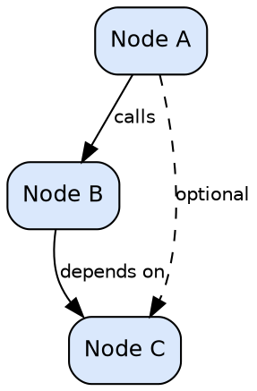
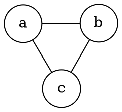
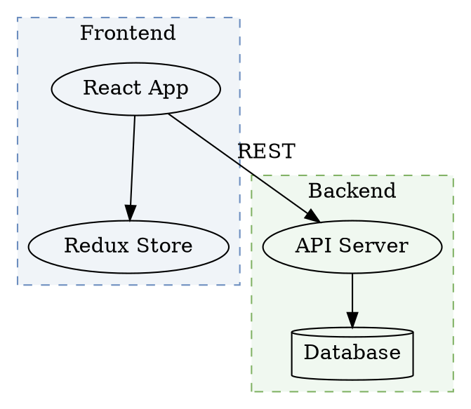
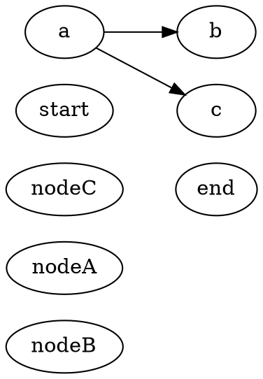
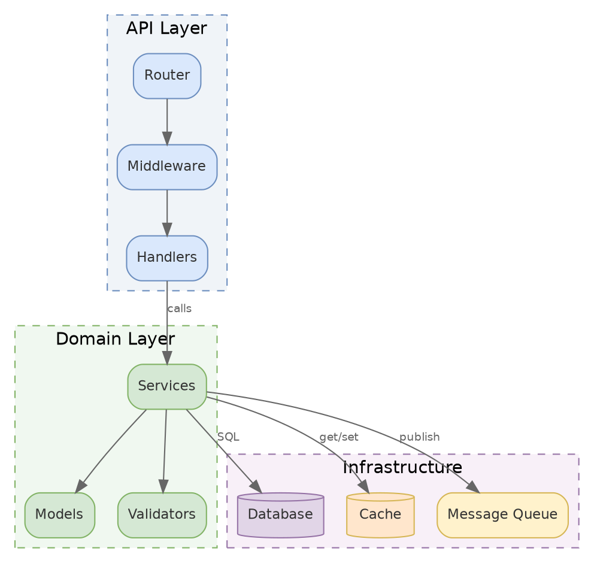
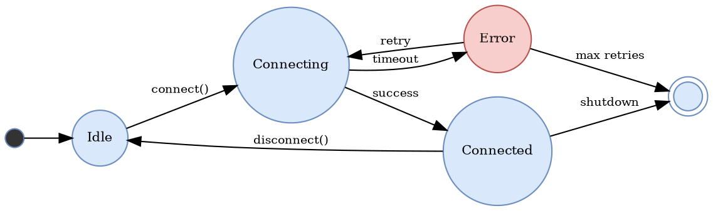

# diagram-graphviz

Use `diagram-graphviz` to create Graphviz DOT diagrams — strict layout for dependency graphs and existing .dot assets. WASM-based rendering, no browser needed. In normal use, explicit selector flags win over inference, but the skill can still auto-detect the right path when the prompt is short.

## Overview

`diagram-graphviz` belongs to the `task` layer and is declared at the `full` tier with the `quick-action` workflow family. That metadata is more than labeling: it tells you how much planning happens before execution, how much the skill is allowed to infer, and whether the result should be a final artifact, a routing decision, or a shared contract for another skill.

The design philosophy across these skills is self-sufficiency with shared composition. When the helper skills listed in `SKILL.md` are available, the workflow composes with them for workflow structure, preflight checks, communication style, and output shaping. When they are not available, the inline fallback summaries still make the behavior readable and predictable.

## Parameters

| Parameter | Values | Default | Description |
|-----------|--------|---------|-------------|
| `--render` | flag | off | Render to image after generating source |
| `--format` | `svg`, `png` | `svg` | Output image format |
| `--theme` | `both`, `light`, `dark` | `both` | Theme variants to render |
| `--layout` | `dot`, `neato`, `fdp`, `sfdp`, `circo`, `twopi` | `dot` | Layout engine |
| `--help` | flag | off | Show help |

### Parameter Notes

- `--render` changes the deliverable from source-only generation to source plus rendered assets.
- `--format` controls the artifact shape, which can also change embedding rules or publishing behavior.
- `--help` prints the embedded reference and exits without running the workflow.

## How It Works

Execution starts by resolving intent from explicit selector flags first and inference rules second. After that, the workflow family and shared helper skills shape how much confirmation, research, planning, and validation happen around the core action.

The sections below come directly from the current `SKILL.md` so developers can see the live contract the implementation is supposed to follow.

### Shared Skills

This skill uses shared helper skills. Load each skill's reference file ONLY when the condition in "Load When" is met. If a shared skill is not installed, use the inline summary as a fallback.

| Skill | Load When | Inline Fallback |
|-------|-----------|-----------------|
| `/adk:workflow --family quick-action` | always | Quick Action workflow: confirm → execute → verify. For narrow tasks with single execution path. `--auto` skips confirmations. |
| `/adk:communication` | always | Lead with conclusion. Bullet points. No preamble. Concrete specifics over abstractions. |
| `/adk:preflight-check` | before rendering | Run preflight.py for diagramkit and MCP validation. Ensure npm packages are installed. |
| `/adk:output-format` | when producing output | short/standard/detailed verbosity. Keep both editable source file and rendered SVG. |
| `/adk:principal-engineer` | complexity >= medium | Five questions: need? simplest? alternatives? maintenance costs? clarity in 6 months? |
| `/adk:agentic-teams` | complexity >= medium AND parallel work needed | Launch 2+ child agents with distinct roles. |
| `/adk:interaction` | NOT --auto | Inline protocols for intent confirmation, approach selection, plan approval. |
| `/adk:workspace-conventions` | always | All work inside the project repo. Temp files in `.temp/<task-slug>/` (gitignored). Diagrams in `diagrams/` (sibling to doc, or project root). Both light+dark SVG and PNG. Respect `diagramkit.config.json` when present. Always commit source files with rendered output. |

### Helper Skill Resolution

Resolve shared behavior through **helper skills**, not by loading reference markdown files. Invoke the needed skill using either form: `/adk:<skill>` (Claude plugin) or `/<skill>` (skills.sh). The usual helpers are **workflow** (phase structure), **communication** (tone and structure), **preflight-check** (tool and MCP validation), **output-format** (verbosity and deliverable shape), **principal-engineer** (engineering bar), **agentic-teams** (child agents), and **interaction** (prompting and confirmations).

If a required helper skill is unavailable, print a warning and continue using the inline fallback summary in the Shared Skills table.

### Preflight

`python3 ${CLAUDE_SKILL_DIR}/scripts/preflight.py ${CLAUDE_SKILL_DIR}`

### Workflow

### 1. Confirm

Confirm: graph type (directed/undirected), nodes, edges, layout engine preference, whether updating existing files. Invoke `/adk:workspace-conventions` to determine output location.

### 2. Execute

If updating existing `.dot` files, read them first and preserve conventions unless cleanup is requested. For new graphs, determine nodes, edges, clusters, and the best layout engine.

Write a `.dot` file to the determined output location following the reference below. Ensure `.temp/` is gitignored if using temp files.

### 3. Verify

Run the rendering pipeline (Step 1–4 above). Then report:

```
Graphviz diagram complete:
  Source: ./diagrams/dependency-graph.dot
  Output:
    ./diagrams/dependency-graph-light.svg
    ./diagrams/dependency-graph-dark.svg
    ./diagrams/dependency-graph-light.png
    ./diagrams/dependency-graph-dark.png
```

---

## Output

Output is part of the contract for this skill, not just presentation. This is what callers and end users should expect back after execution.


## Related Skills

### Adjacent Skills

- `/adk:diagram` — parent routing skill that auto-detects engine
- `/adk:diagram-mermaid` — text-based diagrams (flowcharts, sequence, ER, etc.)
- `/adk:diagram-excalidraw` — hand-drawn architecture diagrams
- `/adk:diagram-drawio` — precise layout with rich icon library
- `/adk:docs-write` — documentation that may embed diagrams

## Additional Reference

### Human in the Loop

- **Plan first (Phase 0)**: Always confirm intent — diagram scope, layout engine, and whether updating existing `.dot` files — before generating.
- **Auto mode**: When invoked with `--auto` or by a parent skill, skip confirmations and proceed directly.

### Rendering Pipeline

Rendering always produces both **light and dark** variants in **SVG and PNG** by default.

### Step 1: Determine Output Location

1. If a `diagramkit.config.json` exists at the project root → use its `outputDir` setting
2. If invoked by a doc skill → place in `diagrams/` folder sibling to the document
3. Otherwise → place in `./diagrams/` at the project root

### Step 2: Render with diagramkit (Primary)

```bash
# SVG — both light and dark
diagramkit render diagram.dot --format svg --theme both

# PNG — both themes, 2x scale for retina
diagramkit render diagram.dot --format png --theme both --scale 2

# Specific layout engine
diagramkit render diagram.dot --format svg --theme both --layout neato
```

diagramkit uses WASM-based Graphviz rendering (no browser, no local `dot` binary required). For dark mode, it runs `adaptGraphvizSvgForDarkMode` which:

- Swaps default black strokes and text for dark-surface-compatible colors
- `postProcessDarkSvg` adjusts high-luminance fills using a WCAG luminance threshold of 0.4
- Preserves the graph structure and layout exactly

If the project has a `diagramkit.config.json`, diagramkit reads it automatically for output directory, default format, theme, and scale.

### Step 3: Fallback — Graphviz CLI (`dot`)

If diagramkit is not installed or fails, use the Graphviz `dot` binary directly.

**Install:** `brew install graphviz` (macOS) or `apt-get install graphviz` (Linux)

```bash
# Light variants
dot -Tsvg -Gbgcolor=white diagram.dot -o diagrams/diagram-light.svg
dot -Tpng -Gbgcolor=white diagram.dot -o diagrams/diagram-light.png

# Dark variants — create a temp wrapper that overrides colors
cat > .temp/diagram-dark-wrapper.dot << 'DARKEOF'
digraph dark_wrapper {
    graph [bgcolor="#1e1e1e"];
    node [fontcolor="#cccccc", color="#cccccc"];
    edge [color="#999999", fontcolor="#999999"];
}
DARKEOF
# Merge dark overrides with the source file manually, or:
dot -Tsvg -Gbgcolor="#1e1e1e" -Nfontcolor="#cccccc" -Ncolor="#cccccc" -Ecolor="#999999" diagram.dot -o diagrams/diagram-dark.svg
dot -Tpng -Gbgcolor="#1e1e1e" -Nfontcolor="#cccccc" -Ncolor="#cccccc" -Ecolor="#999999" diagram.dot -o diagrams/diagram-dark.png
```

For complex graphs with custom colors, the CLI dark fallback may not match diagramkit quality. Consider installing diagramkit for best results.

### Step 4: Verify Outputs

Confirm these files exist:
- `<name>-light.svg` and `<name>-dark.svg`
- `<name>-light.png` and `<name>-dark.png`

---

### DOT Language Reference

### Directed Graph (digraph)



### Undirected Graph



### Subgraphs and Clusters

Subgraph names must start with `cluster_` to be rendered as boxes:



---

### Layout Engines

| Engine | Best For | Algorithm |
|--------|----------|-----------|
| `dot` | Hierarchical/directed graphs, DAGs, call trees | Sugiyama layered layout |
| `neato` | Undirected graphs, network topologies | Spring model (Kamada-Kawai) |
| `fdp` | Large undirected graphs | Force-directed placement |
| `sfdp` | Very large graphs (1000+ nodes) | Scalable force-directed |
| `circo` | Circular layouts, ring topologies | Circular layout |
| `twopi` | Radial layouts, hub-and-spoke | Radial layout |

### Layout Control with `dot`



---

### Node Shapes

| Shape | Keyword | Use For |
|-------|---------|---------|
| Box | `box` | Services, modules, components |
| Rounded box | `box` + `style="rounded"` | Softer visual for services |
| Circle | `circle` | States, decision points |
| Ellipse | `ellipse` | Default; general purpose |
| Diamond | `diamond` | Decision nodes |
| Record | `record` | Structured data (fields) |
| Mrecord | `Mrecord` | Rounded record |
| Cylinder | `cylinder` | Databases, storage |
| Polygon | `polygon` + `sides=N` | Custom shapes |
| Double circle | `doublecircle` | Accept states (automata) |
| Plain | `plaintext` or `none` | Labels without borders |
| Folder | `folder` | File system, packages |
| Component | `component` | UML components |
| Tab | `tab` | Tabbed interfaces |
| House | `house` | Entry points |
| Inverted house | `invhouse` | Sinks |
| Star | `star` | Highlights, special nodes |
| Note | `note` | Annotations |
| Cds | `cds` | DNA/bio diagrams |
| Underline | `underline` | Dictionary entries |

### Record Nodes

```dot
node [shape=record];
struct [label="{ClassName|+ field1: int\l+ field2: string\l|+ method1(): void\l+ method2(): bool\l}"];
```

Use `\l` for left-aligned lines, `\r` for right, `\n` for centered.

### Ports

```dot
node [shape=record];
a [label="<port1> Left | <port2> Center | <port3> Right"];
b [label="<in> Input | <out> Output"];

a:port2 -> b:in;
```

---

### Edge Styles

| Style | Attribute | Example |
|-------|-----------|---------|
| Solid | (default) | `a -> b;` |
| Dashed | `style=dashed` | `a -> b [style=dashed];` |
| Dotted | `style=dotted` | `a -> b [style=dotted];` |
| Bold | `style=bold` | `a -> b [style=bold];` |
| Invisible | `style=invis` | `a -> b [style=invis];` |

### Arrowhead Types

| Type | Description |
|------|-------------|
| `normal` | Standard filled arrow (default) |
| `inv` | Inverted arrow |
| `dot` | Circle |
| `odot` | Open circle |
| `none` | No arrowhead |
| `diamond` | Diamond (composition) |
| `odiamond` | Open diamond (aggregation) |
| `box` | Box endpoint |
| `obox` | Open box endpoint |
| `crow` | Crow's foot (ER many) |
| `tee` | T-bar (ER one) |
| `vee` | V-shaped arrow |
| `curve` | Curved arrow |
| `empty` | Open triangle |

Combine: `arrowhead=odiamond` for aggregation, `arrowhead=diamond` for composition.

### Edge Labels

```dot
a -> b [label="sync call", fontsize=10, fontcolor="#666666"];
a -> b [headlabel="1", taillabel="*"];  // Multiplicity
a -> b [xlabel="external label"];        // Non-overlapping label
```

---

### Color Reference

### Colors for Both Light and Dark Mode

Use mid-tone fills that survive dark mode transformation. Avoid pure white/black.

| Purpose | fillcolor | fontcolor | color (stroke) |
|---------|-----------|-----------|----------------|
| Primary (blue) | `#dae8fc` | `#333333` | `#6c8ebf` |
| Success (green) | `#d5e8d4` | `#333333` | `#82b366` |
| Warning (orange) | `#ffe6cc` | `#333333` | `#d6b656` |
| Error (red) | `#f8cecc` | `#333333` | `#b85450` |
| Service (purple) | `#e1d5e7` | `#333333` | `#9673a6` |
| Highlight (yellow) | `#fff2cc` | `#333333` | `#d6b656` |
| Neutral (gray) | `#f5f5f5` | `#333333` | `#666666` |
| Header (dark blue) | `#4C78A8` | `#ffffff` | `#2E5A88` |

### Dark Mode Behavior

diagramkit uses WASM rendering (no browser) and runs `adaptGraphvizSvgForDarkMode`:

1. Default black strokes (`#000000`) are swapped for light colors visible on dark surfaces
2. Default black text is lightened for readability
3. `postProcessDarkSvg` checks fill luminance against WCAG threshold (0.4):
   - High-luminance fills (light colors like `#dae8fc`) are darkened proportionally
   - Low-luminance fills (already dark) are kept or slightly lightened
4. Transparent/no-fill elements get the dark surface background

**Guidelines for best results:**

- Use `fontcolor="#333333"` — it adapts to both modes
- Use the fill colors from the table above — they are designed for both modes
- Avoid `bgcolor="white"` on graphs — use `bgcolor="transparent"` instead
- Avoid very light fills (> 0.9 luminance) — they lose distinction when darkened
- Avoid very dark fills (< 0.1 luminance) — they become invisible on dark backgrounds

---

### Complete Example: Module Dependency Graph



### Complete Example: State Machine



---

### Quality Standards

1. **Use semantic node IDs** — `api_server` not `a`, `auth_service` not `n1`.
2. **Use descriptive labels** — `PostgreSQL Primary` not `DB`.
3. **Group related nodes** in `cluster_` subgraphs.
4. **Use consistent styling** — same colors for same component types.
5. **Set graph-level defaults** for `node` and `edge` to reduce repetition.
6. **Keep it focused** — max 30-40 nodes per graph; split into multiple files for complex systems.
7. **Use `bgcolor="transparent"`** for graph background — allows dark mode adaptation.
8. **Use `fontcolor="#333333"`** — adapts well to both light and dark modes.

### When to Use Graphviz vs Other Engines

| Use Case | Preferred Engine | Why |
|----------|-----------------|-----|
| Automatic dependency layout | **Graphviz** | Best algorithmic layout |
| Existing `.dot` files | **Graphviz** | Preserve conventions |
| Strict rank constraints | **Graphviz** | `rank=same`, `rank=min/max` |
| Record/port nodes | **Graphviz** | Only engine with ports |
| Architecture overview | **Excalidraw** | Hand-drawn feel, better for presentations |
| Sequence/ER/Gantt | **Mermaid** | Native support for these types |
| Network topology | **draw.io** | Rich infrastructure icon library |
| Precise manual layout | **draw.io** | Exact pixel positioning |

---

## Examples

The examples below start with a minimal invocation and then show the most common ways developers override detection or change the resulting artifact.

### Start With The Default Path

Start with the smallest useful invocation. If the skill supports auto-detection, this is the fastest way to see which path it chooses before you pin it down with extra flags.

```text
/adk:diagram-graphviz
```
### Change Output Or Execution Style

These examples change the returned artifact, detail level, rendering, or approval behavior without changing what the skill fundamentally does.

```text
/adk:diagram-graphviz --render --format png <prompt-text>
```
