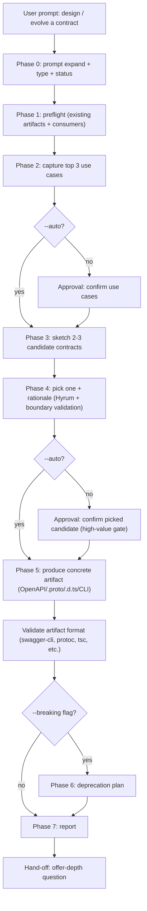
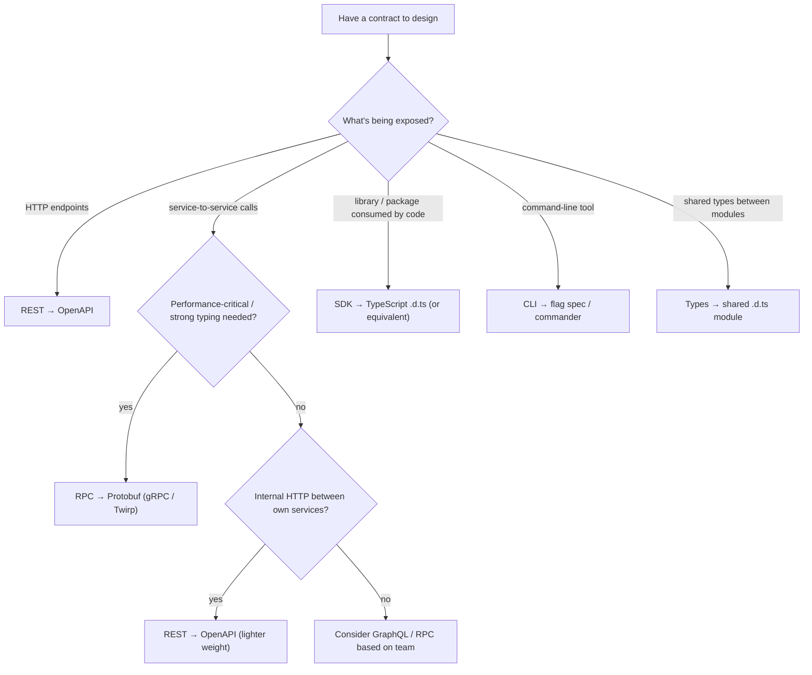
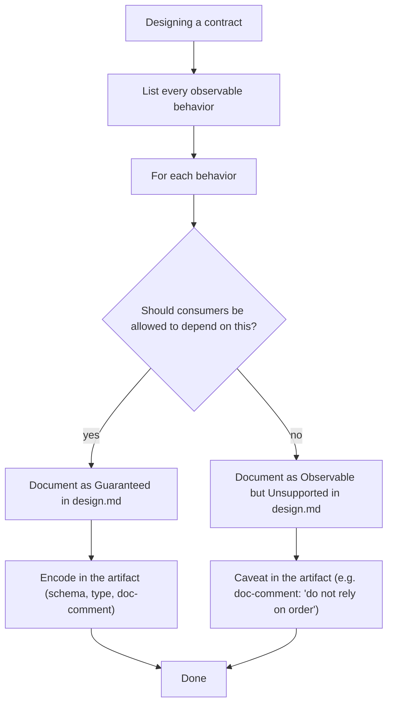
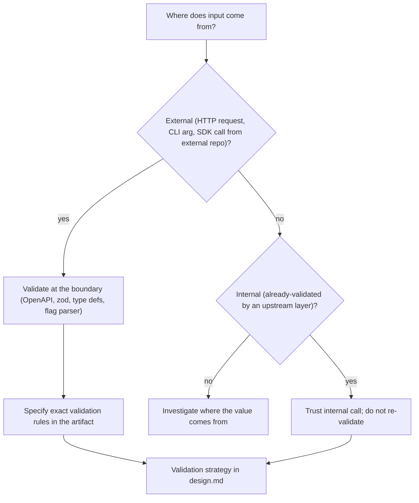
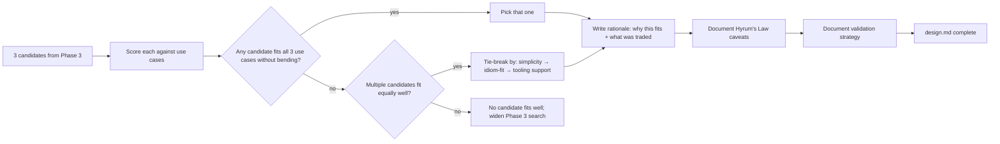

# `code-api` — how it works (diagrams)

## Phase flow

```mermaid
flowchart TD
    Prompt["User prompt: design / evolve a contract"] --> P0["Phase 0: prompt expand + type + status"]
    P0 --> P1["Phase 1: preflight (existing artifacts + consumers)"]
    P1 --> P2["Phase 2: capture top 3 use cases"]
    P2 --> Approve2{"--auto?"}
    Approve2 -- no --> Gate2["Approval: confirm use cases"]
    Approve2 -- yes --> P3
    Gate2 --> P3["Phase 3: sketch 2-3 candidate contracts"]
    P3 --> P4["Phase 4: pick one + rationale (Hyrum + boundary validation)"]
    P4 --> Approve4{"--auto?"}
    Approve4 -- no --> Gate4["Approval: confirm picked candidate (high-value gate)"]
    Approve4 -- yes --> P5
    Gate4 --> P5["Phase 5: produce concrete artifact (OpenAPI/.proto/.d.ts/CLI)"]
    P5 --> Validate["Validate artifact format (swagger-cli, protoc, tsc, etc.)"]
    Validate --> Breaking{"--breaking flag?"}
    Breaking -- yes --> P6["Phase 6: deprecation plan"]
    Breaking -- no --> P7
    P6 --> P7["Phase 7: report"]
    P7 --> Done["Hand-off: offer-depth question"]
```

## Contract type decision tree

```mermaid
flowchart TD
    Start["Have a contract to design"] --> Q1{"What's being exposed?"}
    Q1 -- "HTTP endpoints" --> REST["REST → OpenAPI"]
    Q1 -- "service-to-service calls" --> Q2{"Performance-critical / strong typing needed?"}
    Q2 -- yes --> RPC["RPC → Protobuf (gRPC / Twirp)"]
    Q2 -- no --> Q3{"Internal HTTP between own services?"}
    Q3 -- yes --> RESTI["REST → OpenAPI (lighter weight)"]
    Q3 -- no --> ConsiderG["Consider GraphQL / RPC based on team"]
    Q1 -- "library / package consumed by code" --> SDK["SDK → TypeScript .d.ts (or equivalent)"]
    Q1 -- "command-line tool" --> CLI["CLI → flag spec / commander"]
    Q1 -- "shared types between modules" --> Types["Types → shared .d.ts module"]
```

## Hyrum's Law decision tree

```mermaid
flowchart TD
    Start["Designing a contract"] --> List["List every observable behavior"]
    List --> ForEach["For each behavior"]
    ForEach --> Q{"Should consumers be allowed to depend on this?"}
    Q -- yes --> Doc["Document as Guaranteed in design.md"]
    Q -- no --> NotDoc["Document as Observable but Unsupported in design.md"]
    Doc --> Encode["Encode in the artifact (schema, type, doc-comment)"]
    NotDoc --> Caveat["Caveat in the artifact (e.g. doc-comment: 'do not rely on order')"]
    Encode --> Done
    Caveat --> Done
```

## Validation strategy decision

```mermaid
flowchart TD
    Start["Where does input come from?"] --> Q1{"External (HTTP request, CLI arg, SDK call from external repo)?"}
    Q1 -- yes --> Boundary["Validate at the boundary (OpenAPI, zod, type defs, flag parser)"]
    Q1 -- no --> Q2{"Internal (already-validated by an upstream layer)?"}
    Q2 -- yes --> Trust["Trust internal call; do not re-validate"]
    Q2 -- no --> Investigate["Investigate where the value comes from"]
    Boundary --> Specify["Specify exact validation rules in the artifact"]
    Specify --> Done["Validation strategy in design.md"]
    Trust --> Done
```

## Candidate selection (Phase 4)

```mermaid
flowchart LR
    Start["3 candidates from Phase 3"] --> Score["Score each against use cases"]
    Score --> Q1{"Any candidate fits all 3 use cases without bending?"}
    Q1 -- yes --> Pick["Pick that one"]
    Q1 -- no --> Q2{"Multiple candidates fit equally well?"}
    Q2 -- yes --> Tiebreak["Tie-break by: simplicity → idiom-fit → tooling support"]
    Q2 -- no --> Reconsider["No candidate fits well; widen Phase 3 search"]
    Pick --> Justify["Write rationale: why this fits + what was traded"]
    Tiebreak --> Justify
    Justify --> HyrumsLaw["Document Hyrum's Law caveats"]
    HyrumsLaw --> Validation["Document validation strategy"]
    Validation --> Done["design.md complete"]
```
