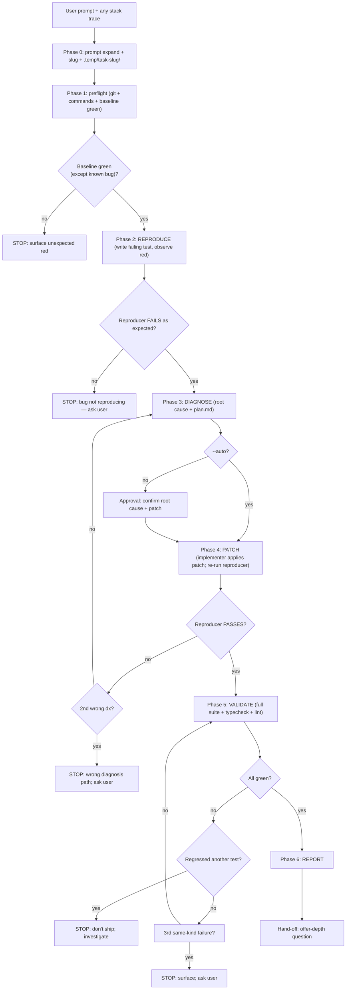
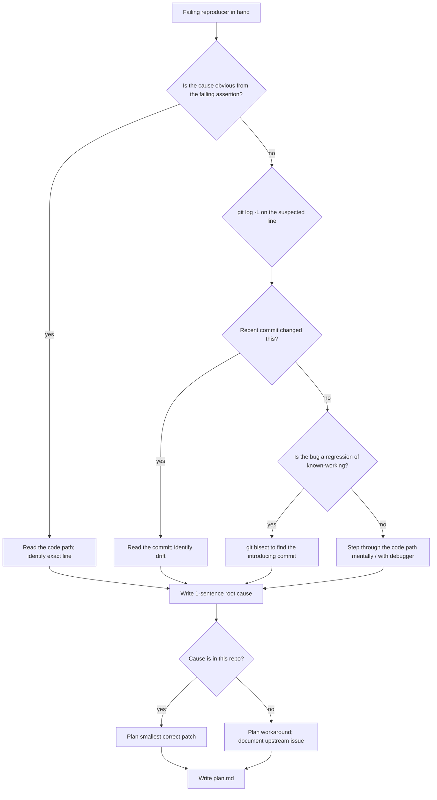
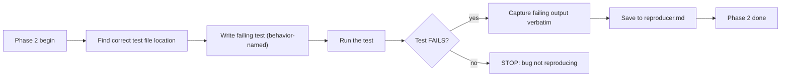
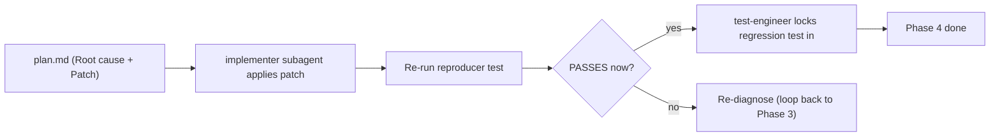

# `code-bugfix` — how it works (diagrams)

## Phase flow (reproducer-first)

```mermaid
flowchart TD
    Prompt["User prompt + any stack trace"] --> P0["Phase 0: prompt expand + slug + .temp/task-slug/"]
    P0 --> P1["Phase 1: preflight (git + commands + baseline green)"]
    P1 --> Baseline{"Baseline green<br/>(except known bug)?"}
    Baseline -- no --> Stop1["STOP: surface unexpected red"]
    Baseline -- yes --> P2["Phase 2: REPRODUCE (write failing test, observe red)"]
    P2 --> ReproRed{"Reproducer FAILS as expected?"}
    ReproRed -- no --> Stop2["STOP: bug not reproducing — ask user"]
    ReproRed -- yes --> P3["Phase 3: DIAGNOSE (root cause + plan.md)"]
    P3 --> Approve3{"--auto?"}
    Approve3 -- no --> Gate3["Approval: confirm root cause + patch"]
    Approve3 -- yes --> P4
    Gate3 --> P4["Phase 4: PATCH (implementer applies patch; re-run reproducer)"]
    P4 --> ReproGreen{"Reproducer PASSES?"}
    ReproGreen -- no --> WrongDx{"2nd wrong dx?"}
    WrongDx -- no --> P3
    WrongDx -- yes --> Stop3["STOP: wrong diagnosis path; ask user"]
    ReproGreen -- yes --> P5["Phase 5: VALIDATE (full suite + typecheck + lint)"]
    P5 --> AllGreen{"All green?"}
    AllGreen -- no --> Regress{"Regressed another test?"}
    Regress -- yes --> Stop4["STOP: don't ship; investigate"]
    Regress -- no --> Loop3["3rd same-kind failure?"]
    Loop3 -- no --> P5
    Loop3 -- yes --> Stop5["STOP: surface; ask user"]
    AllGreen -- yes --> P6["Phase 6: REPORT"]
    P6 --> Done["Hand-off: offer-depth question"]
```

## Diagnosis decision tree

```mermaid
flowchart TD
    Start["Failing reproducer in hand"] --> Q1{"Is the cause obvious from the failing assertion?"}
    Q1 -- yes --> ReadCode["Read the code path; identify exact line"]
    Q1 -- no --> History{"git log -L on the suspected line"}
    History --> Recent{"Recent commit changed this?"}
    Recent -- yes --> ReadCommit["Read the commit; identify drift"]
    Recent -- no --> Bisect{"Is the bug a regression of known-working?"}
    Bisect -- yes --> RunBisect["git bisect to find the introducing commit"]
    Bisect -- no --> Trace["Step through the code path mentally / with debugger"]
    ReadCode --> RC["Write 1-sentence root cause"]
    ReadCommit --> RC
    RunBisect --> RC
    Trace --> RC
    RC --> Decide{"Cause is in this repo?"}
    Decide -- yes --> Patch["Plan smallest correct patch"]
    Decide -- no --> Workaround["Plan workaround; document upstream issue"]
    Patch --> Plan["Write plan.md"]
    Workaround --> Plan
```

## Reproducer protocol (Phase 2)

```mermaid
flowchart LR
    Start["Phase 2 begin"] --> Locate["Find correct test file location"]
    Locate --> Write["Write failing test (behavior-named)"]
    Write --> Run["Run the test"]
    Run --> Result{"Test FAILS?"}
    Result -- yes --> Capture["Capture failing output verbatim"]
    Result -- no --> Stop["STOP: bug not reproducing"]
    Capture --> Save["Save to reproducer.md"]
    Save --> Done["Phase 2 done"]
```

## Patch + regression test cycle (Phase 4)

```mermaid
flowchart LR
    Plan["plan.md (Root cause + Patch)"] --> Impl["implementer subagent applies patch"]
    Impl --> Rerun["Re-run reproducer test"]
    Rerun --> Result{"PASSES now?"}
    Result -- yes --> Tester["test-engineer locks regression test in"]
    Tester --> Done["Phase 4 done"]
    Result -- no --> Diagnose["Re-diagnose (loop back to Phase 3)"]
```
