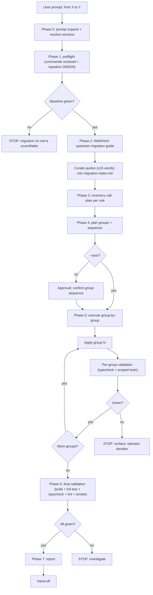
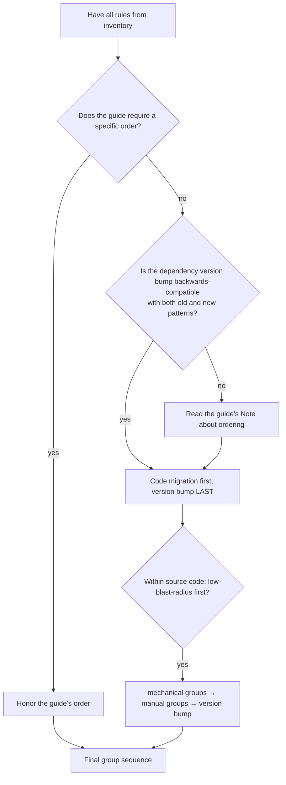
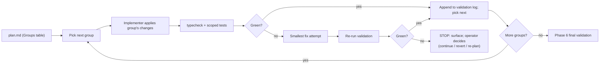
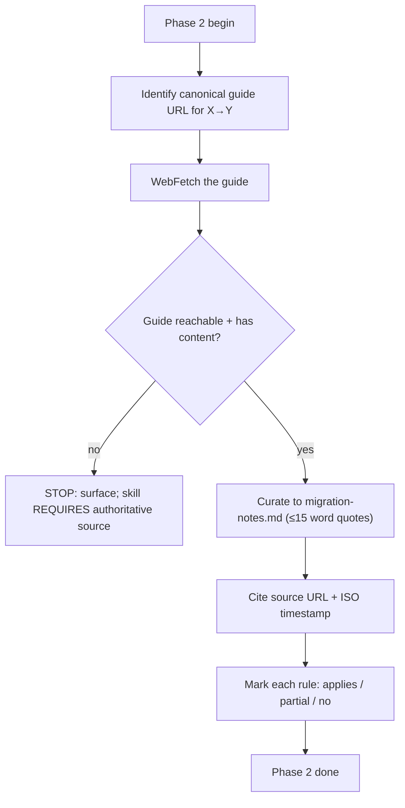
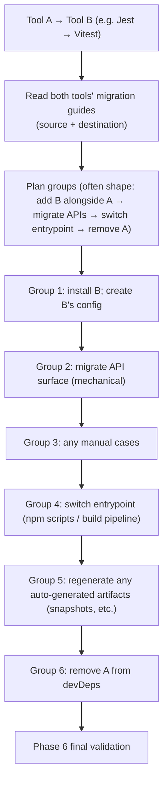

# `code-migrate` — how it works (diagrams)

## Phase flow

## Group sequencing decision tree

## Per-group execution loop

## Migration-guide-fetch protocol

## What "tool replacement" looks like

