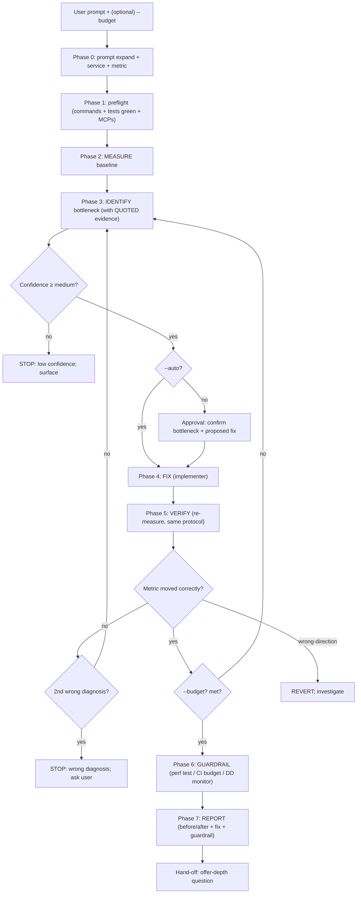
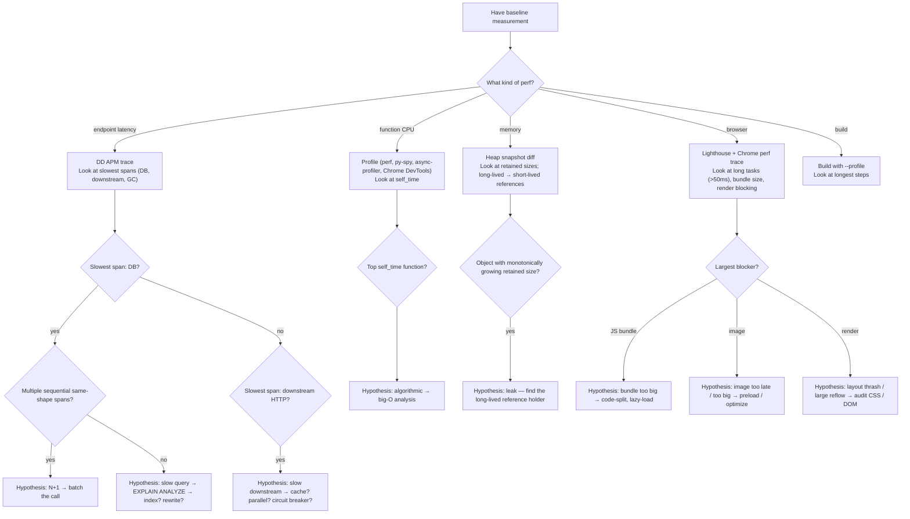
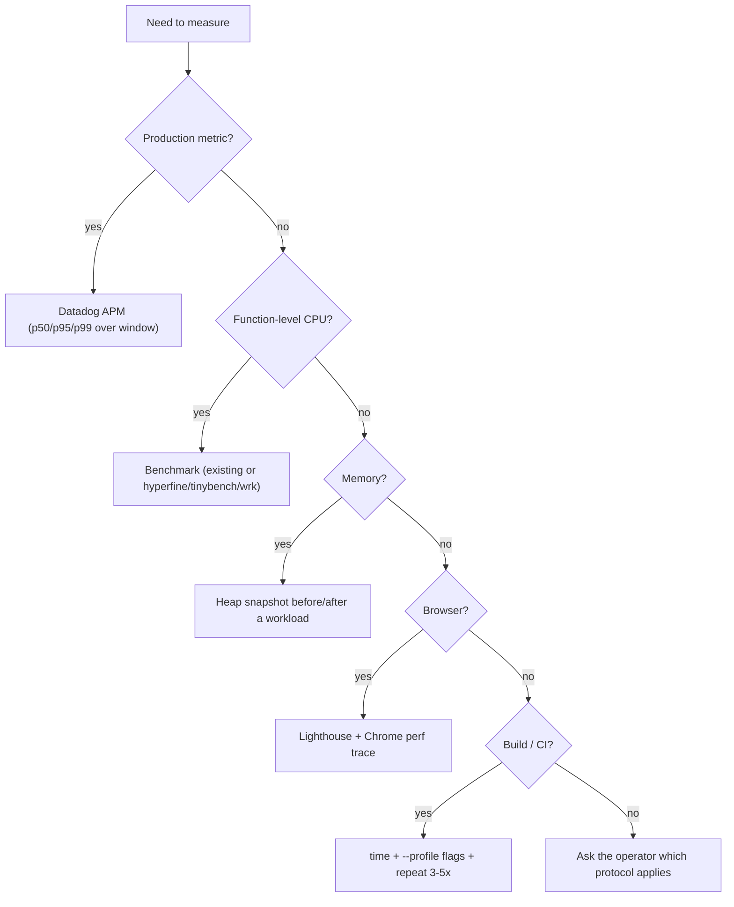

# `code-perf` — how it works (diagrams)

## Phase flow (measure-fix-verify cycle)

## Bottleneck identification decision tree

## Measurement protocol decision (Phase 2)

## Guardrail decision tree

```mermaid
flowchart TD
    Start["Need a guardrail"] --> Q1{"Function / endpoint perf?"}
    Q1 -- yes --> PerfTest["Perf test in suite (assert duration < threshold)"]
    Q1 -- no --> Q2{"Browser perf?"}
    Q2 -- yes --> LCi["Lighthouse-CI threshold"]
    Q2 -- no --> Q3{"Bundle size?"}
    Q3 -- yes --> BundleCI["Bundle-size CI check (e.g. webpack-bundle-analyzer threshold)"]
    Q3 -- no --> Q4{"Build time?"}
    Q4 -- yes --> BuildCI["CI step that fails if build > N seconds"]
    Q4 -- no --> Q5{"Production-monitored?"}
    Q5 -- yes --> DDMon["Datadog monitor recommendation (skill does not create directly)"]
    Q5 -- no --> Manual["Document the manual check in the runbook"]
```

