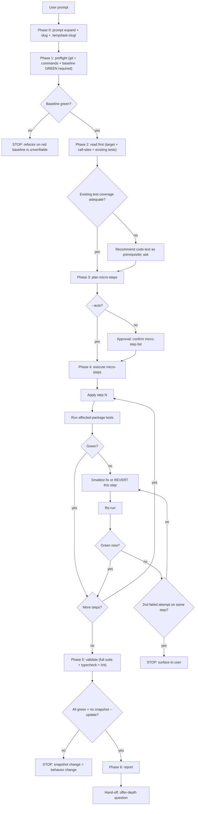
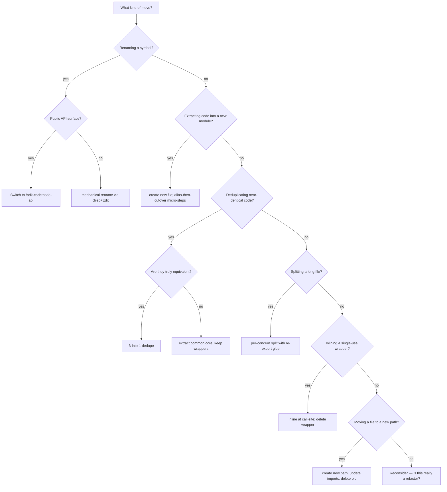
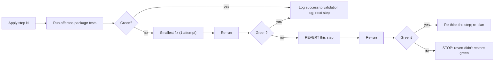
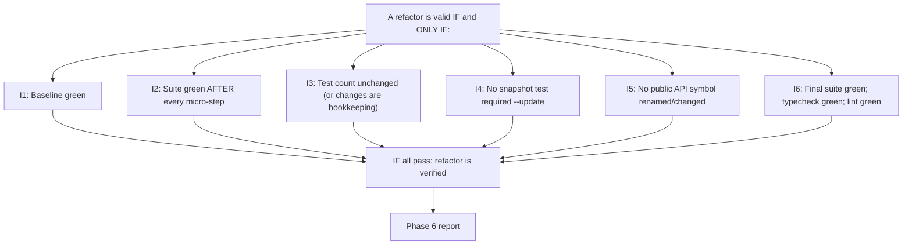

# `code-refactor` — how it works (diagrams)

## Phase flow

```mermaid
flowchart TD
    Prompt["User prompt"] --> P0["Phase 0: prompt expand + slug + .temp/task-slug/"]
    P0 --> P1["Phase 1: preflight (git + commands + baseline GREEN required)"]
    P1 --> Baseline{"Baseline green?"}
    Baseline -- no --> Stop1["STOP: refactor on red baseline is unverifiable"]
    Baseline -- yes --> P2["Phase 2: read first (target + call-sites + existing tests)"]
    P2 --> Coverage{"Existing test coverage adequate?"}
    Coverage -- no --> Recommend["Recommend code-test as prerequisite; ask"]
    Coverage -- yes --> P3
    Recommend --> P3["Phase 3: plan micro-steps"]
    P3 --> Approve3{"--auto?"}
    Approve3 -- no --> Gate3["Approval: confirm micro-step list"]
    Approve3 -- yes --> P4
    Gate3 --> P4["Phase 4: execute micro-steps"]
    P4 --> Step["Apply step N"]
    Step --> Run["Run affected-package tests"]
    Run --> Result{"Green?"}
    Result -- yes --> More{"More steps?"}
    More -- yes --> Step
    More -- no --> P5["Phase 5: validate (full suite + typecheck + lint)"]
    Result -- no --> Recover["Smallest fix or REVERT this step"]
    Recover --> ReRun["Re-run"]
    ReRun --> Result2{"Green now?"}
    Result2 -- yes --> More
    Result2 -- no --> SecondFail{"2nd failed attempt on same step?"}
    SecondFail -- no --> Recover
    SecondFail -- yes --> Stop2["STOP: surface to user"]
    P5 --> AllGreen{"All green + no snapshot --update?"}
    AllGreen -- no --> Stop3["STOP: snapshot change = behavior change"]
    AllGreen -- yes --> P6["Phase 6: report"]
    P6 --> Done["Hand-off: offer-depth question"]
```

## Refactor-move decision tree

```mermaid
flowchart TD
    Start["What kind of move?"] --> Q1{"Renaming a symbol?"}
    Q1 -- yes --> Public{"Public API surface?"}
    Public -- yes --> APISkill["Switch to /adk-code:code-api"]
    Public -- no --> Rename["mechanical rename via Grep+Edit"]
    Q1 -- no --> Q2{"Extracting code into a new module?"}
    Q2 -- yes --> Extract["create new file; alias-then-cutover micro-steps"]
    Q2 -- no --> Q3{"Deduplicating near-identical code?"}
    Q3 -- yes --> CheckEquiv{"Are they truly equivalent?"}
    CheckEquiv -- yes --> DedupOne["3-into-1 dedupe"]
    CheckEquiv -- no --> ExtractCore["extract common core; keep wrappers"]
    Q3 -- no --> Q4{"Splitting a long file?"}
    Q4 -- yes --> Split["per-concern split with re-export glue"]
    Q4 -- no --> Q5{"Inlining a single-use wrapper?"}
    Q5 -- yes --> Inline["inline at call-site; delete wrapper"]
    Q5 -- no --> Q6{"Moving a file to a new path?"}
    Q6 -- yes --> Move["create new path; update imports; delete old"]
    Q6 -- no --> Reconsider["Reconsider — is this really a refactor?"]
```

## Micro-step protocol

```mermaid
flowchart LR
    Step["Apply step N"] --> Test["Run affected-package tests"]
    Test --> Green{"Green?"}
    Green -- yes --> Log["Log success to validation log; next step"]
    Green -- no --> Try1["Smallest fix (1 attempt)"]
    Try1 --> ReRun1["Re-run"]
    ReRun1 --> Green1{"Green?"}
    Green1 -- yes --> Log
    Green1 -- no --> Revert["REVERT this step"]
    Revert --> ReRun2["Re-run"]
    ReRun2 --> Green2{"Green?"}
    Green2 -- yes --> Reconsider["Re-think the step; re-plan"]
    Green2 -- no --> Stop["STOP: revert didn't restore green"]
```

## Behavior-preservation invariants

```mermaid
flowchart TD
    Refactor["A refactor is valid IF and ONLY IF:"] --> I1["I1: Baseline green"]
    Refactor --> I2["I2: Suite green AFTER every micro-step"]
    Refactor --> I3["I3: Test count unchanged (or changes are bookkeeping)"]
    Refactor --> I4["I4: No snapshot test required --update"]
    Refactor --> I5["I5: No public API symbol renamed/changed"]
    Refactor --> I6["I6: Final suite green; typecheck green; lint green"]
    I1 --> Pass["IF all pass: refactor is verified"]
    I2 --> Pass
    I3 --> Pass
    I4 --> Pass
    I5 --> Pass
    I6 --> Pass
    Pass --> Report["Phase 6 report"]
```
