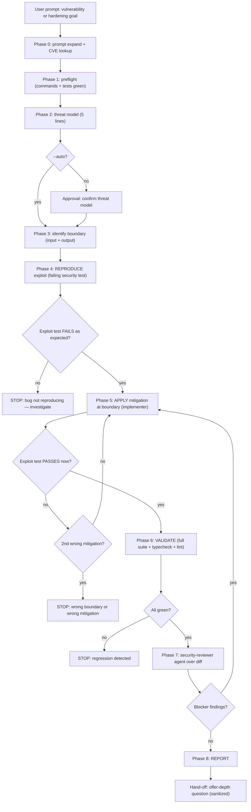
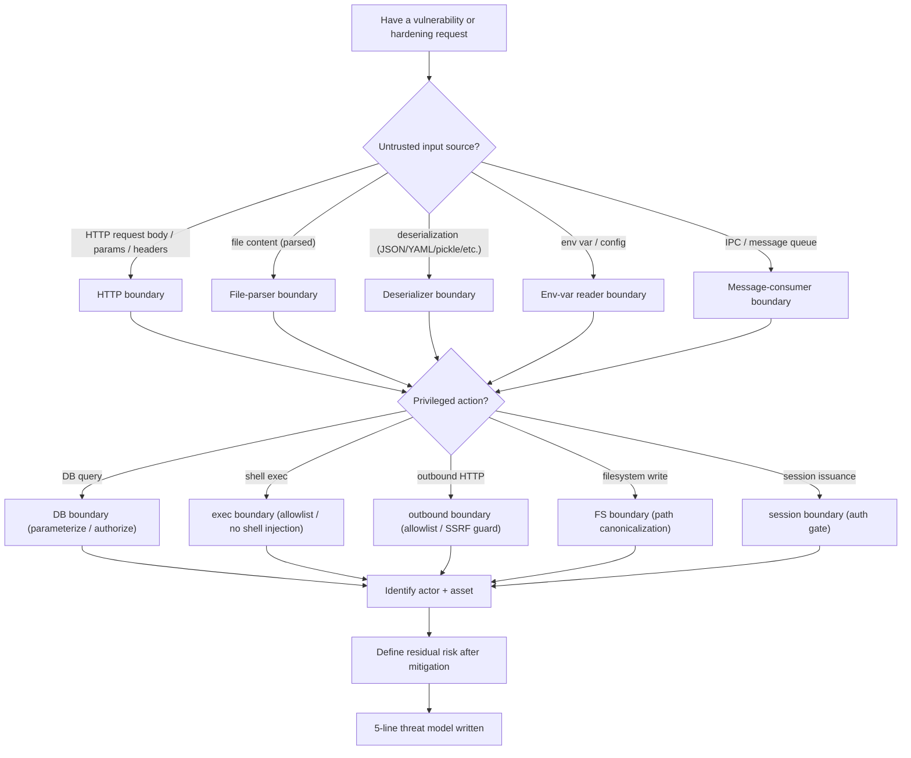
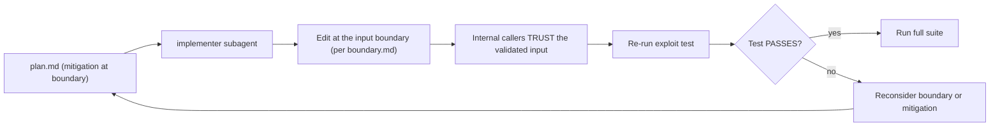
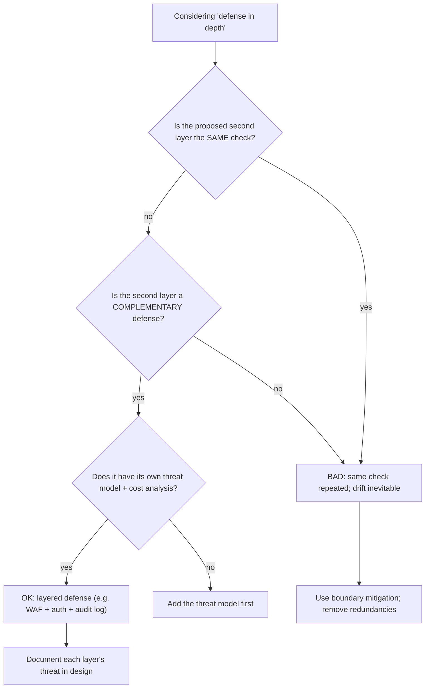
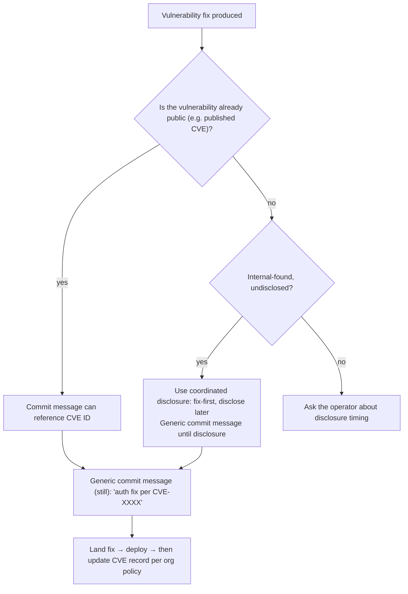

# `code-security` — how it works (diagrams)

## Phase flow

## Threat-model decision tree

## Mitigation-at-boundary protocol (Phase 5)

## Defense-in-depth (when it's right vs wrong)

## Disclosure decision tree

