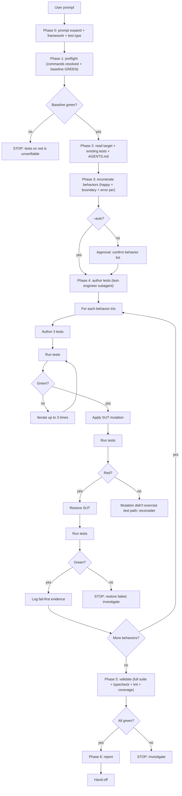
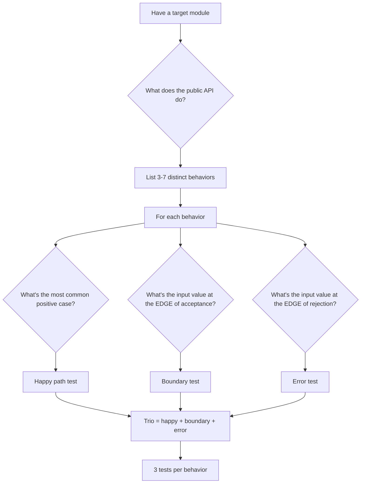
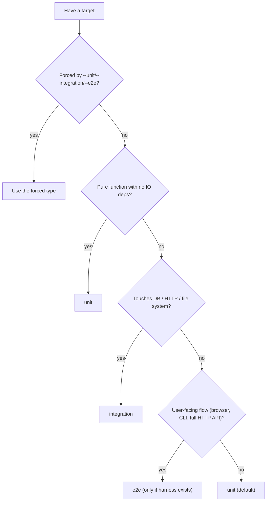
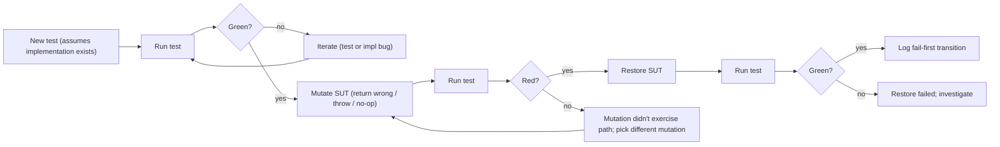

# `code-test` — how it works (diagrams)

## Phase flow

## Behavior-enumeration decision tree

## Test-type decision tree

## Fail-first protocol

## When --coverage is requested

```mermaid
flowchart LR
    P5["Phase 5 begin"] --> Suite["Run full suite"]
    Suite --> CovBefore["Snapshot coverage BEFORE the new tests"]
    CovBefore --> CovAfter["Snapshot coverage AFTER the new tests"]
    CovAfter --> Delta["Compute delta (lines, branches)"]
    Delta --> ReportTbl["Add delta table to report.md"]
    ReportTbl --> Gaps["Identify remaining gaps"]
    Gaps --> Residual["List remaining gaps in residual risk"]
```

Note: most coverage tools compare a single run's coverage against a baseline. The skill captures coverage from BEFORE running on HEAD (Phase 1), then again at Phase 5 with the new tests; the delta is computed by subtraction.
