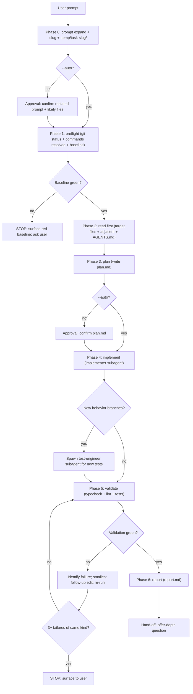
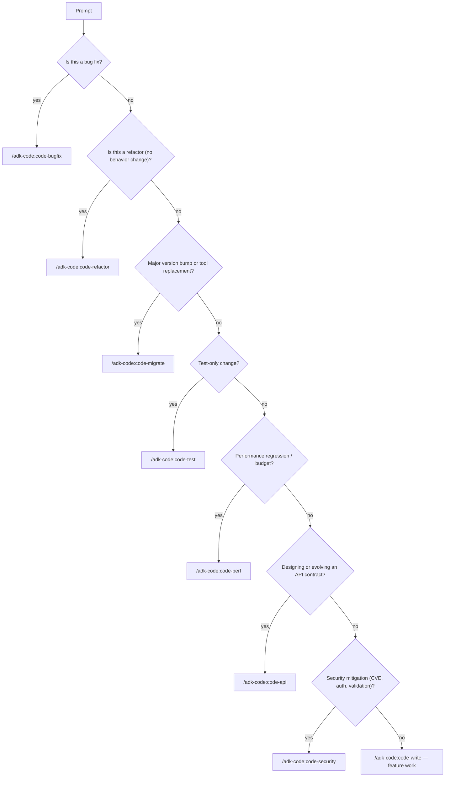
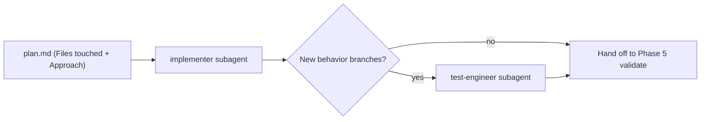
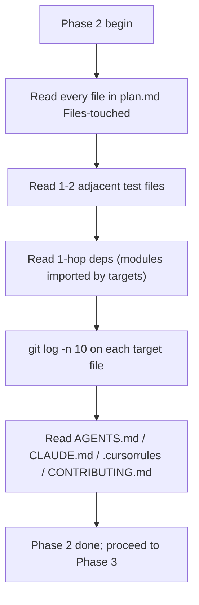

# `code-write` — how it works (diagrams)

## Phase flow

```mermaid
flowchart TD
    Prompt["User prompt"] --> P0["Phase 0: prompt expand + slug + .temp/task-slug/"]
    P0 --> Approve0{"--auto?"}
    Approve0 -- no --> Gate0["Approval: confirm restated prompt + likely files"]
    Approve0 -- yes --> P1
    Gate0 --> P1["Phase 1: preflight (git status + commands resolved + baseline)"]
    P1 --> Baseline{"Baseline green?"}
    Baseline -- no --> Stop1["STOP: surface red baseline; ask user"]
    Baseline -- yes --> P2["Phase 2: read first (target files + adjacent + AGENTS.md)"]
    P2 --> P3["Phase 3: plan (write plan.md)"]
    P3 --> Approve3{"--auto?"}
    Approve3 -- no --> Gate3["Approval: confirm plan.md"]
    Approve3 -- yes --> P4
    Gate3 --> P4["Phase 4: implement (implementer subagent)"]
    P4 --> NewBehavior{"New behavior branches?"}
    NewBehavior -- yes --> P4b["Spawn test-engineer subagent for new tests"]
    NewBehavior -- no --> P5
    P4b --> P5["Phase 5: validate (typecheck + lint + tests)"]
    P5 --> Result{"Validation green?"}
    Result -- no --> Fix["Identify failure; smallest follow-up edit; re-run"]
    Fix --> Loop{"3+ failures of same kind?"}
    Loop -- yes --> Stop2["STOP: surface to user"]
    Loop -- no --> P5
    Result -- yes --> P6["Phase 6: report (report.md)"]
    P6 --> Done["Hand-off: offer-depth question"]
```

## Decision tree — what kind of change is this?

```mermaid
flowchart TD
    Start["Prompt"] --> Q1{"Is this a bug fix?"}
    Q1 -- yes --> Bug["/adk-code:code-bugfix"]
    Q1 -- no --> Q2{"Is this a refactor (no behavior change)?"}
    Q2 -- yes --> Refactor["/adk-code:code-refactor"]
    Q2 -- no --> Q3{"Major version bump or tool replacement?"}
    Q3 -- yes --> Migrate["/adk-code:code-migrate"]
    Q3 -- no --> Q4{"Test-only change?"}
    Q4 -- yes --> Test["/adk-code:code-test"]
    Q4 -- no --> Q5{"Performance regression / budget?"}
    Q5 -- yes --> Perf["/adk-code:code-perf"]
    Q5 -- no --> Q6{"Designing or evolving an API contract?"}
    Q6 -- yes --> API["/adk-code:code-api"]
    Q6 -- no --> Q7{"Security mitigation (CVE, auth, validation)?"}
    Q7 -- yes --> Sec["/adk-code:code-security"]
    Q7 -- no --> Write["/adk-code:code-write — feature work"]
```

## Implementer + test-engineer dispatch (Phase 4)

```mermaid
flowchart LR
    Plan["plan.md (Files touched + Approach)"] --> Impl["implementer subagent"]
    Impl --> Behavior{"New behavior branches?"}
    Behavior -- yes --> Tester["test-engineer subagent"]
    Behavior -- no --> Done["Hand off to Phase 5 validate"]
    Tester --> Done
```

## Read-first protocol (Phase 2)

```mermaid
flowchart TD
    Start["Phase 2 begin"] --> Target["Read every file in plan.md Files-touched"]
    Target --> Tests["Read 1-2 adjacent test files"]
    Tests --> Hop1["Read 1-hop deps (modules imported by targets)"]
    Hop1 --> Commits["git log -n 10 on each target file"]
    Commits --> Conventions["Read AGENTS.md / CLAUDE.md / .cursorrules / CONTRIBUTING.md"]
    Conventions --> Done["Phase 2 done; proceed to Phase 3"]
```
