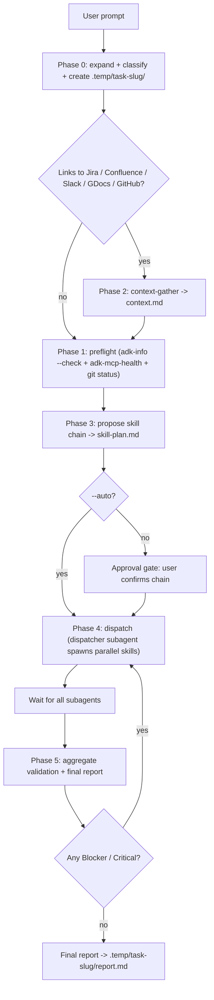
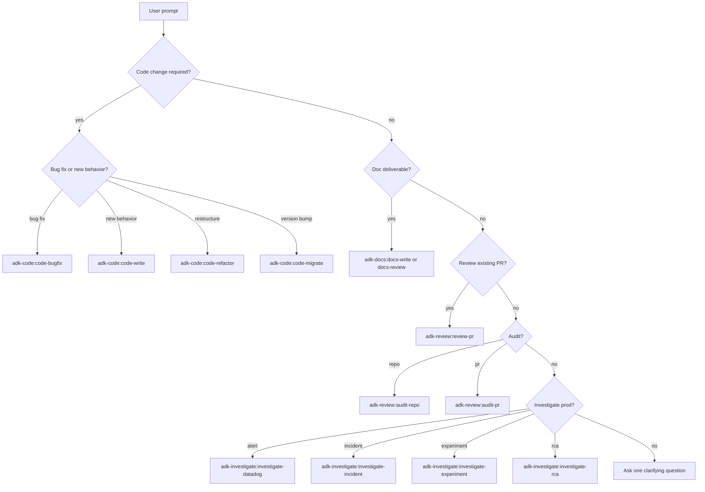
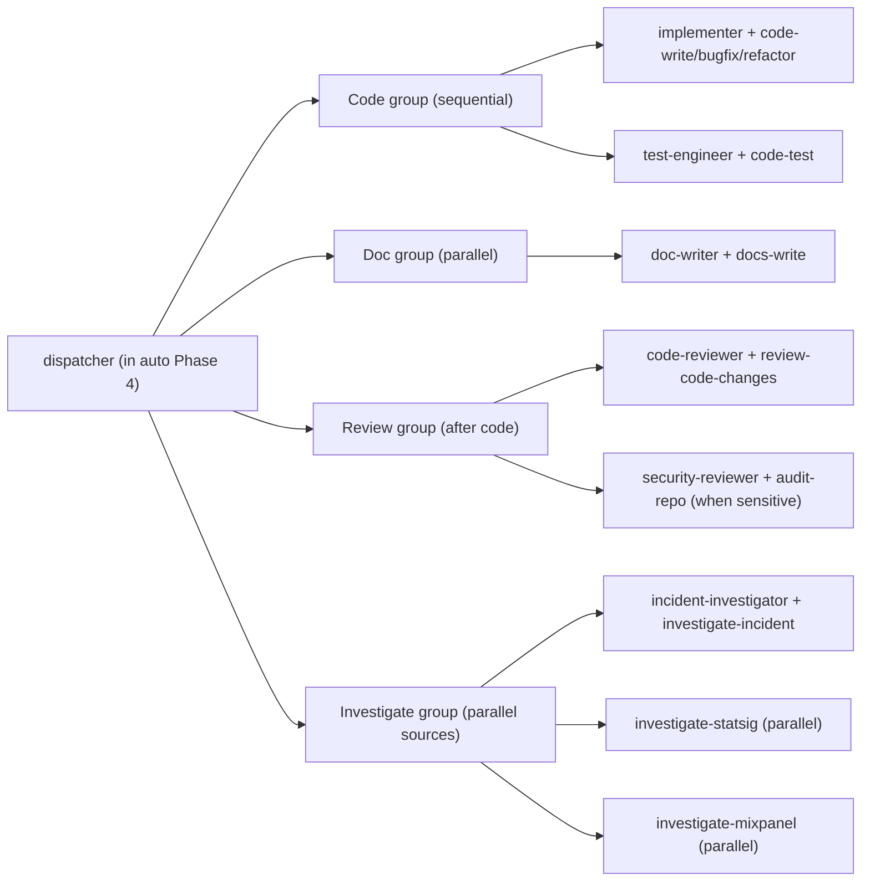

# `auto` — how it works (diagrams)

## Phase flow

```mermaid
flowchart TD
    Prompt["User prompt"] --> P0["Phase 0: expand + classify + create .temp/task-slug/"]
    P0 --> Links{"Links to Jira / Confluence / Slack / GDocs / GitHub?"}
    Links -- yes --> CG["Phase 2: context-gather -> context.md"]
    Links -- no --> P1
    CG --> P1["Phase 1: preflight (adk-info --check + adk-mcp-health + git status)"]
    P1 --> P3["Phase 3: propose skill chain -> skill-plan.md"]
    P3 --> Approve{"--auto?"}
    Approve -- no --> Gate["Approval gate: user confirms chain"]
    Approve -- yes --> P4
    Gate --> P4["Phase 4: dispatch (dispatcher subagent spawns parallel skills)"]
    P4 --> Wait["Wait for all subagents"]
    Wait --> P5["Phase 5: aggregate validation + final report"]
    P5 --> Verdict{"Any Blocker / Critical?"}
    Verdict -- yes --> P4
    Verdict -- no --> Done["Final report -> .temp/task-slug/report.md"]
```

## Verb classification decision tree

```mermaid
flowchart TD
    Start["User prompt"] --> Q1{"Code change required?"}
    Q1 -- yes --> Q2{"Bug fix or new behavior?"}
    Q2 -- bug fix --> BB["adk-code:code-bugfix"]
    Q2 -- new behavior --> BF["adk-code:code-write"]
    Q2 -- restructure --> BR["adk-code:code-refactor"]
    Q2 -- version bump --> BM["adk-code:code-migrate"]
    Q1 -- no --> Q4{"Doc deliverable?"}
    Q4 -- yes --> DW["adk-docs:docs-write or docs-review"]
    Q4 -- no --> Q5{"Review existing PR?"}
    Q5 -- yes --> RP["adk-review:review-pr"]
    Q5 -- no --> Q6{"Audit?"}
    Q6 -- repo --> AR["adk-review:audit-repo"]
    Q6 -- pr --> AP["adk-review:audit-pr"]
    Q6 -- no --> Q7{"Investigate prod?"}
    Q7 -- alert --> OD["adk-investigate:investigate-datadog"]
    Q7 -- incident --> OI["adk-investigate:investigate-incident"]
    Q7 -- experiment --> OE["adk-investigate:investigate-experiment"]
    Q7 -- rca --> RC["adk-investigate:investigate-rca"]
    Q7 -- no --> Ask["Ask one clarifying question"]
```

## Subagent dispatch groups

```mermaid
flowchart LR
    Dispatcher["dispatcher (in auto Phase 4)"] --> CodeGroup["Code group (sequential)"]
    Dispatcher --> DocGroup["Doc group (parallel)"]
    Dispatcher --> ReviewGroup["Review group (after code)"]
    Dispatcher --> InvGroup["Investigate group (parallel sources)"]
    CodeGroup --> Implementer["implementer + code-write/bugfix/refactor"]
    CodeGroup --> Tester["test-engineer + code-test"]
    DocGroup --> DocWriter["doc-writer + docs-write"]
    ReviewGroup --> CodeReviewer["code-reviewer + review-code-changes"]
    ReviewGroup --> SecReviewer["security-reviewer + audit-repo (when sensitive)"]
    InvGroup --> Incident["incident-investigator + investigate-incident"]
    InvGroup --> Statsig["investigate-statsig (parallel)"]
    InvGroup --> Mixpanel["investigate-mixpanel (parallel)"]
```

