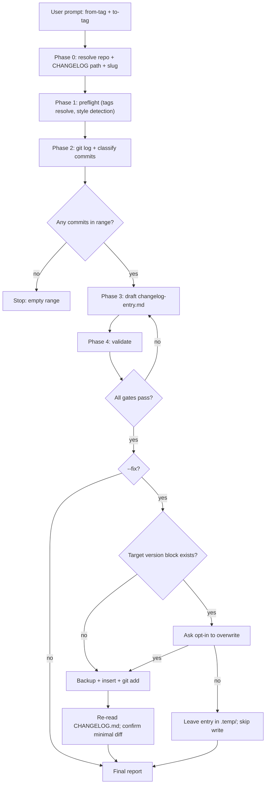
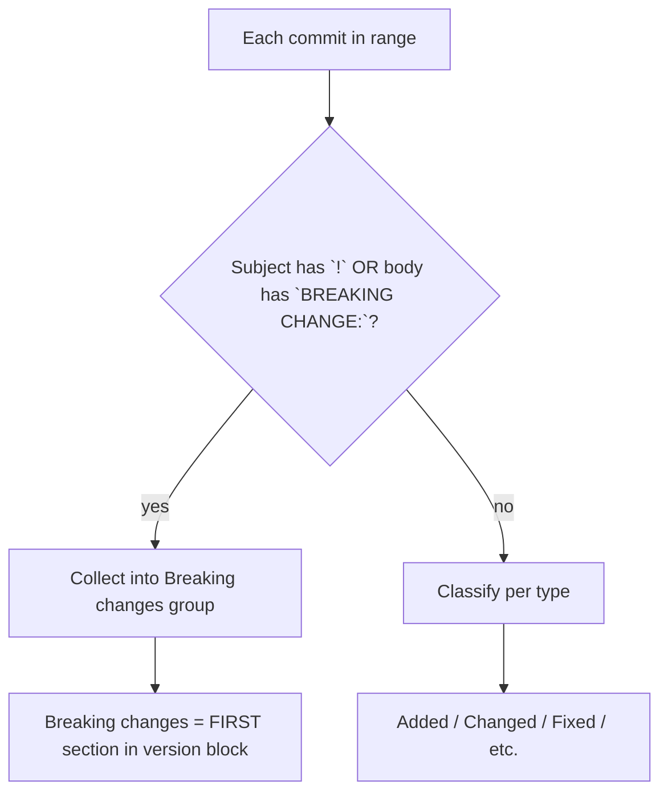

# `docs-changelog` — how it works (diagrams)

## Phase flow



## Style detection

```mermaid
flowchart TD
    Start["Read first 100 lines of CHANGELOG.md"] --> Kac{"`### Added` / `### Fixed` headers present?"}
    Kac -- yes --> KaC["keep-a-changelog"]
    Kac -- no --> Sem{"`## [X.Y.Z](compare-url) (YYYY-MM-DD)` pattern + `### Features` / `### Bug Fixes`?"}
    Sem -- yes --> SemR["semantic-release"]
    Sem -- no --> Free["free-form (mirror release-header pattern)"]
```

## Breaking-change surfacing


