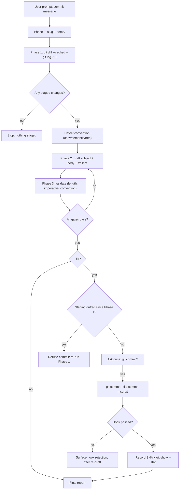
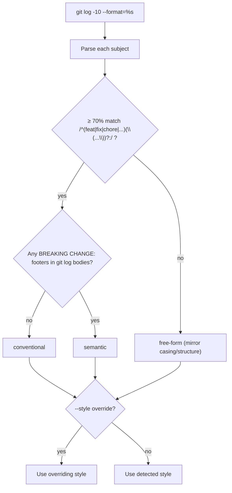
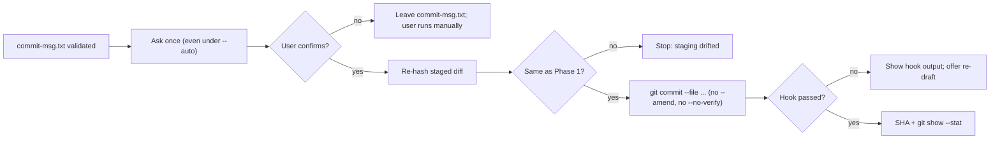

# `docs-commit-message` — how it works (diagrams)

## Phase flow

```mermaid
flowchart TD
    Start["User prompt: commit message"] --> P0["Phase 0: slug + .temp/"]
    P0 --> P1["Phase 1: git diff --cached + git log -10"]
    P1 --> Empty{"Any staged changes?"}
    Empty -- no --> Stop["Stop: nothing staged"]
    Empty -- yes --> Detect["Detect convention (conv/semantic/free)"]
    Detect --> P2["Phase 2: draft subject + body + trailers"]
    P2 --> P3["Phase 3: validate (length, imperative, convention)"]
    P3 --> Pass{"All gates pass?"}
    Pass -- no --> P2
    Pass -- yes --> FixMode{"--fix?"}
    FixMode -- no --> Report["Final report"]
    FixMode -- yes --> Drift{"Staging drifted since Phase 1?"}
    Drift -- yes --> Stop2["Refuse commit; re-run Phase 1"]
    Drift -- no --> Ask["Ask once: git commit?"]
    Ask -- yes --> Commit["git commit --file commit-msg.txt"]
    Commit --> Hook{"Hook passed?"}
    Hook -- no --> Surface["Surface hook rejection; offer re-draft"]
    Hook -- yes --> Record["Record SHA + git show --stat"]
    Record --> Report
```

## Convention detection

```mermaid
flowchart TD
    Start["git log -10 --format=%s"] --> Parse["Parse each subject"]
    Parse --> Conv{"≥ 70% match /^(feat|fix|chore|...)(\\(...\\))?:/ ?"}
    Conv -- yes --> SemanticCheck{"Any BREAKING CHANGE: footers in git log bodies?"}
    SemanticCheck -- yes --> Sem["semantic"]
    SemanticCheck -- no --> C["conventional"]
    Conv -- no --> Free["free-form (mirror casing/structure)"]
    C --> Override{"--style override?"}
    Sem --> Override
    Free --> Override
    Override -- yes --> Use["Use overriding style"]
    Override -- no --> KeepDetected["Use detected style"]
```

## `--fix` safety

```mermaid
flowchart LR
    Draft["commit-msg.txt validated"] --> Ask["Ask once (even under --auto)"]
    Ask --> Confirm{"User confirms?"}
    Confirm -- no --> Leave["Leave commit-msg.txt; user runs manually"]
    Confirm -- yes --> DriftCheck["Re-hash staged diff"]
    DriftCheck --> Same{"Same as Phase 1?"}
    Same -- no --> Stop["Stop: staging drifted"]
    Same -- yes --> Commit["git commit --file ... (no --amend, no --no-verify)"]
    Commit --> HookOK{"Hook passed?"}
    HookOK -- no --> Surface["Show hook output; offer re-draft"]
    HookOK -- yes --> Done["SHA + git show --stat"]
```
