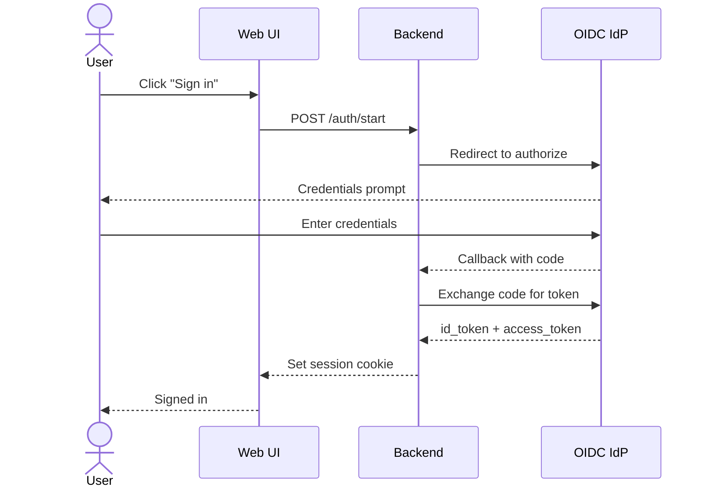
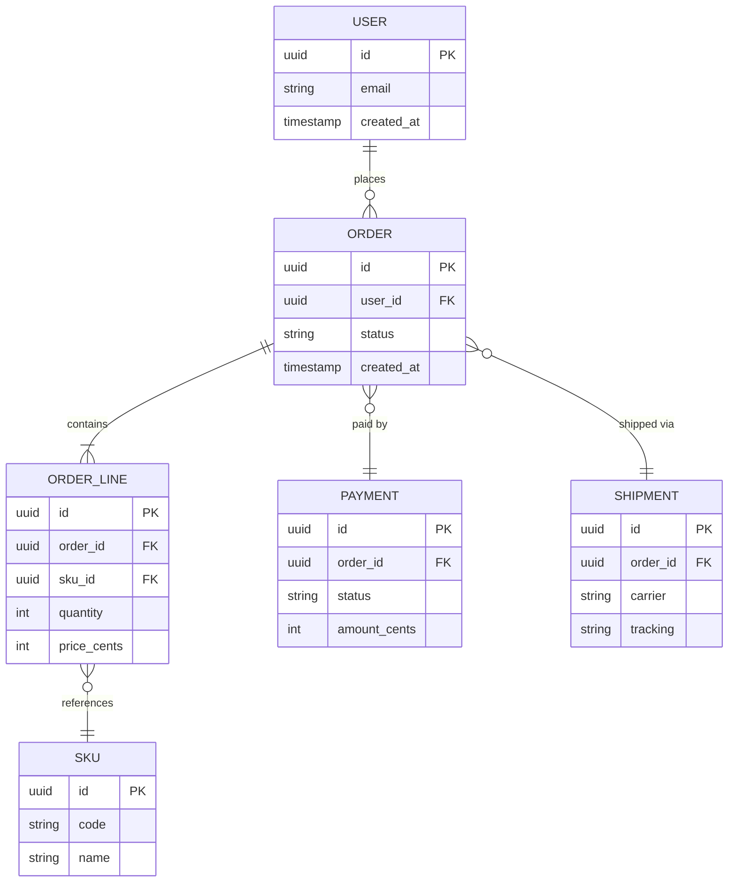
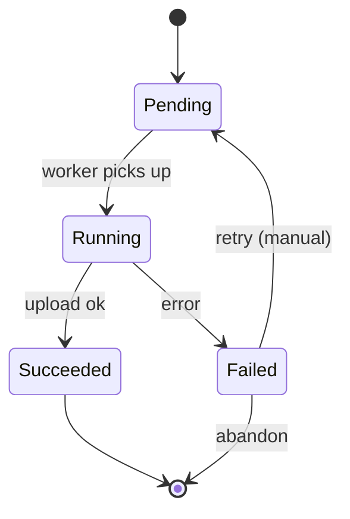
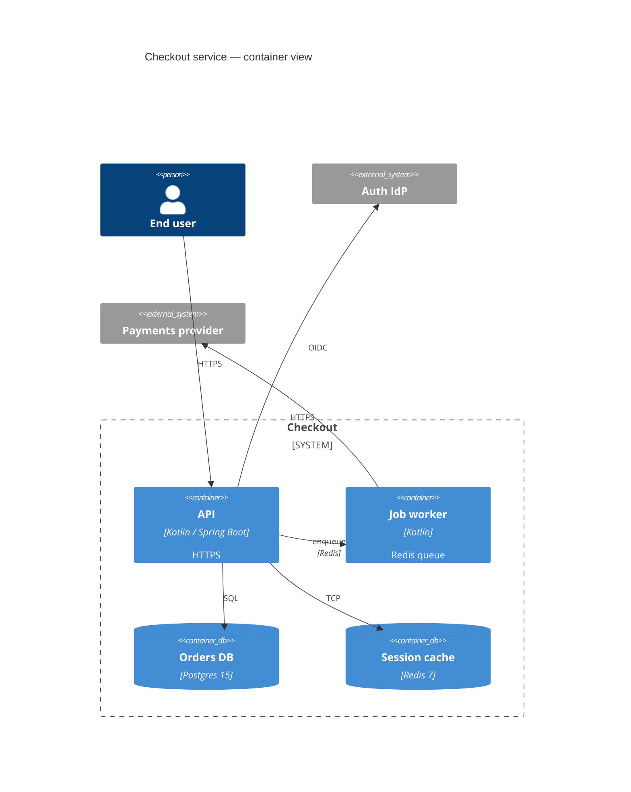

# `docs-diagram` — worked examples

## Example 1 — sequence for a login flow

**Prompt:** `/adk-docs:docs-diagram sequence "OIDC login"`

`oidc-login.mermaid`:



10 participants/messages. Under budget.

## Example 2 — ER for the orders schema

**Prompt:** `/adk-docs:docs-diagram er "orders schema" --scope db/schema.sql`

`orders-schema.mermaid`:



6 entities; grounded in `db/schema.sql`.

## Example 3 — state machine for export jobs

**Prompt:** `/adk-docs:docs-diagram state "export job lifecycle"`

`export-job-lifecycle.mermaid`:



4 states (plus start/end pseudo). Minimal.

## Example 4 — C4 container for checkout service

**Prompt:** `/adk-docs:docs-diagram c4 "checkout service" --scope services/checkout/`

`checkout-c4.mermaid`:



10 "boxes" (person + containers + external systems). Under budget.

## Example 5 — splitting a too-big diagram

**Prompt:** `/adk-docs:docs-diagram flowchart "full checkout architecture" --scope services/`

`elements.md` counts 23 nodes. The skill, under `--auto`, emits two files:

- `full-checkout.overview.mermaid` — 6 nodes: user, web, checkout, orders, payments, auth.
- `full-checkout.checkout-zoom.mermaid` — 9 nodes: the checkout service's internal components.

Report notes the split + suggests a third zoom-in if the orders
service internals are also of interest later.

## Example 6 — timeline for an incident

**Prompt:** `/adk-docs:docs-diagram timeline "2026-05-02 checkout outage"`

`checkout-outage-timeline.mermaid`:

```mermaid
%% 2026-05-02 checkout outage — drawn by adk-docs:docs-diagram on 2026-05-03 %%
timeline
    title 2026-05-02 Checkout Outage
    section Deploy
        12:58 : new version of checkout-api deployed (sha abc123)
    section Detection
        13:02 : DD monitor "checkout p99" fires
        13:04 : on-call acks in #platform-oncall
    section Mitigation
        13:12 : rollback started (git revert abc123)
        13:18 : rollback deployed; traffic shifting
    section Recovery
        13:22 : p99 recovered below SLO
        13:30 : incident closed
```

6 events. Short, readable.
