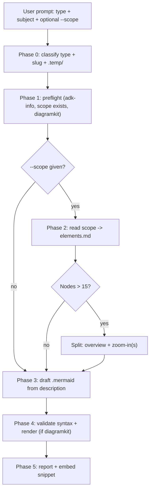
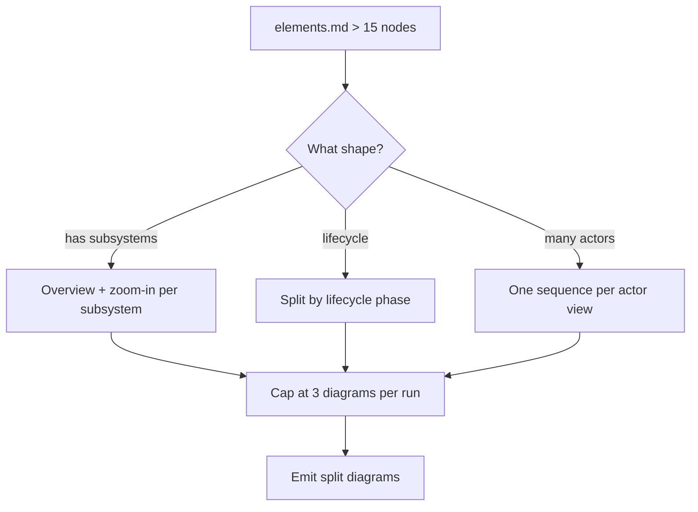

# `docs-diagram` — how it works (diagrams)

## Phase flow



## Type classifier

```mermaid
flowchart TD
    Prompt["Subject + context"] --> Q1{"Interaction between actors?"}
    Q1 -- yes --> Sequence["sequenceDiagram"]
    Q1 -- no --> Q2{"Lifecycle / status transitions?"}
    Q2 -- yes --> State["stateDiagram-v2"]
    Q2 -- no --> Q3{"Data entities + relations?"}
    Q3 -- yes --> ER["erDiagram"]
    Q3 -- no --> Q4{"UML class hierarchy?"}
    Q4 -- yes --> Class["classDiagram"]
    Q4 -- no --> Q5{"Architecture / containers?"}
    Q5 -- yes --> C4["C4Container"]
    Q5 -- no --> Q6{"Time-ordered events?"}
    Q6 -- durations --> Gantt["gantt"]
    Q6 -- events only --> Timeline["timeline"]
    Q6 -- no --> Q7{"Git branching?"}
    Q7 -- yes --> GitGraph["gitgraph"]
    Q7 -- no --> Q8{"Hierarchical outline?"}
    Q8 -- yes --> Mindmap["mindmap"]
    Q8 -- no --> Flowchart["flowchart (default)"]
```

## Split strategy selection


