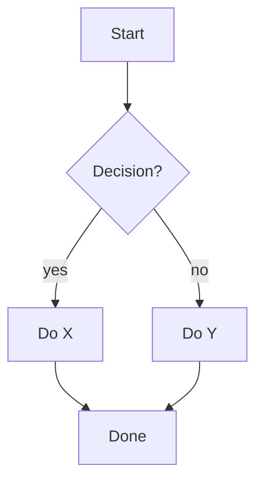
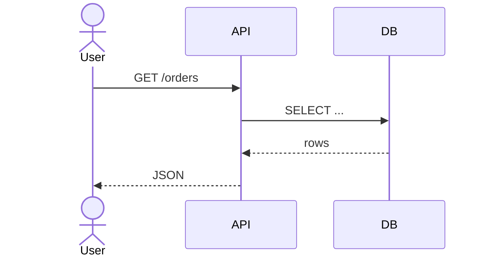
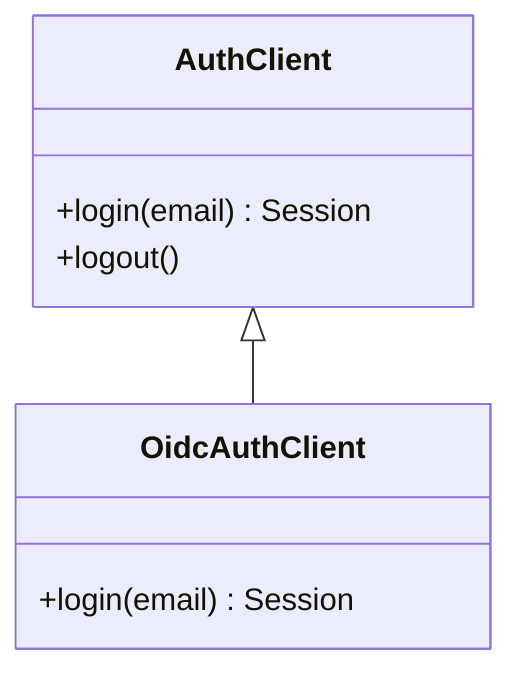
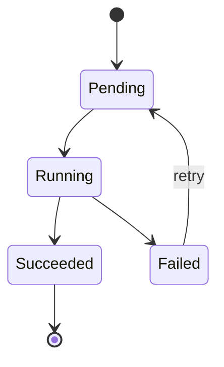
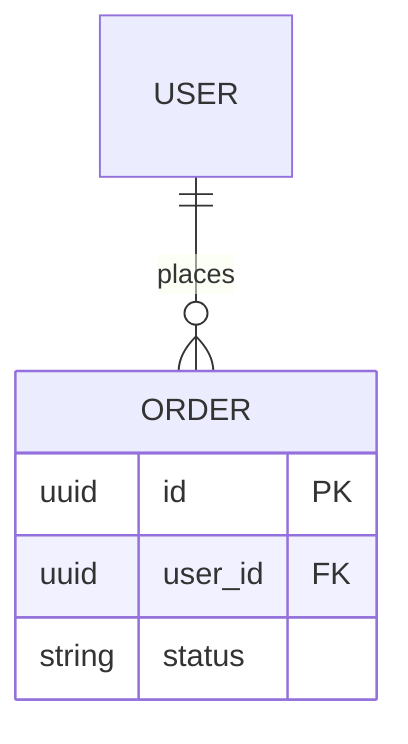
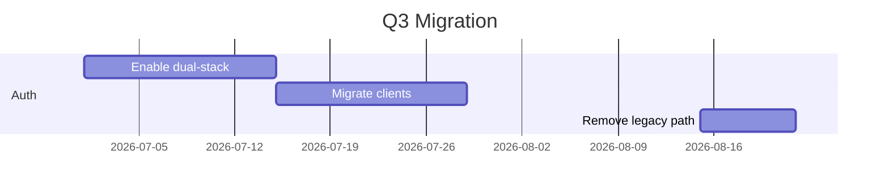
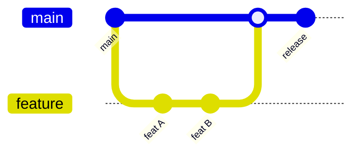
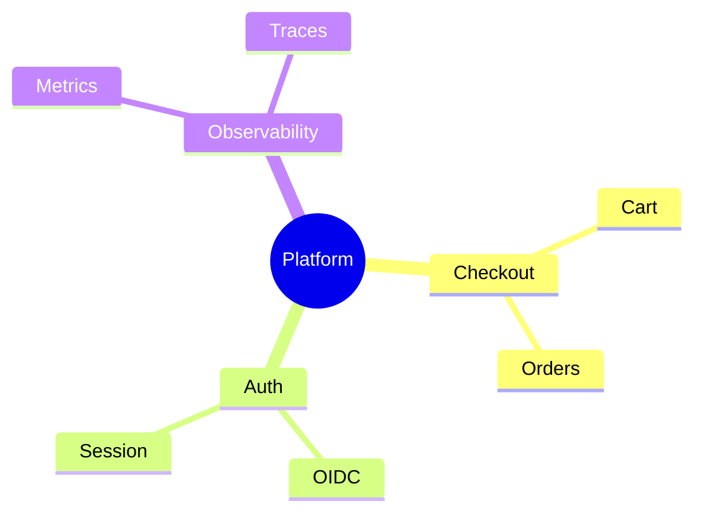
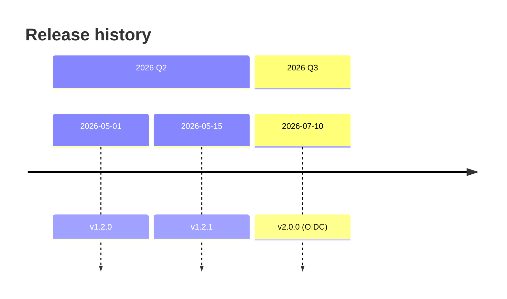
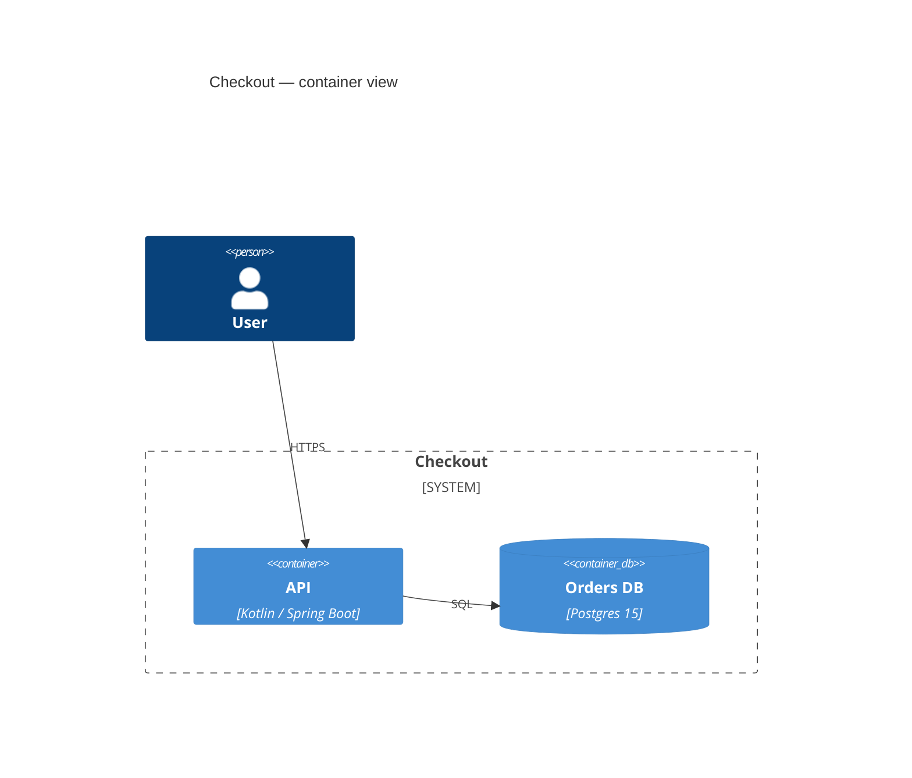

# Mermaid types catalog

The 10 diagram types `docs-diagram` supports, with when-to-use, sweet
spot, and minimal idiomatic syntax. Used by the type classifier and
the draft step.

## 1. flowchart — branching / decision / process

### When to use
- Conditional flow with decisions.
- Default when nothing else fits.

### Sweet spot
- 5-10 nodes, 3-7 edges, 1-2 decision diamonds.

### Syntax

## 2. sequenceDiagram — interactions over time

### When to use
- Request-response across services.
- Actor → system → actor flows.

### Sweet spot
- 3-5 participants, 5-15 messages.

### Syntax

## 3. classDiagram — UML class hierarchies

### When to use
- OOP hierarchy; inheritance; interfaces.
- SDK surface.

### Sweet spot
- 3-8 classes, clear interface/implementation distinction.

### Syntax

## 4. stateDiagram-v2 — lifecycle / state machine

### When to use
- Finite states with transitions.
- Order / job / resource lifecycle.

### Sweet spot
- 3-7 states, 4-10 transitions.

### Syntax

## 5. erDiagram — entity-relationship

### When to use
- Database schema overview.
- Data-domain model.

### Sweet spot
- 4-8 entities; relationships first, column lists second.

### Syntax

## 6. gantt — time-bound tasks with durations

### When to use
- Project / release / migration timeline.
- Tasks with start + duration, not just events.

### Sweet spot
- 5-10 tasks, 1-3 sections.

### Syntax

## 7. gitgraph — git branching model

### When to use
- Explaining the release branching / trunk model.
- Tracking a specific merge flow.

### Sweet spot
- 1-3 branches, 5-10 commits.

### Syntax

## 8. mindmap — hierarchical brainstorm

### When to use
- Concept decomposition.
- Feature hierarchy.

### Sweet spot
- 3 levels deep; 3-5 children per parent.

### Syntax

## 9. timeline — events over time

### When to use
- Event-ordered narrative (incident, release history).
- Events, not durations.

### Sweet spot
- 2-4 sections, 5-15 events total.

### Syntax

## 10. C4 — architecture (C4 model)

### When to use
- Architecture docs; system / container / component view.
- Cross-system boundaries.

### Sweet spot
- 4-8 containers + 1-3 external systems.

### Syntax

(Note: the exact C4 Mermaid syntax may need the `C4Context`,
`C4Container`, or `C4Component` variant depending on zoom level;
pick based on the subject.)

## Type → file extension

All 10 types go into `.mermaid` files. GitHub / Confluence /
diagramkit all render via the first-line declaration
(`sequenceDiagram`, `flowchart TD`, etc.).
