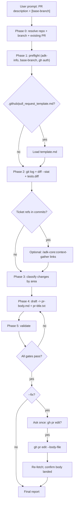
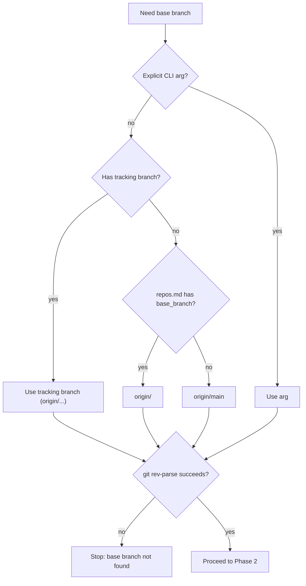
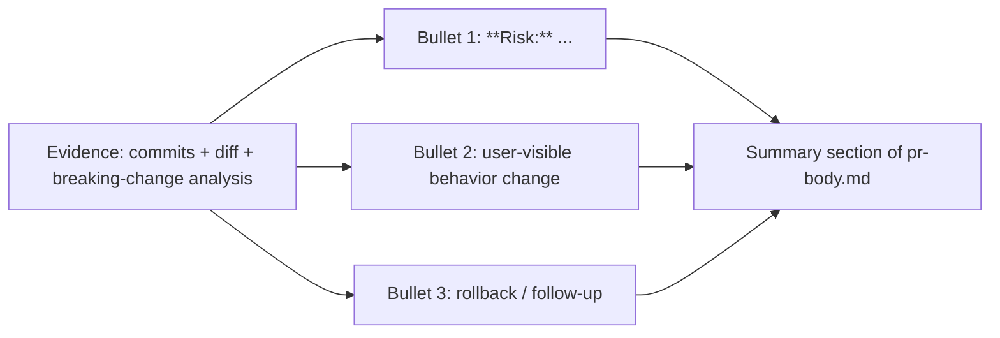

# `docs-pr-description` — how it works (diagrams)

## Phase flow

```mermaid
flowchart TD
    Start["User prompt: PR description + [base-branch]"] --> P0["Phase 0: resolve repo + branch + existing PR"]
    P0 --> P1["Phase 1: preflight (adk-info, base-branch, gh auth)"]
    P1 --> TemplateExists{".github/pull_request_template.md?"}
    TemplateExists -- yes --> LoadT["Load template.md"]
    TemplateExists -- no --> Gather
    LoadT --> Gather["Phase 2: git log + diff --stat + tests.diff"]
    Gather --> Tickets{"Ticket refs in commits?"}
    Tickets -- yes --> CtxGather["Optional: /adk-core:context-gather links"]
    Tickets -- no --> P3
    CtxGather --> P3["Phase 3: classify changes by area"]
    P3 --> P4["Phase 4: draft -> pr-body.md + pr-title.txt"]
    P4 --> V["Phase 5: validate"]
    V --> Pass{"All gates pass?"}
    Pass -- no --> P4
    Pass -- yes --> FixMode{"--fix?"}
    FixMode -- no --> Report["Final report"]
    FixMode -- yes --> Ask["Ask once: gh pr edit?"]
    Ask -- yes --> Edit["gh pr edit --body-file"]
    Edit --> Refetch["Re-fetch; confirm body landed"]
    Refetch --> Report
```

## Base-branch resolution

```mermaid
flowchart TD
    Start["Need base branch"] --> Arg{"Explicit CLI arg?"}
    Arg -- yes --> Use["Use arg"]
    Arg -- no --> Track{"Has tracking branch?"}
    Track -- yes --> UseTrack["Use tracking branch (origin/...)"]
    Track -- no --> RepoDef{"repos.md has base_branch?"}
    RepoDef -- yes --> UseRepoDef["origin/<base_branch>"]
    RepoDef -- no --> UseMain["origin/main"]
    UseTrack --> Exists{"git rev-parse succeeds?"}
    UseRepoDef --> Exists
    UseMain --> Exists
    Use --> Exists
    Exists -- no --> Stop["Stop: base branch not found"]
    Exists -- yes --> Proceed["Proceed to Phase 2"]
```

## Risk-first summary ordering

```mermaid
flowchart LR
    Evidence["Evidence: commits + diff + breaking-change analysis"] --> RiskBullet["Bullet 1: **Risk:** ..."]
    Evidence --> BehaviorBullet["Bullet 2: user-visible behavior change"]
    Evidence --> FollowBullet["Bullet 3: rollback / follow-up"]
    RiskBullet --> Body["Summary section of pr-body.md"]
    BehaviorBullet --> Body
    FollowBullet --> Body
```
