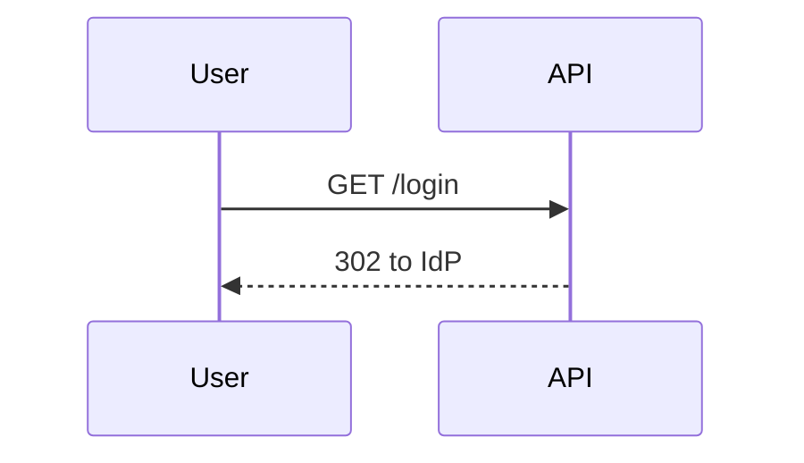

# `docs-publish-confluence` — worked examples

## Example 1 — create a new page

**Prompt:** `/adk-docs:docs-publish-confluence docs/runbooks/oncall.md --space ENG --parent "Runbooks"`

**Phase 0:**
- `<md-file>` = `docs/runbooks/oncall.md`.
- Title = "Runbook: Platform on-call rotation" (from H1).
- Space = `ENG`, parent = `"Runbooks"`.
- Slug = `publish-conf-oncall`.

**Phase 1:** workspace Atlassian connector is connected. Space
`ENG` exists. Parent "Runbooks" page exists (page id `8801`).

**Phase 2:** converted to `storage.xhtml`. 1 admonition →
`ac:structured-macro` info panel. 0 mermaid fences.

**Phase 3:** existence check — no page titled "Runbook: Platform
on-call rotation" under parent `8801` in `ENG`. Action = `new`.

**Phase 4 ask:**

```
Publish docs/runbooks/oncall.md as "Runbook: Platform on-call
rotation" to space=ENG, parent="Runbooks"?
Action: new
[yes / no / diff]
```

User confirms. Connector `create-page` returns page id `12345`,
version `1`.

**Phase 5:** re-fetch succeeds; storage matches; labels
`["adk-published", "runbook"]` set. Report includes the final URL.

## Example 2 — update an existing bot-authored page

**Prompt:** `/adk-docs:docs-publish-confluence docs/adr/0007-oidc.md --space ENG --parent "ADRs" --auto`

**Phase 3:** existence check — found page id `13500` under parent
"ADRs". Last editor: `adk-bot@acme.com` (bot). Last updated 8 days
ago. Action = `update`.

**Phase 4 ask (even under `--auto`):**

```
Publish docs/adr/0007-oidc.md as "ADR-0007: OIDC for
service-to-service auth" to space=ENG, parent="ADRs"?
Action: update (existing page id 13500, version 3, last editor
adk-bot@acme.com 2026-04-25)
[yes / no / diff]
```

Confirm. Connector `update-page` returns version `4`.

**Phase 5:** verify. Report includes URL + version bump.

## Example 3 — refuse to overwrite a human-authored page

**Prompt:** `/adk-docs:docs-publish-confluence docs/guides/auth-overview.md --space ENG --parent "Engineering Home" --auto`

**Phase 3:** found page id `9001`. Last editor:
`sujeet@onequince.com` (human). Last updated 2 hours ago. Action =
`defer`.

**Phase 4:**

```
Existing page "Authentication Overview" (id 9001, version 12) was
last edited by sujeet@onequince.com 2 hours ago (a human, not a
bot).

Publishing would overwrite this work. Default action: DEFER.

Options:
- `yes, update` — update anyway (opt-in)
- `no` / `defer` — leave the page untouched (default)
- `diff` — show the diff between current page and new draft
```

Under `--auto`, the skill defaults to `defer` on this branch — the
ask isn't skipped and the "yes, update" response must be explicit.

## Example 4 — conflict mid-run (409)

**Phase 4:** `update-page` returns 409 (someone edited between
Phase 3 and Phase 4).

**Phase 4b:** refresh existence check. Last editor changed.
Show the new last-editor + ask again. Don't silently retry.

## Example 5 — Mermaid code fence conversion

**Input (`.md`):**

````
## OIDC flow


````

**Output (`storage.xhtml`, excerpt):**

```xml
<h2>OIDC flow</h2>
<ac:structured-macro ac:name="mermaid">
  <ac:parameter ac:name="theme">default</ac:parameter>
  <ac:plain-text-body><![CDATA[sequenceDiagram
    User->>API: GET /login
    API-->>User: 302 to IdP]]></ac:plain-text-body>
</ac:structured-macro>
```

Confluence renders this as a native Mermaid diagram (assuming the
Mermaid macro plugin is enabled in the space, which the connector
reports during Phase 1; if it's missing, the skill falls back to
a `<ac:structured-macro ac:name="code">` fence with language
`mermaid` and surfaces the missing-plugin hint in the report).
