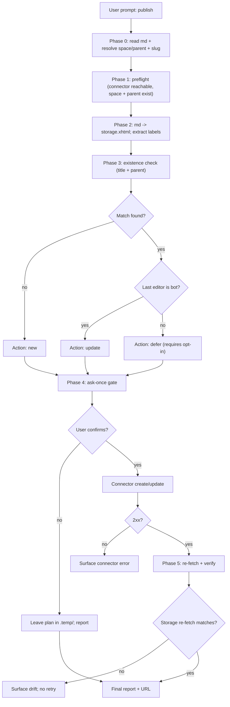
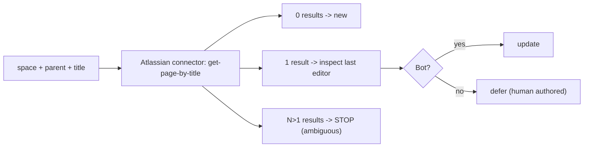
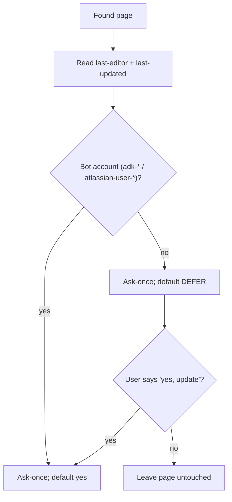

# `docs-publish-confluence` — how it works (diagrams)

## Phase flow

```mermaid
flowchart TD
    Start["User prompt: publish <md-file>"] --> P0["Phase 0: read md + resolve space/parent + slug"]
    P0 --> P1["Phase 1: preflight (connector reachable, space + parent exist)"]
    P1 --> P2["Phase 2: md -> storage.xhtml; extract labels"]
    P2 --> P3["Phase 3: existence check (title + parent)"]
    P3 --> Found{"Match found?"}
    Found -- no --> Action1["Action: new"]
    Found -- yes --> Bot{"Last editor is bot?"}
    Bot -- yes --> Action2["Action: update"]
    Bot -- no --> Action3["Action: defer (requires opt-in)"]
    Action1 --> P4
    Action2 --> P4
    Action3 --> P4["Phase 4: ask-once gate"]
    P4 --> Confirm{"User confirms?"}
    Confirm -- no --> Defer["Leave plan in .temp/; report"]
    Confirm -- yes --> Write["Connector create/update"]
    Write --> Ok{"2xx?"}
    Ok -- no --> Surface["Surface connector error"]
    Ok -- yes --> P5["Phase 5: re-fetch + verify"]
    P5 --> Match{"Storage re-fetch matches?"}
    Match -- no --> SurfaceDrift["Surface drift; no retry"]
    Match -- yes --> Report["Final report + URL"]
    Defer --> Report
```

## Existence check

```mermaid
flowchart LR
    Query["space + parent + title"] --> Connector["Atlassian connector: get-page-by-title"]
    Connector --> Zero["0 results -> new"]
    Connector --> One["1 result -> inspect last editor"]
    Connector --> Many["N>1 results -> STOP (ambiguous)"]
    One --> Bot{"Bot?"}
    Bot -- yes --> Update["update"]
    Bot -- no --> Defer["defer (human authored)"]
```

## Human-editor safeguard

```mermaid
flowchart TD
    Found["Found page"] --> Check["Read last-editor + last-updated"]
    Check --> Bot{"Bot account (adk-* / atlassian-user-*)?"}
    Bot -- yes --> Proceed["Ask-once; default yes"]
    Bot -- no --> Conservative["Ask-once; default DEFER"]
    Conservative --> Override{"User says 'yes, update'?"}
    Override -- yes --> Proceed
    Override -- no --> Leave["Leave page untouched"]
```
