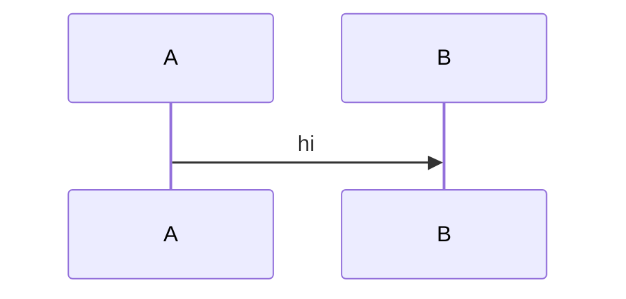

# Markdown → Confluence storage format conversion

Confluence storage format is an XHTML dialect. Most markdown converts
mechanically; the gotchas are: code fences, mermaid, admonitions,
tables, and internal-wiki links.

## Mechanical mappings

| Markdown | Confluence storage |
| --- | --- |
| `# H1` | `<h1>...</h1>` |
| `## H2` | `<h2>...</h2>` |
| `**bold**` | `<strong>...</strong>` |
| `*italic*` | `<em>...</em>` |
| `` `inline` `` | `<code>...</code>` |
| `[text](url)` | `<a href="url">text</a>` |
| `` | `<ac:image><ri:url ri:value="src"/></ac:image>` |
| ordered list | `<ol><li>...</li></ol>` |
| unordered list | `<ul><li>...</li></ul>` |
| blockquote | `<blockquote>...</blockquote>` |
| hr (`---`) | `<hr/>` |
| table | `<table><tbody><tr><td>...</td></tr></tbody></table>` |

## Code fences

A fenced code block becomes a `ac:structured-macro ac:name="code"`.

Input:

````
```bash
echo "hi"
```
````

Output:

```xml
<ac:structured-macro ac:name="code">
  <ac:parameter ac:name="language">bash</ac:parameter>
  <ac:plain-text-body><![CDATA[echo "hi"]]></ac:plain-text-body>
</ac:structured-macro>
```

### Language tag mapping

| Markdown lang | Confluence language |
| --- | --- |
| (none) | `none` |
| `bash` / `shell` / `sh` | `bash` |
| `js` / `javascript` | `js` |
| `ts` / `typescript` | `typescript` |
| `py` / `python` | `python` |
| `kotlin` / `kt` | `kotlin` |
| `go` | `go` |
| `yaml` / `yml` | `yaml` |
| `json` | `json` |
| `sql` | `sql` |
| `diff` | `diff` |

Unknown languages default to `none`.

## Mermaid fences

Input:

````

````

Output (if Mermaid macro is installed in the space):

```xml
<ac:structured-macro ac:name="mermaid">
  <ac:parameter ac:name="theme">default</ac:parameter>
  <ac:plain-text-body><![CDATA[sequenceDiagram
    A->>B: hi]]></ac:plain-text-body>
</ac:structured-macro>
```

If the Mermaid macro isn't installed (detected during Phase 1),
fall back to a `code` macro with `language="mermaid"` and surface
the missing-plugin hint in the report.

## Admonitions

Markdown extended admonitions:

```
> [!NOTE]
> This is a note.

> [!WARNING]
> Watch out.

> [!TIP]
> Pro-tip.
```

→ Confluence info / warning / tip panels:

```xml
<ac:structured-macro ac:name="info">
  <ac:rich-text-body>This is a note.</ac:rich-text-body>
</ac:structured-macro>
```

Types: `note` / `info` / `tip` / `warning` / `caution` / `danger` →
`info` / `info` / `tip` / `warning` / `warning` / `warning`
(Confluence only has 3 panels; map conservatively).

## Internal links

- Markdown link to a sibling `.md` file: `[Foo](../bar.md)` — if
  `bar.md` is also being published to Confluence and its page id is
  known, rewrite to a Confluence page link:
  ```xml
  <ac:link><ri:page ri:content-title="Bar"/><ac:plain-text-link-body><![CDATA[Foo]]></ac:plain-text-link-body></ac:link>
  ```
- Otherwise, rewrite to an absolute repo URL (e.g. GitHub blob URL)
  so the link still resolves.

## Anchors

- Markdown `[Foo](#foo)` → `<a href="#foo">Foo</a>`. Confluence
  auto-generates anchors from heading text; the link should resolve.

## Frontmatter

- Strip the leading frontmatter block (`---\n...\n---`).
- Extract `title:` (optional), `labels:` (optional), `toc:` (if set
  to `true`, insert `<ac:structured-macro ac:name="toc"/>` after
  the first heading).

## Escape rules

- `<` and `>` inside text become `&lt;` and `&gt;`.
- `&` becomes `&amp;`.
- `"` inside attributes becomes `&quot;`.
- Content inside `<ac:plain-text-body><![CDATA[...]]>` is NOT
  escaped (CDATA protects).

## What doesn't survive

- HTML comments (`<!-- ... -->`) — stripped during conversion.
- Inline JavaScript / `<script>` — forbidden; rejected by the
  validator.
- Inline raw HTML beyond the supported tags — surface in the report
  as an unconverted fragment.
