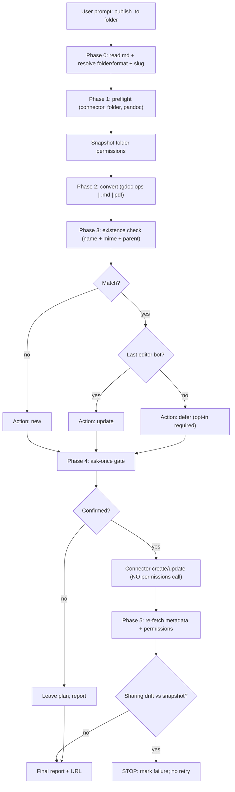
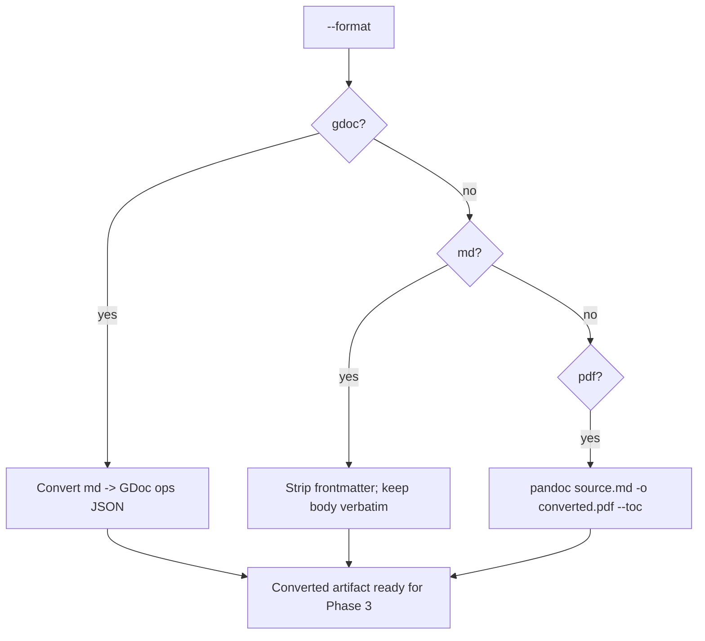
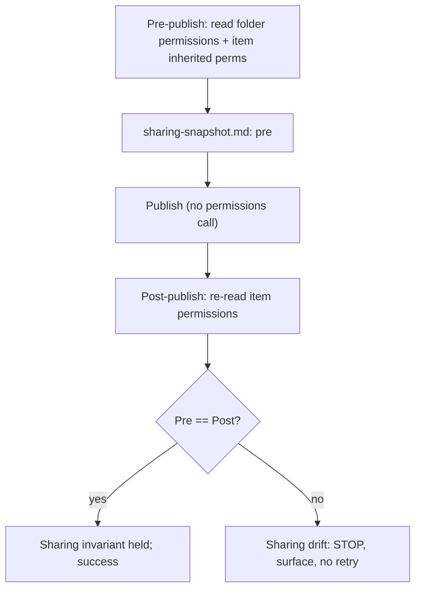

# `docs-publish-gdrive` — how it works (diagrams)

## Phase flow

```mermaid
flowchart TD
    Start["User prompt: publish <md-file> to folder"] --> P0["Phase 0: read md + resolve folder/format + slug"]
    P0 --> P1["Phase 1: preflight (connector, folder, pandoc)"]
    P1 --> Snap["Snapshot folder permissions"]
    Snap --> P2["Phase 2: convert (gdoc ops | .md | pdf)"]
    P2 --> P3["Phase 3: existence check (name + mime + parent)"]
    P3 --> Found{"Match?"}
    Found -- no --> New["Action: new"]
    Found -- yes --> Bot{"Last editor bot?"}
    Bot -- yes --> Upd["Action: update"]
    Bot -- no --> Defer["Action: defer (opt-in required)"]
    New --> P4["Phase 4: ask-once gate"]
    Upd --> P4
    Defer --> P4
    P4 --> Go{"Confirmed?"}
    Go -- no --> Leave["Leave plan; report"]
    Go -- yes --> Write["Connector create/update (NO permissions call)"]
    Write --> P5["Phase 5: re-fetch metadata + permissions"]
    P5 --> Drift{"Sharing drift vs snapshot?"}
    Drift -- yes --> Fail["STOP: mark failure; no retry"]
    Drift -- no --> Report["Final report + URL"]
    Leave --> Report
```

## Format branch

```mermaid
flowchart TD
    Format["--format"] --> G{"gdoc?"}
    G -- yes --> ConvertG["Convert md -> GDoc ops JSON"]
    G -- no --> M{"md?"}
    M -- yes --> StripMD["Strip frontmatter; keep body verbatim"]
    M -- no --> P{"pdf?"}
    P -- yes --> Pandoc["pandoc source.md -o converted.pdf --toc"]
    ConvertG --> Ready
    StripMD --> Ready
    Pandoc --> Ready["Converted artifact ready for Phase 3"]
```

## Sharing-policy invariant

```mermaid
flowchart TD
    Pre["Pre-publish: read folder permissions + item inherited perms"] --> Snapshot["sharing-snapshot.md: pre"]
    Snapshot --> Publish["Publish (no permissions call)"]
    Publish --> Post["Post-publish: re-read item permissions"]
    Post --> Compare{"Pre == Post?"}
    Compare -- yes --> Ok["Sharing invariant held; success"]
    Compare -- no --> Stop["Sharing drift: STOP, surface, no retry"]
```
