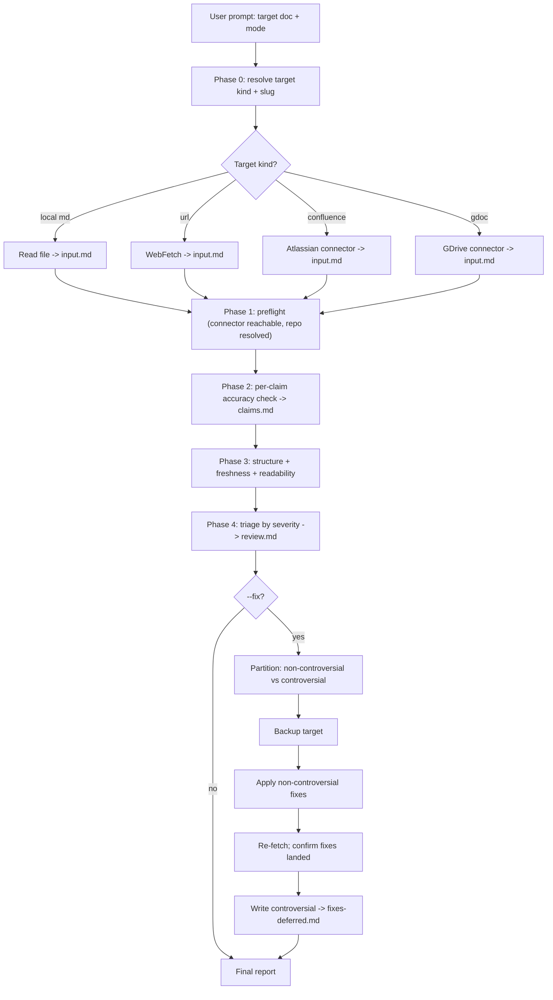
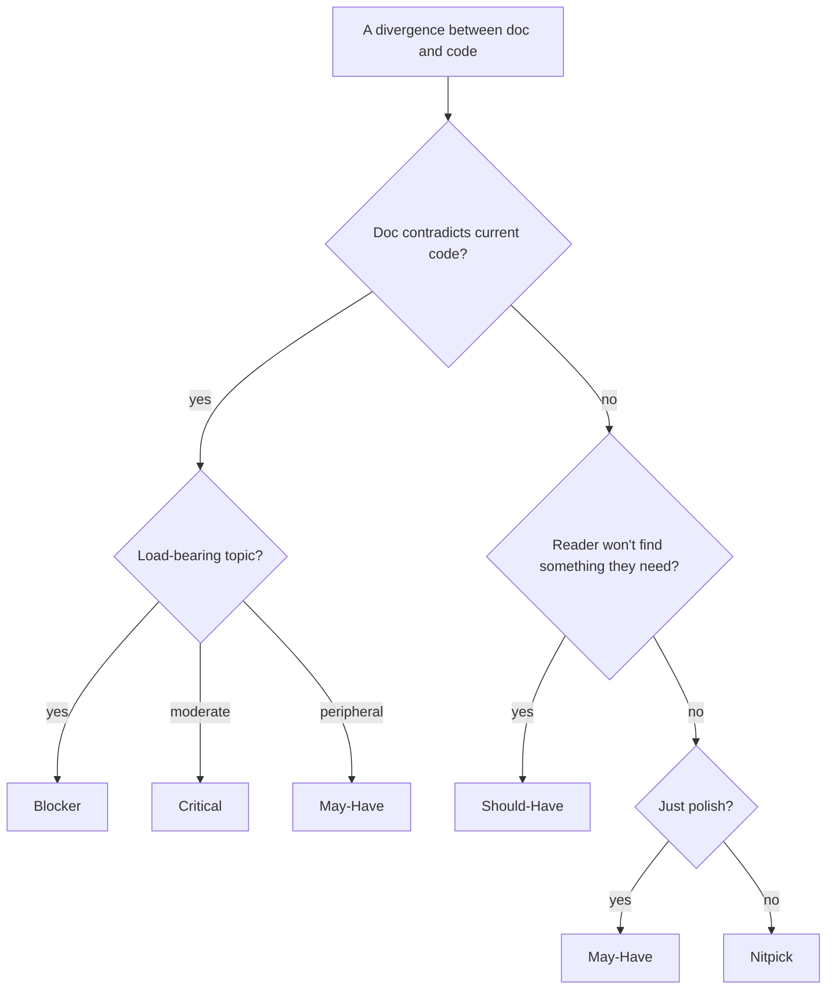
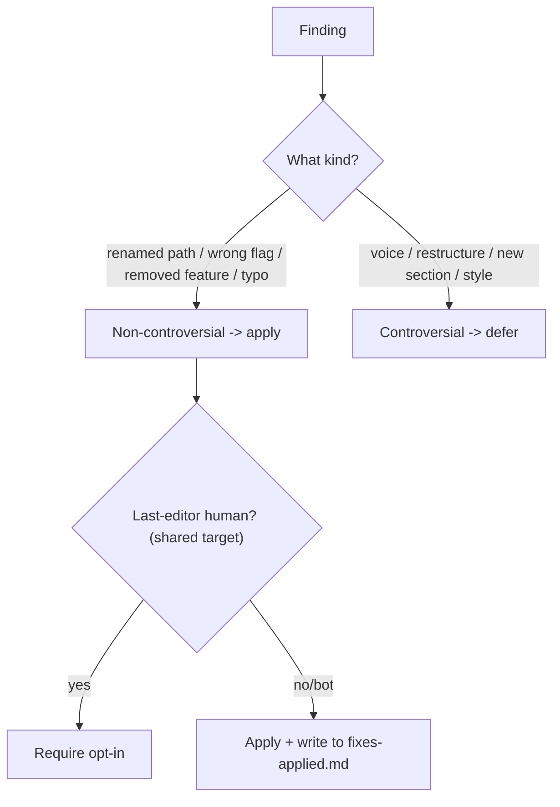

# `docs-review` — how it works (diagrams)

## Phase flow

```mermaid
flowchart TD
    Prompt["User prompt: target doc + mode"] --> P0["Phase 0: resolve target kind + slug"]
    P0 --> TargetKind{"Target kind?"}
    TargetKind -- local md --> Read["Read file -> input.md"]
    TargetKind -- url --> Fetch["WebFetch -> input.md"]
    TargetKind -- confluence --> Atl["Atlassian connector -> input.md"]
    TargetKind -- gdoc --> GDrive["GDrive connector -> input.md"]
    Read --> P1["Phase 1: preflight (connector reachable, repo resolved)"]
    Fetch --> P1
    Atl --> P1
    GDrive --> P1
    P1 --> P2["Phase 2: per-claim accuracy check -> claims.md"]
    P2 --> P3["Phase 3: structure + freshness + readability"]
    P3 --> P4["Phase 4: triage by severity -> review.md"]
    P4 --> FixMode{"--fix?"}
    FixMode -- no --> Report
    FixMode -- yes --> Partition["Partition: non-controversial vs controversial"]
    Partition --> Backup["Backup target"]
    Backup --> Apply["Apply non-controversial fixes"]
    Apply --> Revalidate["Re-fetch; confirm fixes landed"]
    Revalidate --> Defer["Write controversial -> fixes-deferred.md"]
    Defer --> Report["Final report"]
```

## Severity decision

```mermaid
flowchart TD
    Finding["A divergence between doc and code"] --> Q1{"Doc contradicts current code?"}
    Q1 -- no --> Q2{"Reader won't find something they need?"}
    Q1 -- yes --> Q3{"Load-bearing topic?"}
    Q3 -- yes --> B["Blocker"]
    Q3 -- moderate --> C["Critical"]
    Q3 -- peripheral --> M["May-Have"]
    Q2 -- yes --> SH["Should-Have"]
    Q2 -- no --> Q4{"Just polish?"}
    Q4 -- yes --> MH["May-Have"]
    Q4 -- no --> N["Nitpick"]
```

## `--fix` classifier

```mermaid
flowchart TD
    F["Finding"] --> Kind{"What kind?"}
    Kind -- renamed path / wrong flag / removed feature / typo --> NC["Non-controversial -> apply"]
    Kind -- voice / restructure / new section / style --> Controv["Controversial -> defer"]
    NC --> LastEd{"Last-editor human? (shared target)"}
    LastEd -- yes --> Optin["Require opt-in"]
    LastEd -- no/bot --> Apply["Apply + write to fixes-applied.md"]
```
