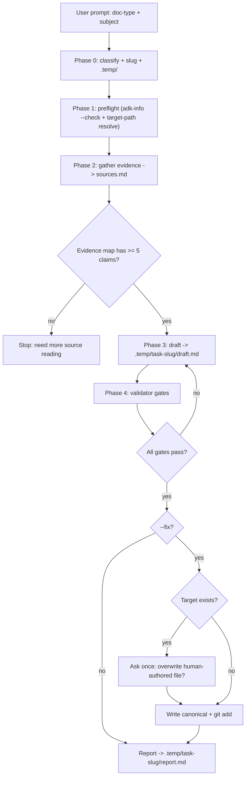
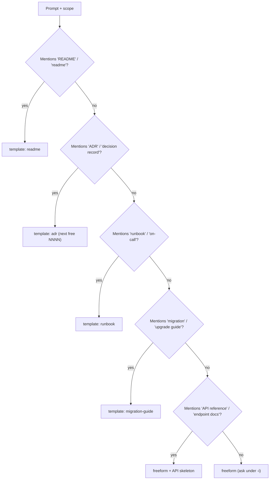
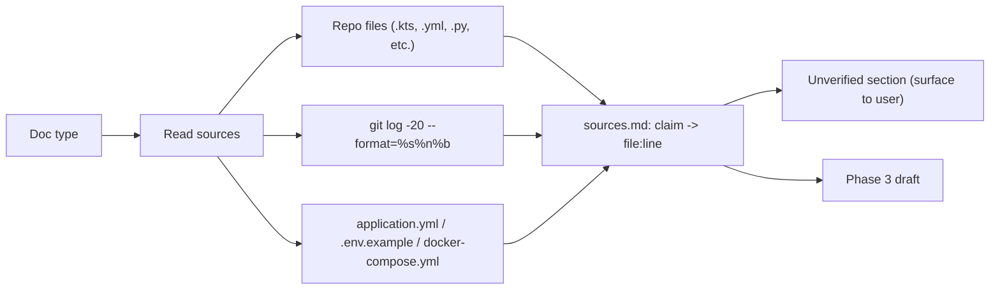

# `docs-write` — how it works (diagrams)

## Phase flow

```mermaid
flowchart TD
    Prompt["User prompt: doc-type + subject"] --> P0["Phase 0: classify + slug + .temp/"]
    P0 --> P1["Phase 1: preflight (adk-info --check + target-path resolve)"]
    P1 --> P2["Phase 2: gather evidence -> sources.md"]
    P2 --> HasEvidence{"Evidence map has >= 5 claims?"}
    HasEvidence -- no --> Stop["Stop: need more source reading"]
    HasEvidence -- yes --> P3["Phase 3: draft -> .temp/task-slug/draft.md"]
    P3 --> P4["Phase 4: validator gates"]
    P4 --> Pass{"All gates pass?"}
    Pass -- no --> P3
    Pass -- yes --> FixMode{"--fix?"}
    FixMode -- no --> Report["Report -> .temp/task-slug/report.md"]
    FixMode -- yes --> Overwrite{"Target exists?"}
    Overwrite -- yes --> Ask["Ask once: overwrite human-authored file?"]
    Ask --> Write["Write canonical + git add"]
    Overwrite -- no --> Write
    Write --> Report
```

## Doc-type classification

```mermaid
flowchart TD
    Start["Prompt + scope"] --> Q1{"Mentions 'README' / 'readme'?"}
    Q1 -- yes --> Readme["template: readme"]
    Q1 -- no --> Q2{"Mentions 'ADR' / 'decision record'?"}
    Q2 -- yes --> Adr["template: adr (next free NNNN)"]
    Q2 -- no --> Q3{"Mentions 'runbook' / 'on-call'?"}
    Q3 -- yes --> Rb["template: runbook"]
    Q3 -- no --> Q4{"Mentions 'migration' / 'upgrade guide'?"}
    Q4 -- yes --> Mig["template: migration-guide"]
    Q4 -- no --> Q5{"Mentions 'API reference' / 'endpoint docs'?"}
    Q5 -- yes --> Api["freeform + API skeleton"]
    Q5 -- no --> Free["freeform (ask under -i)"]
```

## Evidence gathering

```mermaid
flowchart LR
    DocType["Doc type"] --> Sources["Read sources"]
    Sources --> Files["Repo files (.kts, .yml, .py, etc.)"]
    Sources --> Commits["git log -20 --format=%s%n%b"]
    Sources --> Configs["application.yml / .env.example / docker-compose.yml"]
    Files --> EvMap["sources.md: claim -> file:line"]
    Commits --> EvMap
    Configs --> EvMap
    EvMap --> Unverified["Unverified section (surface to user)"]
    EvMap --> Draft["Phase 3 draft"]
```
