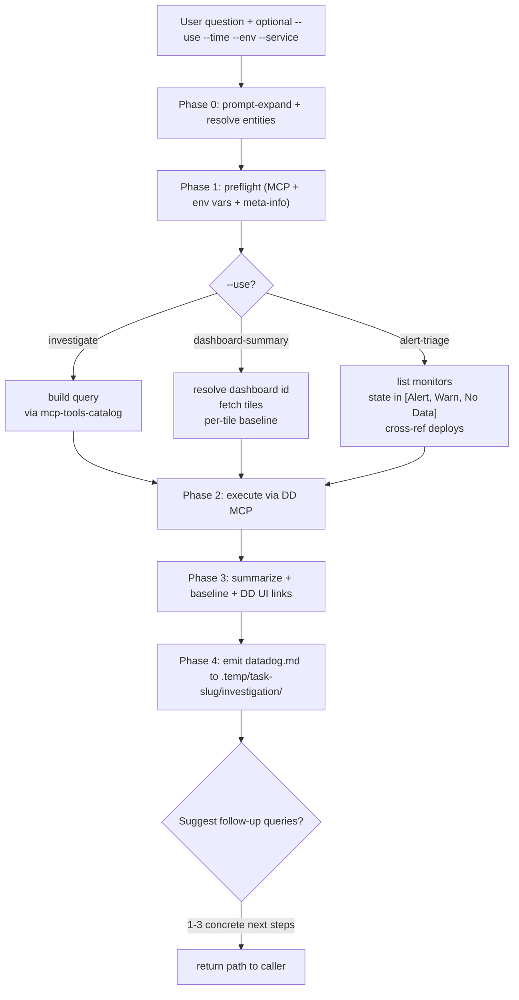
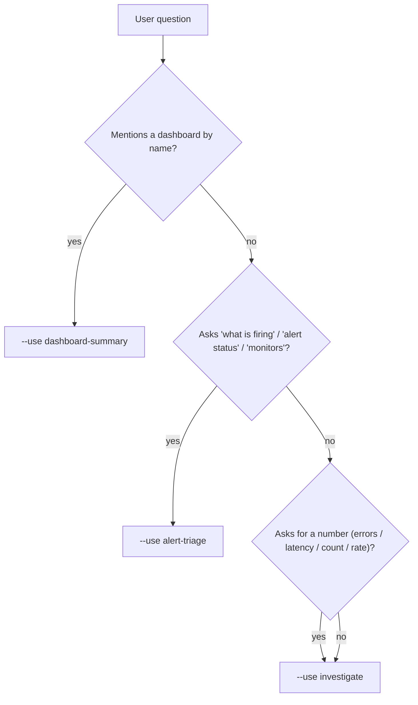
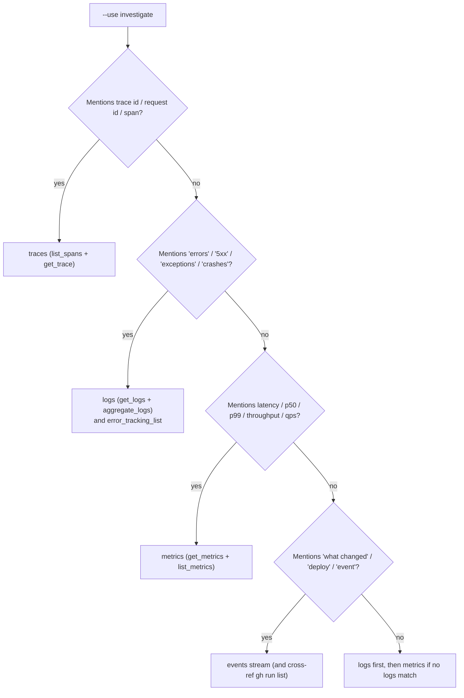
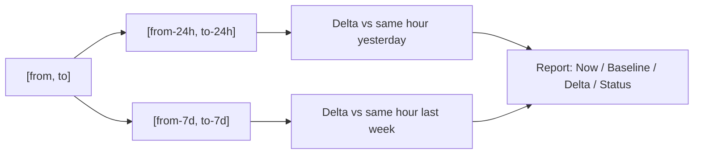

# `investigate-datadog` — how it works (diagrams)

## Phase flow

```mermaid
flowchart TD
    Prompt["User question + optional --use --time --env --service"] --> P0["Phase 0: prompt-expand + resolve entities"]
    P0 --> P1["Phase 1: preflight (MCP + env vars + meta-info)"]
    P1 --> Branch{"--use?"}
    Branch -- investigate --> Inv["build query<br/>via mcp-tools-catalog"]
    Branch -- dashboard-summary --> Dash["resolve dashboard id<br/>fetch tiles<br/>per-tile baseline"]
    Branch -- alert-triage --> Alert["list monitors<br/>state in [Alert, Warn, No Data]<br/>cross-ref deploys"]
    Inv --> Exec["Phase 2: execute via DD MCP"]
    Dash --> Exec
    Alert --> Exec
    Exec --> P3["Phase 3: summarize + baseline + DD UI links"]
    P3 --> P4["Phase 4: emit datadog.md to .temp/task-slug/investigation/"]
    P4 --> Followup{"Suggest follow-up queries?"}
    Followup -- "1-3 concrete next steps" --> Done["return path to caller"]
```

## --use selection decision tree

```mermaid
flowchart TD
    Q["User question"] --> Q1{"Mentions a dashboard by name?"}
    Q1 -- yes --> Dash["--use dashboard-summary"]
    Q1 -- no --> Q2{"Asks 'what is firing' / 'alert status' / 'monitors'?"}
    Q2 -- yes --> Alert["--use alert-triage"]
    Q2 -- no --> Q3{"Asks for a number (errors / latency / count / rate)?"}
    Q3 -- yes --> Inv["--use investigate"]
    Q3 -- no --> Inv
```

## --use investigate source-picker

```mermaid
flowchart TD
    Inv["--use investigate"] --> S1{"Mentions trace id / request id / span?"}
    S1 -- yes --> T["traces (list_spans + get_trace)"]
    S1 -- no --> S2{"Mentions 'errors' / '5xx' / 'exceptions' / 'crashes'?"}
    S2 -- yes --> L["logs (get_logs + aggregate_logs)<br/>and error_tracking_list"]
    S2 -- no --> S3{"Mentions latency / p50 / p99 / throughput / qps?"}
    S3 -- yes --> M["metrics (get_metrics + list_metrics)"]
    S3 -- no --> S4{"Mentions 'what changed' / 'deploy' / 'event'?"}
    S4 -- yes --> E["events stream (and cross-ref gh run list)"]
    S4 -- no --> Default["logs first, then metrics if no logs match"]
```

## Baseline computation

```mermaid
flowchart LR
    Window["[from, to]"] --> Yesterday["[from-24h, to-24h]"]
    Window --> LastWeek["[from-7d, to-7d]"]
    Yesterday --> Compare["Delta vs same hour yesterday"]
    LastWeek --> Compare2["Delta vs same hour last week"]
    Compare --> Report["Report: Now / Baseline / Delta / Status"]
    Compare2 --> Report
```
