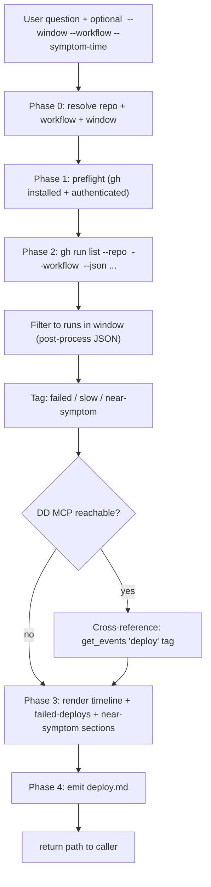
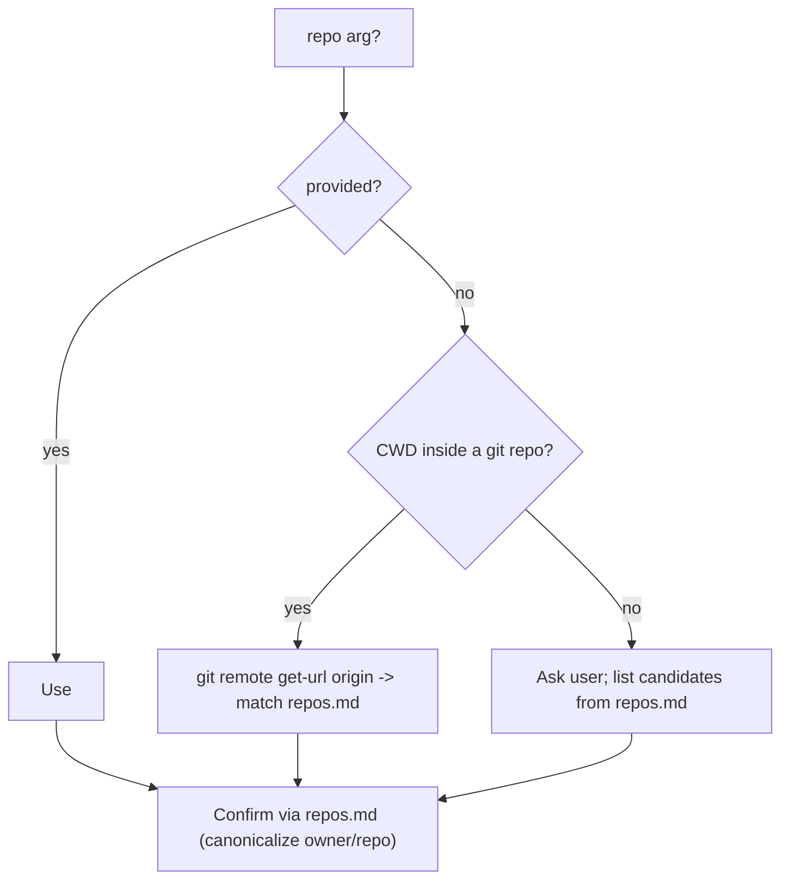
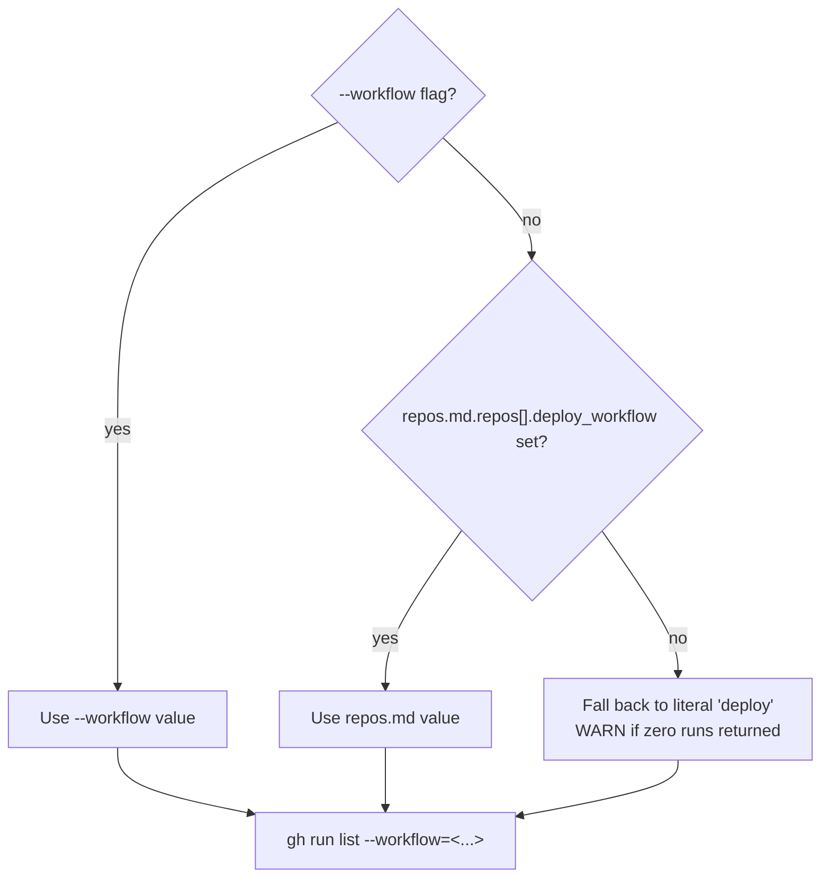
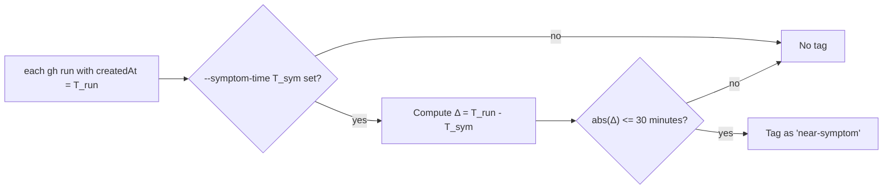
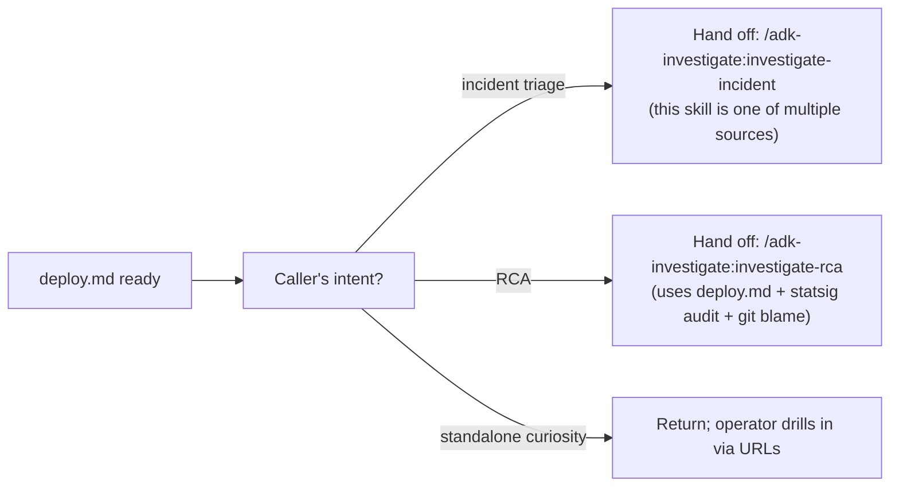

# `investigate-deploy` — how it works (diagrams)

## Phase flow

```mermaid
flowchart TD
    Prompt["User question + optional <repo> --window --workflow --symptom-time"] --> P0["Phase 0: resolve repo + workflow + window"]
    P0 --> P1["Phase 1: preflight (gh installed + authenticated)"]
    P1 --> P2["Phase 2: gh run list --repo <r> --workflow <w> --json ..."]
    P2 --> Filter["Filter to runs in window (post-process JSON)"]
    Filter --> Tag["Tag: failed / slow / near-symptom"]
    Tag --> XRef{"DD MCP reachable?"}
    XRef -- yes --> DDX["Cross-reference: get_events 'deploy' tag"]
    XRef -- no --> P3
    DDX --> P3["Phase 3: render timeline + failed-deploys + near-symptom sections"]
    P3 --> P4["Phase 4: emit deploy.md"]
    P4 --> Done["return path to caller"]
```

## Repo resolution decision tree

```mermaid
flowchart TD
    Q["repo arg?"] --> Q1{"<repo> provided?"}
    Q1 -- yes --> Use["Use <repo>"]
    Q1 -- no --> Q2{"CWD inside a git repo?"}
    Q2 -- yes --> Remote["git remote get-url origin -> match repos.md"]
    Q2 -- no --> Ask["Ask user; list candidates from repos.md"]
    Use --> Confirm["Confirm via repos.md (canonicalize owner/repo)"]
    Remote --> Confirm
    Ask --> Confirm
```

## Workflow resolution

```mermaid
flowchart TD
    W{"--workflow flag?"} -- yes --> WUse["Use --workflow value"]
    W -- no --> WMeta{"repos.md.repos[<repo>].deploy_workflow set?"}
    WMeta -- yes --> WMetaUse["Use repos.md value"]
    WMeta -- no --> WFallback["Fall back to literal 'deploy'<br/>WARN if zero runs returned"]
    WUse --> Run["gh run list --workflow=<...>"]
    WMetaUse --> Run
    WFallback --> Run
```

## Near-symptom tagging

```mermaid
flowchart LR
    Run["each gh run with createdAt = T_run"] --> Sym{"--symptom-time T_sym set?"}
    Sym -- no --> Skip["No tag"]
    Sym -- yes --> Calc["Compute Δ = T_run - T_sym"]
    Calc --> Check{"abs(Δ) <= 30 minutes?"}
    Check -- yes --> Tag["Tag as 'near-symptom'"]
    Check -- no --> Skip
```

## Hand-off pattern

```mermaid
flowchart LR
    DeployReport["deploy.md ready"] --> Q["Caller's intent?"]
    Q -- "incident triage" --> II["Hand off: /adk-investigate:investigate-incident<br/>(this skill is one of multiple sources)"]
    Q -- "RCA" --> RCA["Hand off: /adk-investigate:investigate-rca<br/>(uses deploy.md + statsig audit + git blame)"]
    Q -- "standalone curiosity" --> Done["Return; operator drills in via URLs"]
```
