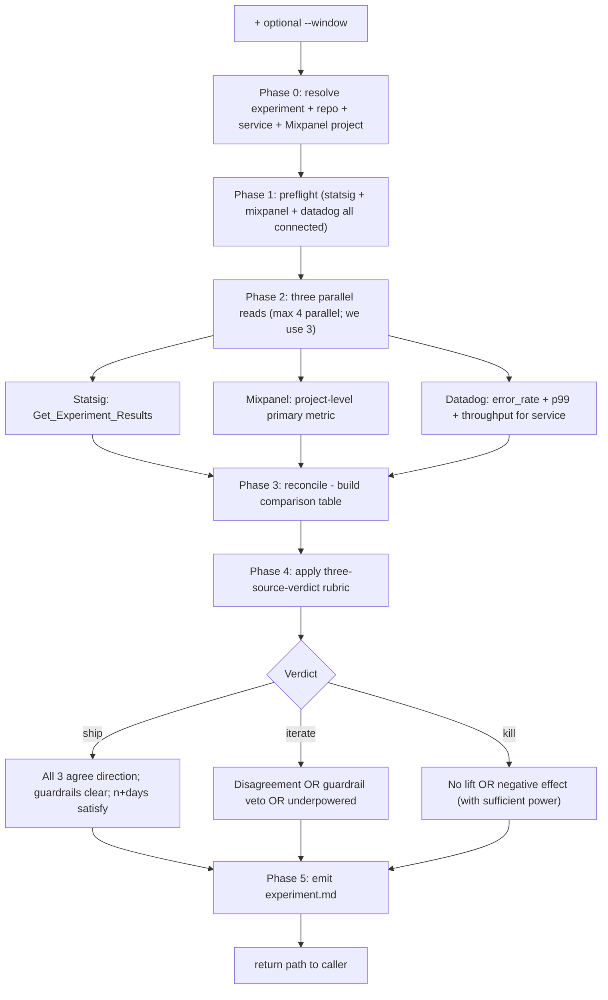
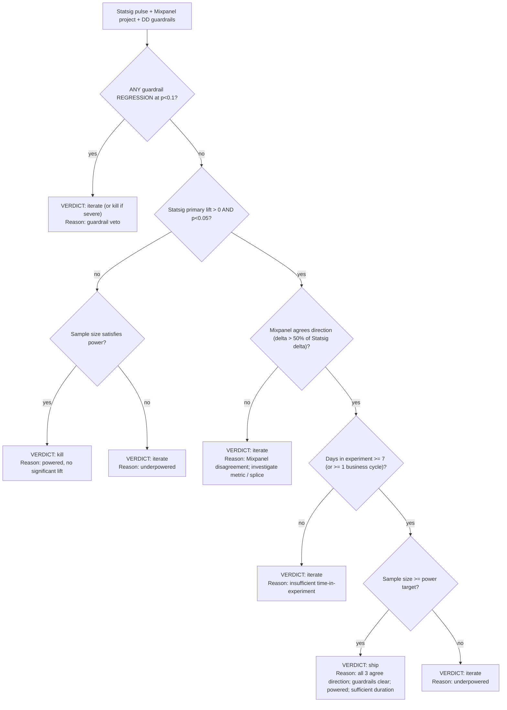
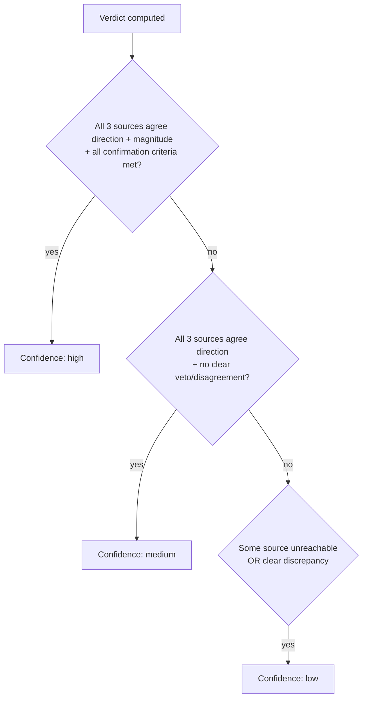
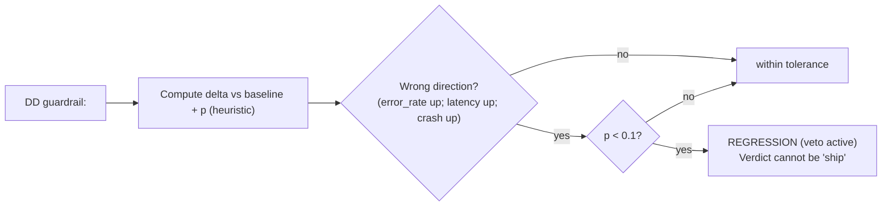

# `investigate-experiment` — how it works (diagrams)

## Phase flow

```mermaid
flowchart TD
    Prompt["<experiment-name> + optional --window"] --> P0["Phase 0: resolve experiment + repo + service + Mixpanel project"]
    P0 --> P1["Phase 1: preflight (statsig + mixpanel + datadog all connected)"]
    P1 --> P2["Phase 2: three parallel reads (max 4 parallel; we use 3)"]
    P2 --> S["Statsig: Get_Experiment_Results"]
    P2 --> M["Mixpanel: project-level primary metric"]
    P2 --> D["Datadog: error_rate + p99 + throughput for service"]
    S --> P3["Phase 3: reconcile - build comparison table"]
    M --> P3
    D --> P3
    P3 --> P4["Phase 4: apply three-source-verdict rubric"]
    P4 --> V{"Verdict"}
    V -- "ship" --> Ship["All 3 agree direction; guardrails clear; n+days satisfy"]
    V -- "iterate" --> Iter["Disagreement OR guardrail veto OR underpowered"]
    V -- "kill" --> Kill["No lift OR negative effect (with sufficient power)"]
    Ship --> P5["Phase 5: emit experiment.md"]
    Iter --> P5
    Kill --> P5
    P5 --> Done["return path to caller"]
```

## Three-source verdict matrix

```mermaid
flowchart TD
    Inputs["Statsig pulse + Mixpanel project + DD guardrails"] --> Q1{"ANY guardrail REGRESSION at p<0.1?"}
    Q1 -- yes --> Veto["VERDICT: iterate (or kill if severe)<br/>Reason: guardrail veto"]
    Q1 -- no --> Q2{"Statsig primary lift > 0 AND p<0.05?"}
    Q2 -- no --> Q2a{"Sample size satisfies power?"}
    Q2a -- yes --> Kill["VERDICT: kill<br/>Reason: powered, no significant lift"]
    Q2a -- no --> IterUnder["VERDICT: iterate<br/>Reason: underpowered"]
    Q2 -- yes --> Q3{"Mixpanel agrees direction (delta > 50% of Statsig delta)?"}
    Q3 -- no --> Disagree["VERDICT: iterate<br/>Reason: Mixpanel disagreement; investigate metric / splice"]
    Q3 -- yes --> Q4{"Days in experiment >= 7 (or >= 1 business cycle)?"}
    Q4 -- no --> IterShort["VERDICT: iterate<br/>Reason: insufficient time-in-experiment"]
    Q4 -- yes --> Q5{"Sample size >= power target?"}
    Q5 -- yes --> Ship["VERDICT: ship<br/>Reason: all 3 agree direction; guardrails clear; powered; sufficient duration"]
    Q5 -- no --> IterUnder2["VERDICT: iterate<br/>Reason: underpowered"]
```

## Confidence anchoring

```mermaid
flowchart TD
    V["Verdict computed"] --> Q1{"All 3 sources agree direction + magnitude<br/>+ all confirmation criteria met?"}
    Q1 -- yes --> H["Confidence: high"]
    Q1 -- no --> Q2{"All 3 sources agree direction<br/>+ no clear veto/disagreement?"}
    Q2 -- yes --> M["Confidence: medium"]
    Q2 -- no --> Q3{"Some source unreachable<br/>OR clear discrepancy"}
    Q3 -- yes --> L["Confidence: low"]
```

## Guardrail veto

```mermaid
flowchart LR
    Pulse["DD guardrail: <metric>"] --> Calc["Compute delta vs baseline + p (heuristic)"]
    Calc --> Direction{"Wrong direction?<br/>(error_rate up; latency up; crash up)"}
    Direction -- no --> Tol["within tolerance"]
    Direction -- yes --> Sig{"p < 0.1?"}
    Sig -- no --> Tol
    Sig -- yes --> Veto["REGRESSION (veto active)<br/>Verdict cannot be 'ship'"]
```
