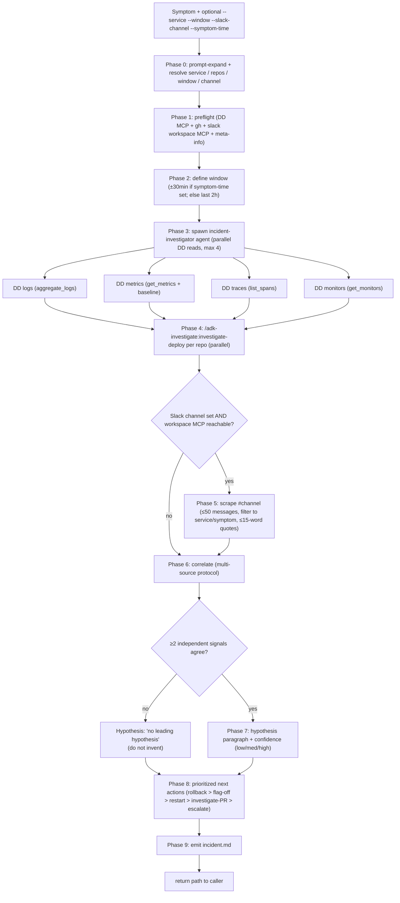
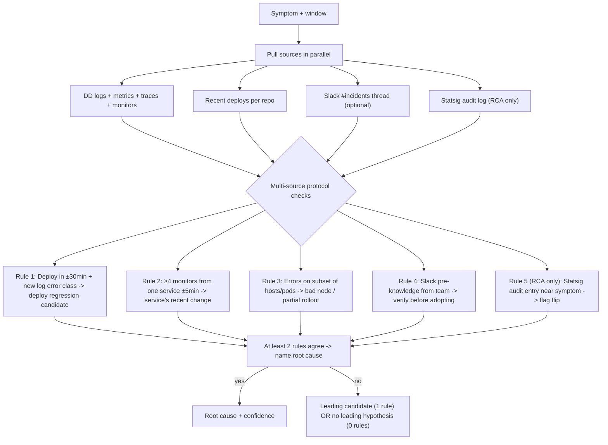
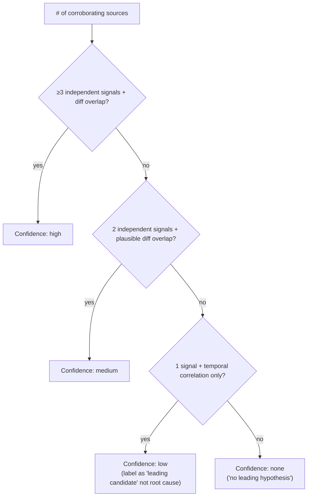
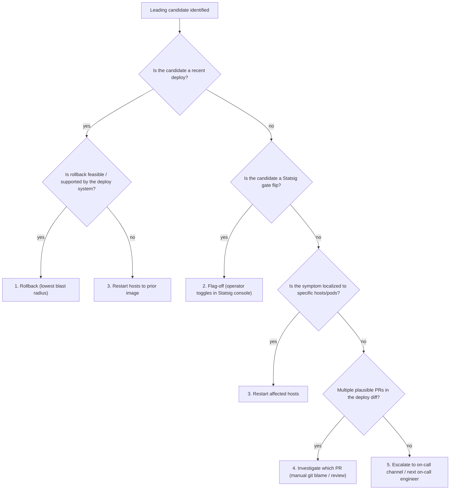

# `investigate-incident` — how it works (diagrams)

## Phase flow

```mermaid
flowchart TD
    Prompt["Symptom + optional --service --window --slack-channel --symptom-time"] --> P0["Phase 0: prompt-expand + resolve service / repos / window / channel"]
    P0 --> P1["Phase 1: preflight (DD MCP + gh + slack workspace MCP + meta-info)"]
    P1 --> P2["Phase 2: define window (±30min if symptom-time set; else last 2h)"]
    P2 --> P3a["Phase 3: spawn incident-investigator agent (parallel DD reads, max 4)"]
    P3a --> Dlog["DD logs (aggregate_logs)"]
    P3a --> Dmet["DD metrics (get_metrics + baseline)"]
    P3a --> Dtra["DD traces (list_spans)"]
    P3a --> Dmon["DD monitors (get_monitors)"]
    Dlog --> P4
    Dmet --> P4
    Dtra --> P4
    Dmon --> P4
    P4["Phase 4: /adk-investigate:investigate-deploy per repo (parallel)"] --> P5{"Slack channel set AND workspace MCP reachable?"}
    P5 -- yes --> Slk["Phase 5: scrape #channel (≤50 messages, filter to service/symptom, ≤15-word quotes)"]
    P5 -- no --> P6
    Slk --> P6["Phase 6: correlate (multi-source protocol)"]
    P6 --> Q1{"≥2 independent signals agree?"}
    Q1 -- no --> NoCause["Hypothesis: 'no leading hypothesis'<br/>(do not invent)"]
    Q1 -- yes --> P7["Phase 7: hypothesis paragraph + confidence (low/med/high)"]
    NoCause --> P8
    P7 --> P8["Phase 8: prioritized next actions (rollback > flag-off > restart > investigate-PR > escalate)"]
    P8 --> P9["Phase 9: emit incident.md"]
    P9 --> Done["return path to caller"]
```

## Multi-source correlation matrix

```mermaid
flowchart TD
    Symptom["Symptom + window"] --> Sources["Pull sources in parallel"]
    Sources --> DD["DD logs + metrics + traces + monitors"]
    Sources --> Dep["Recent deploys per repo"]
    Sources --> Slack["Slack #incidents thread (optional)"]
    Sources --> Stat["Statsig audit log (RCA only)"]
    DD --> M{"Multi-source protocol checks"}
    Dep --> M
    Slack --> M
    Stat --> M
    M --> R1["Rule 1: Deploy in ±30min + new log error class -> deploy regression candidate"]
    M --> R2["Rule 2: ≥4 monitors from one service ±5min -> service's recent change"]
    M --> R3["Rule 3: Errors on subset of hosts/pods -> bad node / partial rollout"]
    M --> R4["Rule 4: Slack pre-knowledge from team -> verify before adopting"]
    M --> R5["Rule 5 (RCA only): Statsig audit entry near symptom -> flag flip"]
    R1 --> Verdict["At least 2 rules agree -> name root cause"]
    R2 --> Verdict
    R3 --> Verdict
    R4 --> Verdict
    R5 --> Verdict
    Verdict -- "yes" --> Hypothesis["Root cause + confidence"]
    Verdict -- "no" --> NoHypo["Leading candidate (1 rule) OR no leading hypothesis (0 rules)"]
```

## Confidence anchoring

```mermaid
flowchart TD
    Sigs["# of corroborating sources"] --> S1{"≥3 independent signals + diff overlap?"}
    S1 -- yes --> H["Confidence: high"]
    S1 -- no --> S2{"2 independent signals + plausible diff overlap?"}
    S2 -- yes --> M["Confidence: medium"]
    S2 -- no --> S3{"1 signal + temporal correlation only?"}
    S3 -- yes --> L["Confidence: low<br/>(label as 'leading candidate' not root cause)"]
    S3 -- no --> Z["Confidence: none<br/>('no leading hypothesis')"]
```

## Next-action priority decision

```mermaid
flowchart TD
    Cause["Leading candidate identified"] --> Q1{"Is the candidate a recent deploy?"}
    Q1 -- yes --> Q2{"Is rollback feasible / supported by the deploy system?"}
    Q2 -- yes --> RB["1. Rollback (lowest blast radius)"]
    Q2 -- no --> Restart["3. Restart hosts to prior image"]
    Q1 -- no --> Q3{"Is the candidate a Statsig gate flip?"}
    Q3 -- yes --> FO["2. Flag-off (operator toggles in Statsig console)"]
    Q3 -- no --> Q4{"Is the symptom localized to specific hosts/pods?"}
    Q4 -- yes --> Restart2["3. Restart affected hosts"]
    Q4 -- no --> Q5{"Multiple plausible PRs in the deploy diff?"}
    Q5 -- yes --> Inv["4. Investigate which PR (manual git blame / review)"]
    Q5 -- no --> Esc["5. Escalate to on-call channel / next on-call engineer"]
```
