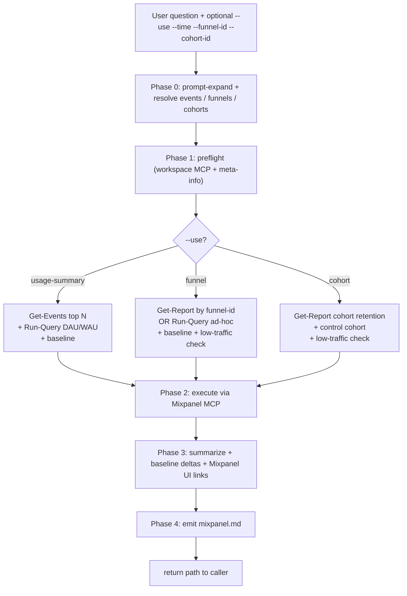
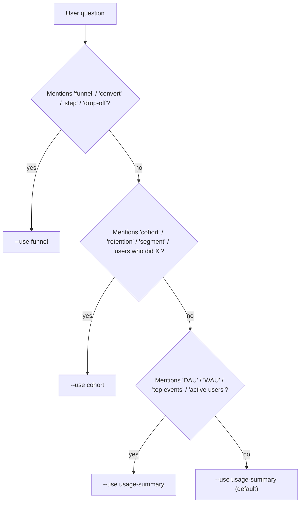
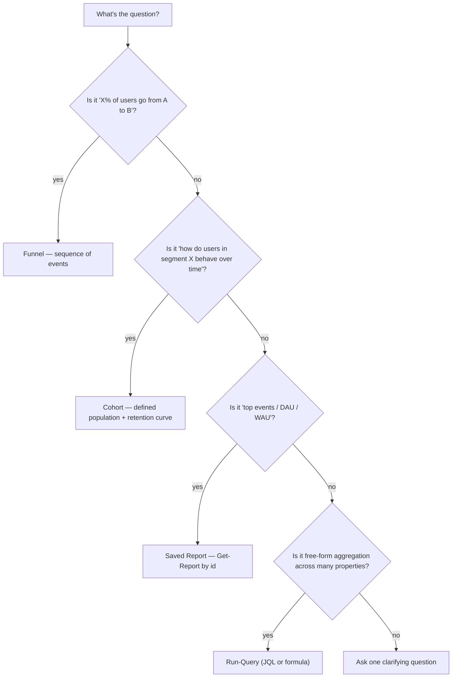
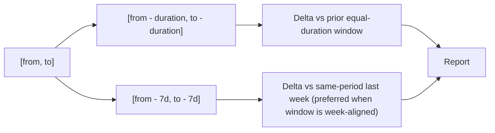
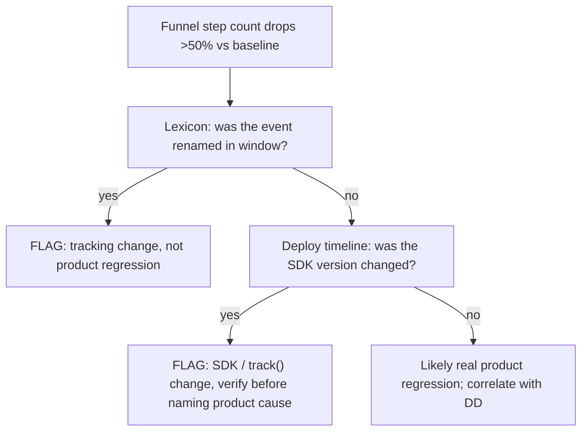

# `investigate-mixpanel` — how it works (diagrams)

## Phase flow

## --use selection decision tree

## Funnel-vs-cohort modeling decision

## Baseline computation

## Tracking-change detection

