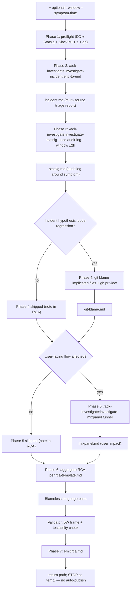
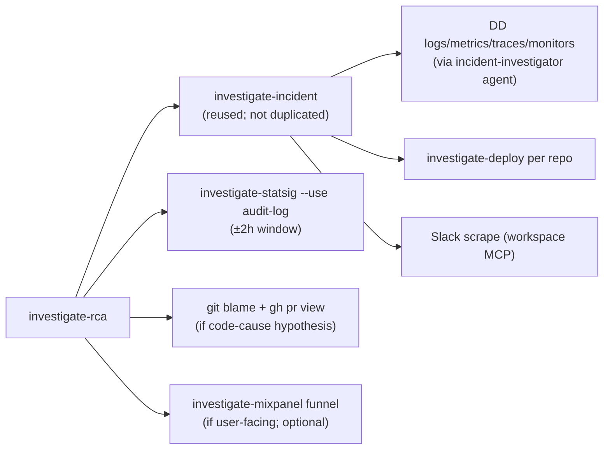
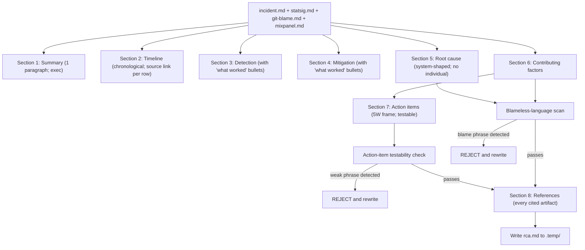
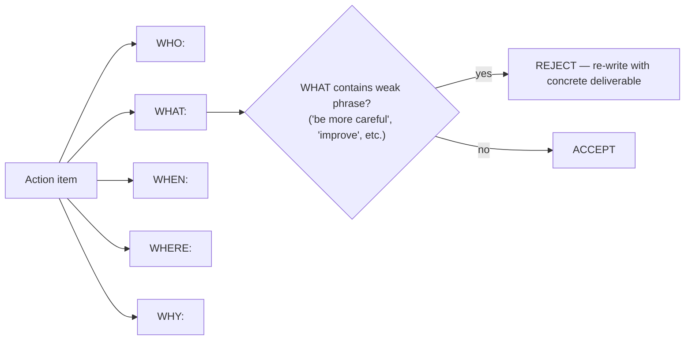
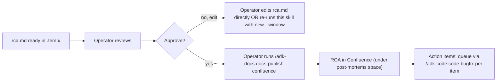

# `investigate-rca` — how it works (diagrams)

## Phase flow

```mermaid
flowchart TD
    Prompt["<symptom> + optional --window --symptom-time"] --> P1["Phase 1: preflight (DD + Statsig + Slack MCPs + gh)"]
    P1 --> P2["Phase 2: /adk-investigate:investigate-incident end-to-end"]
    P2 --> incident["incident.md (multi-source triage report)"]
    incident --> P3["Phase 3: /adk-investigate:investigate-statsig --use audit-log --window ±2h"]
    P3 --> statsig["statsig.md (audit log around symptom)"]
    statsig --> Hyp{"Incident hypothesis: code regression?"}
    Hyp -- yes --> P4["Phase 4: git blame implicated files + gh pr view"]
    Hyp -- no --> P4skip["Phase 4 skipped (note in RCA)"]
    P4 --> blame["git-blame.md"]
    P4skip --> P5{"User-facing flow affected?"}
    blame --> P5
    P5 -- yes --> P5y["Phase 5: /adk-investigate:investigate-mixpanel funnel"]
    P5 -- no --> P5skip["Phase 5 skipped (note in RCA)"]
    P5y --> mixpanel["mixpanel.md (user impact)"]
    P5skip --> P6
    mixpanel --> P6["Phase 6: aggregate RCA per rca-template.md"]
    P6 --> Blameless["Blameless-language pass"]
    Blameless --> Validate["Validator: 5W frame + testability check"]
    Validate --> P7["Phase 7: emit rca.md"]
    P7 --> Done["return path; STOP at .temp/ — no auto-publish"]
```

## Composite chain

```mermaid
flowchart LR
    RCA["investigate-rca"] --> II["investigate-incident<br/>(reused; not duplicated)"]
    II --> DD["DD logs/metrics/traces/monitors<br/>(via incident-investigator agent)"]
    II --> Dep["investigate-deploy per repo"]
    II --> Slk["Slack scrape (workspace MCP)"]
    RCA --> IS["investigate-statsig --use audit-log<br/>(±2h window)"]
    RCA --> GB["git blame + gh pr view<br/>(if code-cause hypothesis)"]
    RCA --> IM["investigate-mixpanel funnel<br/>(if user-facing; optional)"]
```

## RCA template assembly

```mermaid
flowchart TD
    Sources["incident.md + statsig.md + git-blame.md + mixpanel.md"] --> S1["Section 1: Summary (1 paragraph; exec)"]
    Sources --> S2["Section 2: Timeline (chronological; source link per row)"]
    Sources --> S3["Section 3: Detection (with 'what worked' bullets)"]
    Sources --> S4["Section 4: Mitigation (with 'what worked' bullets)"]
    Sources --> S5["Section 5: Root cause (system-shaped; no individual)"]
    Sources --> S6["Section 6: Contributing factors"]
    S6 --> S7["Section 7: Action items (5W frame; testable)"]
    S7 --> Validator["Action-item testability check"]
    Validator -- "weak phrase detected" --> Rewrite["REJECT and rewrite"]
    Validator -- "passes" --> S8
    S5 --> Blameless["Blameless-language scan"]
    S6 --> Blameless
    Blameless -- "blame phrase detected" --> Rewrite2["REJECT and rewrite"]
    Blameless -- "passes" --> S8["Section 8: References (every cited artifact)"]
    S8 --> Emit["Write rca.md to .temp/"]
```

## Action item 5W frame

```mermaid
flowchart LR
    Item["Action item"] --> W1["WHO: <owner>"]
    Item --> W2["WHAT: <concrete deliverable>"]
    Item --> W3["WHEN: <date>"]
    Item --> W4["WHERE: <path or system>"]
    Item --> W5["WHY: <one sentence>"]
    W2 --> Test{"WHAT contains weak phrase?<br/>('be more careful', 'improve', etc.)"}
    Test -- yes --> Reject["REJECT — re-write with concrete deliverable"]
    Test -- no --> Accept["ACCEPT"]
```

## Hand-off (after RCA emit)

```mermaid
flowchart LR
    RCA["rca.md ready in .temp/"] --> Review["Operator reviews"]
    Review --> Approve{"Approve?"}
    Approve -- "no, edit" --> Edit["Operator edits rca.md directly OR re-runs this skill with new --window"]
    Approve -- "yes" --> Pub["Operator runs /adk-docs:docs-publish-confluence <path>"]
    Pub --> Conf["RCA in Confluence (under post-mortems space)"]
    Conf --> Items["Action items: queue via /adk-code:code-bugfix per item"]
```
