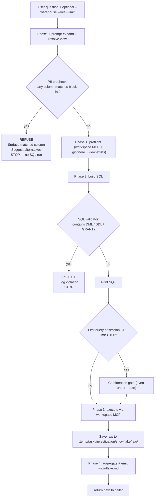
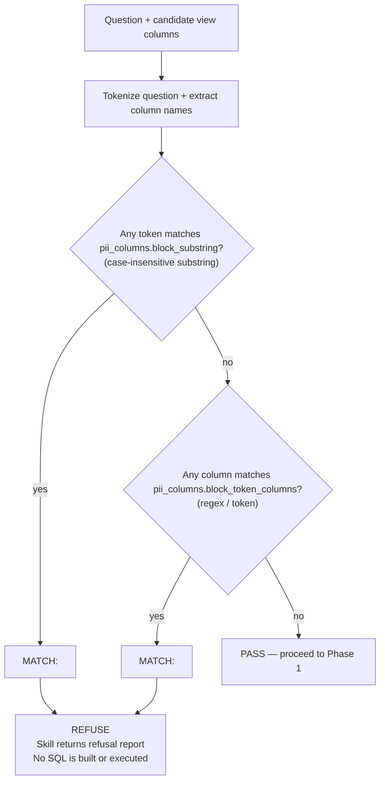
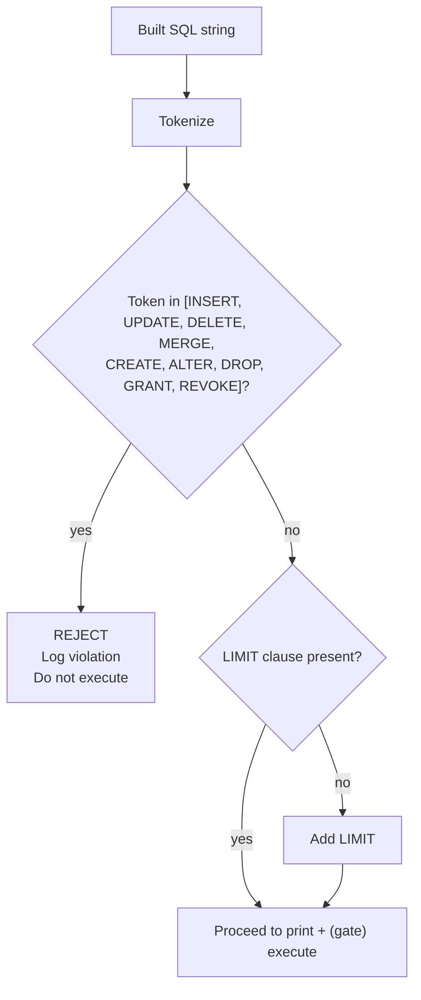
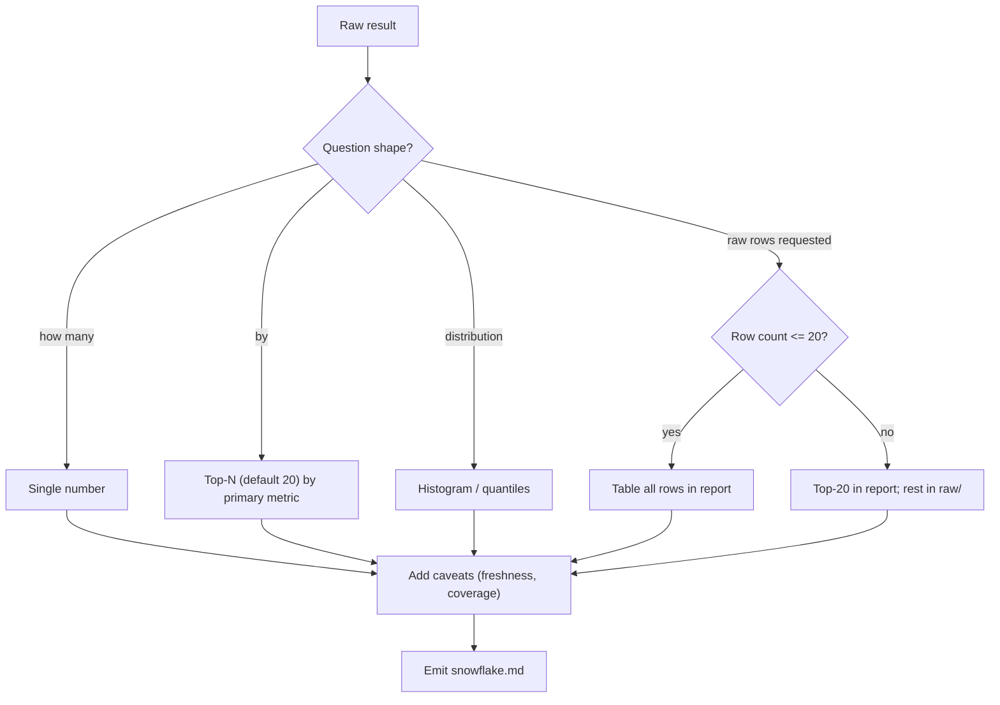

# `investigate-snowflake` — how it works (diagrams)

## Phase flow

```mermaid
flowchart TD
    Prompt["User question + optional --warehouse --role --limit"] --> P0["Phase 0: prompt-expand + resolve view"]
    P0 --> PII{"PII precheck:<br/>any column matches block list?"}
    PII -- yes --> Refuse["REFUSE<br/>Surface matched column<br/>Suggest alternatives<br/>STOP — no SQL run"]
    PII -- no --> P1["Phase 1: preflight (workspace MCP + .gitignore + view exists)"]
    P1 --> P2["Phase 2: build SQL"]
    P2 --> RO{"SQL validator:<br/>contains DML / DDL / GRANT?"}
    RO -- yes --> Reject["REJECT<br/>Log violation<br/>STOP"]
    RO -- no --> Show["Print SQL"]
    Show --> Confirm{"First query of session OR --limit > 100?"}
    Confirm -- yes --> Gate["Confirmation gate (even under --auto)"]
    Confirm -- no --> P3
    Gate --> P3["Phase 3: execute via workspace MCP"]
    P3 --> Save["Save raw to .temp/task-<slug>/investigation/snowflake/raw/"]
    Save --> P4["Phase 4: aggregate + emit snowflake.md"]
    P4 --> Done["return path to caller"]
```

## PII guardrail decision

```mermaid
flowchart TD
    Q["Question + candidate view columns"] --> Tok["Tokenize question + extract column names"]
    Tok --> Sub{"Any token matches pii_columns.block_substring?<br/>(case-insensitive substring)"}
    Sub -- yes --> Match1["MATCH: <column>"]
    Sub -- no --> Token{"Any column matches pii_columns.block_token_columns?<br/>(regex / token)"}
    Token -- yes --> Match2["MATCH: <column>"]
    Token -- no --> Pass["PASS — proceed to Phase 1"]
    Match1 --> Refuse["REFUSE<br/>Skill returns refusal report<br/>No SQL is built or executed"]
    Match2 --> Refuse
```

## Read-only policy SQL gate

```mermaid
flowchart TD
    SQL["Built SQL string"] --> Parse["Tokenize"]
    Parse --> Check{"Token in [INSERT, UPDATE, DELETE, MERGE,<br/>CREATE, ALTER, DROP, GRANT, REVOKE]?"}
    Check -- yes --> Reject["REJECT<br/>Log violation<br/>Do not execute"]
    Check -- no --> Limit{"LIMIT clause present?"}
    Limit -- no --> Add["Add LIMIT <N>"]
    Limit -- yes --> Continue["Proceed to print + (gate) execute"]
    Add --> Continue
```

## Result aggregation rule

```mermaid
flowchart TD
    Res["Raw result"] --> Q1{"Question shape?"}
    Q1 -- "how many" --> Count["Single number"]
    Q1 -- "by <dimension>" --> TopN["Top-N (default 20) by primary metric"]
    Q1 -- "distribution" --> Hist["Histogram / quantiles"]
    Q1 -- "raw rows requested" --> Q2{"Row count <= 20?"}
    Q2 -- yes --> Table["Table all rows in report"]
    Q2 -- no --> TopN2["Top-20 in report; rest in raw/"]
    Count --> Cav["Add caveats (freshness, coverage)"]
    TopN --> Cav
    Hist --> Cav
    Table --> Cav
    TopN2 --> Cav
    Cav --> Emit["Emit snowflake.md"]
```
