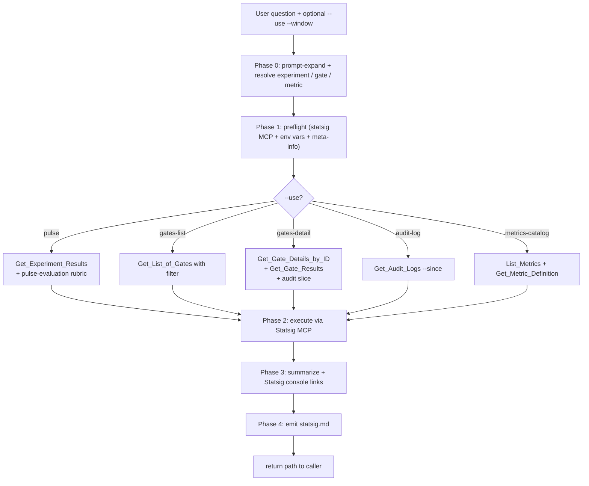
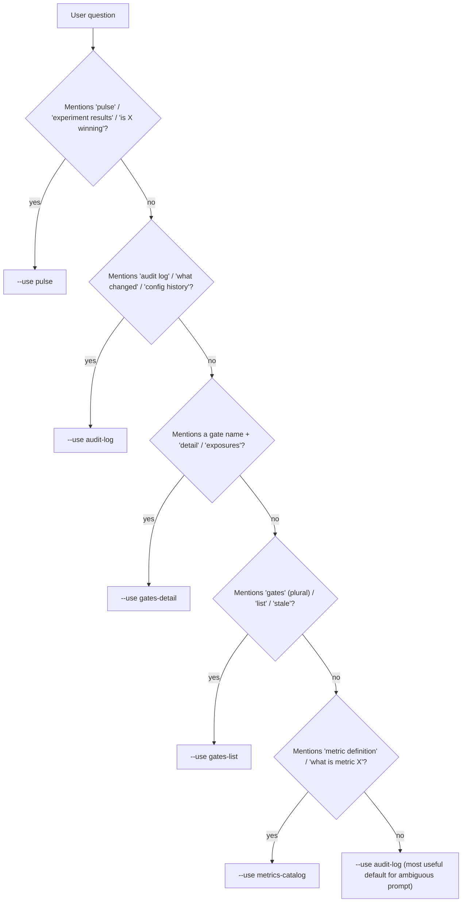
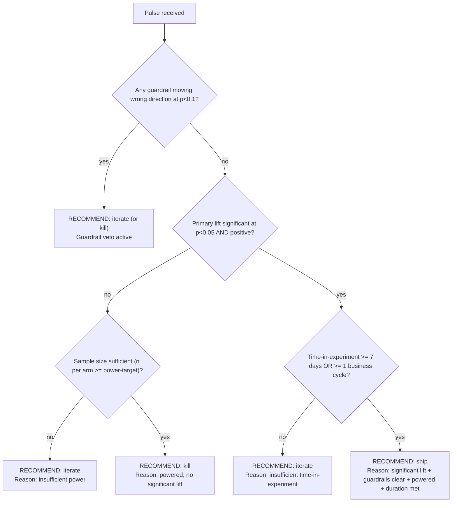
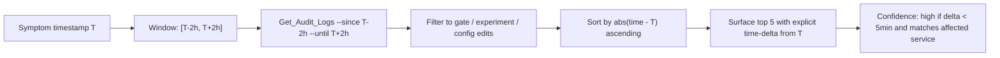

# `investigate-statsig` — how it works (diagrams)

## Phase flow

```mermaid
flowchart TD
    Prompt["User question + optional --use --window"] --> P0["Phase 0: prompt-expand + resolve experiment / gate / metric"]
    P0 --> P1["Phase 1: preflight (statsig MCP + env vars + meta-info)"]
    P1 --> Branch{"--use?"}
    Branch -- pulse --> Pulse["Get_Experiment_Results<br/>+ pulse-evaluation rubric"]
    Branch -- gates-list --> GL["Get_List_of_Gates with filter"]
    Branch -- gates-detail --> GD["Get_Gate_Details_by_ID<br/>+ Get_Gate_Results<br/>+ audit slice"]
    Branch -- audit-log --> AL["Get_Audit_Logs --since <window>"]
    Branch -- metrics-catalog --> MC["List_Metrics + Get_Metric_Definition"]
    Pulse --> Exec["Phase 2: execute via Statsig MCP"]
    GL --> Exec
    GD --> Exec
    AL --> Exec
    MC --> Exec
    Exec --> P3["Phase 3: summarize + Statsig console links"]
    P3 --> P4["Phase 4: emit statsig.md"]
    P4 --> Done["return path to caller"]
```

## --use selection decision tree

```mermaid
flowchart TD
    Q["User question"] --> Q1{"Mentions 'pulse' / 'experiment results' / 'is X winning'?"}
    Q1 -- yes --> Pulse["--use pulse"]
    Q1 -- no --> Q2{"Mentions 'audit log' / 'what changed' / 'config history'?"}
    Q2 -- yes --> Audit["--use audit-log"]
    Q2 -- no --> Q3{"Mentions a gate name + 'detail' / 'exposures'?"}
    Q3 -- yes --> GD["--use gates-detail"]
    Q3 -- no --> Q4{"Mentions 'gates' (plural) / 'list' / 'stale'?"}
    Q4 -- yes --> GL["--use gates-list"]
    Q4 -- no --> Q5{"Mentions 'metric definition' / 'what is metric X'?"}
    Q5 -- yes --> MC["--use metrics-catalog"]
    Q5 -- no --> Default["--use audit-log (most useful default for ambiguous prompt)"]
```

## Pulse evaluation rubric

```mermaid
flowchart TD
    Pulse["Pulse received"] --> Q1{"Any guardrail moving wrong direction at p<0.1?"}
    Q1 -- yes --> Veto["RECOMMEND: iterate (or kill)<br/>Guardrail veto active"]
    Q1 -- no --> Q2{"Primary lift significant at p<0.05 AND positive?"}
    Q2 -- no --> Q3{"Sample size sufficient (n per arm >= power-target)?"}
    Q3 -- no --> Iter["RECOMMEND: iterate<br/>Reason: insufficient power"]
    Q3 -- yes --> Kill["RECOMMEND: kill<br/>Reason: powered, no significant lift"]
    Q2 -- yes --> Q4{"Time-in-experiment >= 7 days OR >= 1 business cycle?"}
    Q4 -- no --> Iter2["RECOMMEND: iterate<br/>Reason: insufficient time-in-experiment"]
    Q4 -- yes --> Ship["RECOMMEND: ship<br/>Reason: significant lift + guardrails clear + powered + duration met"]
```

## Audit-log timeline correlation (during incident triage)

```mermaid
flowchart LR
    Symptom["Symptom timestamp T"] --> Window["Window: [T-2h, T+2h]"]
    Window --> Audit["Get_Audit_Logs --since T-2h --until T+2h"]
    Audit --> Filter["Filter to gate / experiment / config edits"]
    Filter --> Sort["Sort by abs(time - T) ascending"]
    Sort --> Surface["Surface top 5 with explicit time-delta from T"]
    Surface --> Confidence["Confidence: high if delta < 5min and matches affected service"]
```
