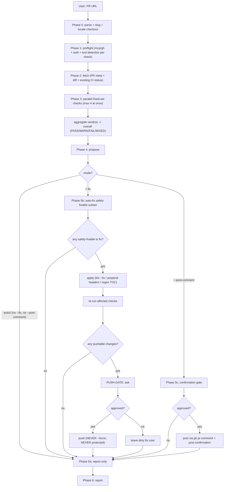
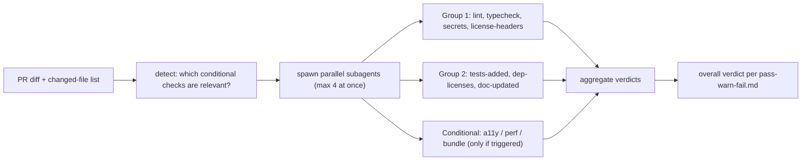
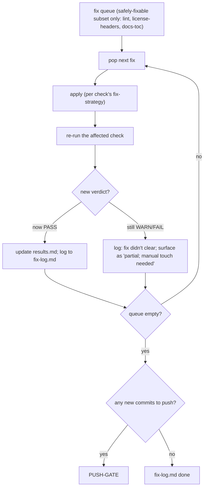
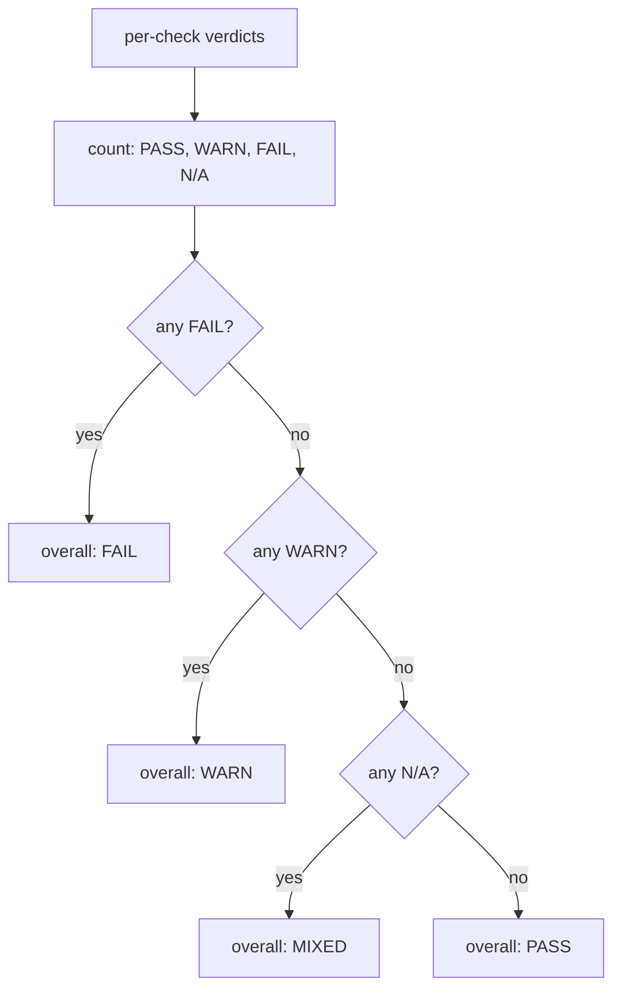
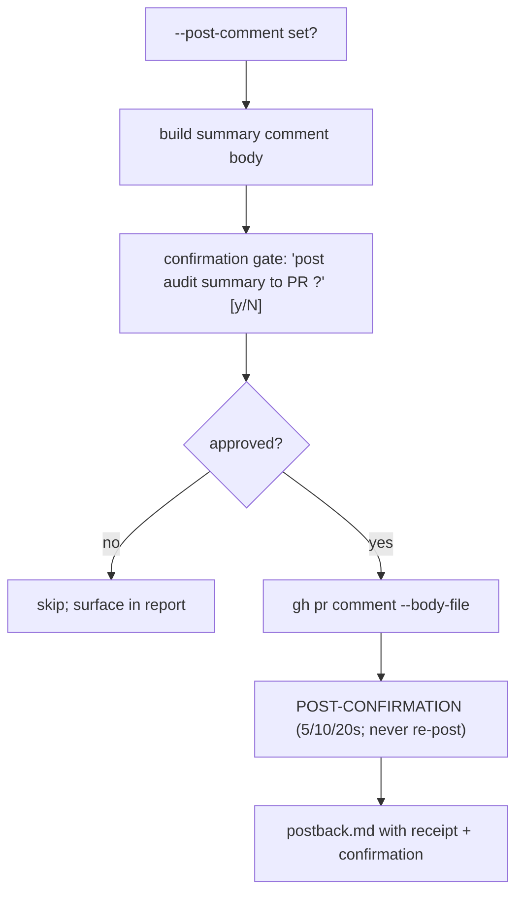
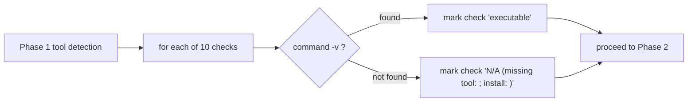

# `audit-pr` — how it works (diagrams)

## Phase flow

## Parallel check fan-out (Phase 3)

## Auto-fix loop (Phase 5b)

## Verdict computation (Phase 4)

## Post-comment gate (Phase 5c)

## Tool detection (Phase 1)

