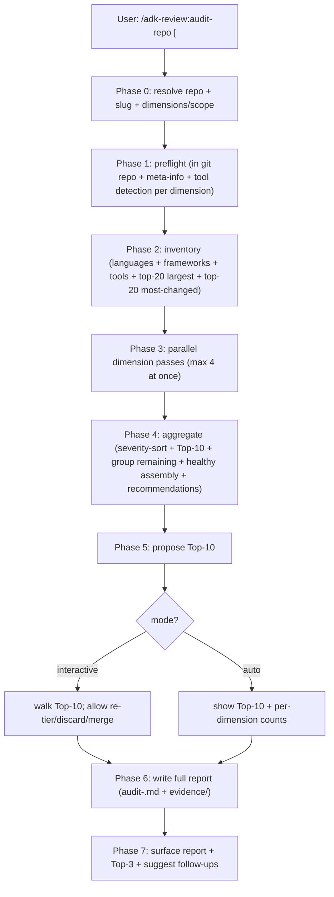
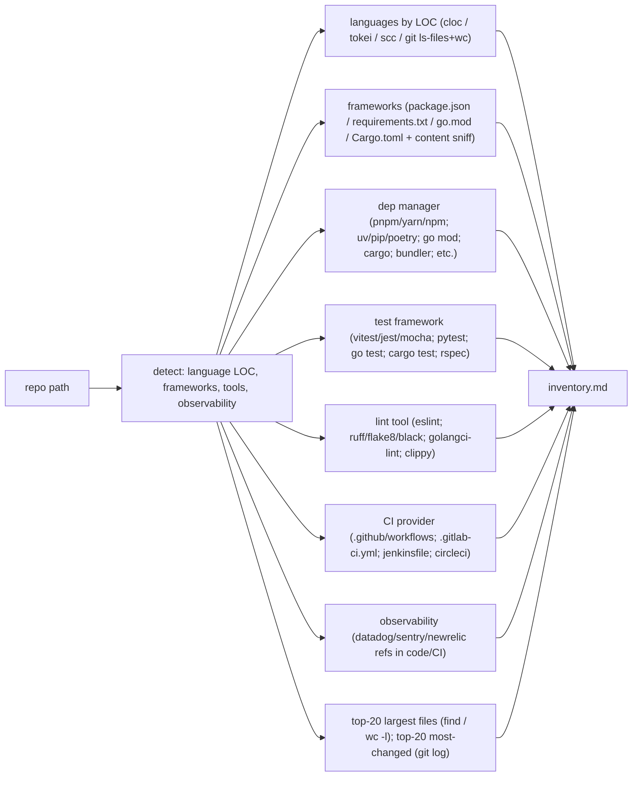
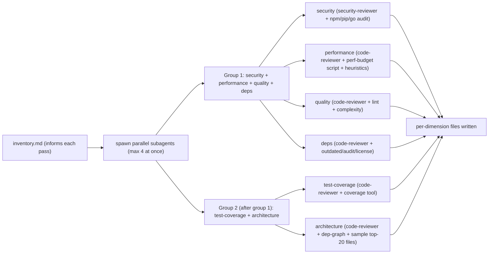
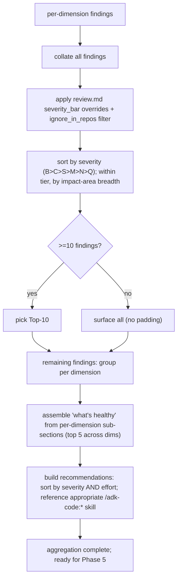
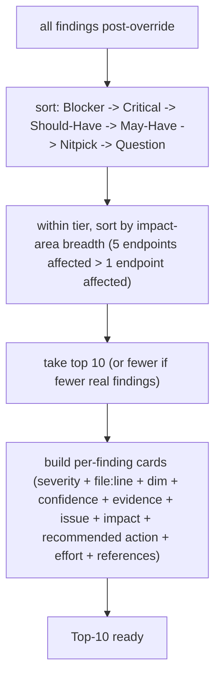
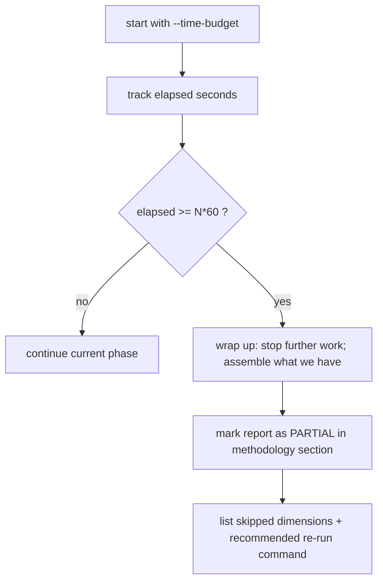
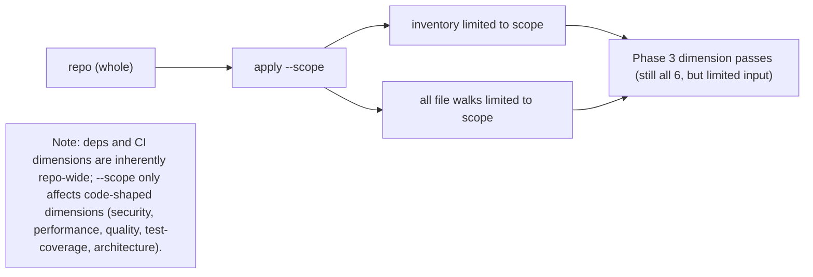

# `audit-repo` — how it works (diagrams)

## Phase flow

## Inventory (Phase 2)

## Dimension passes (Phase 3, parallel groups)

## Aggregation (Phase 4)

## Top-10 selection

## Time budget (when --time-budget <minutes>)

## --scope <path> filter

