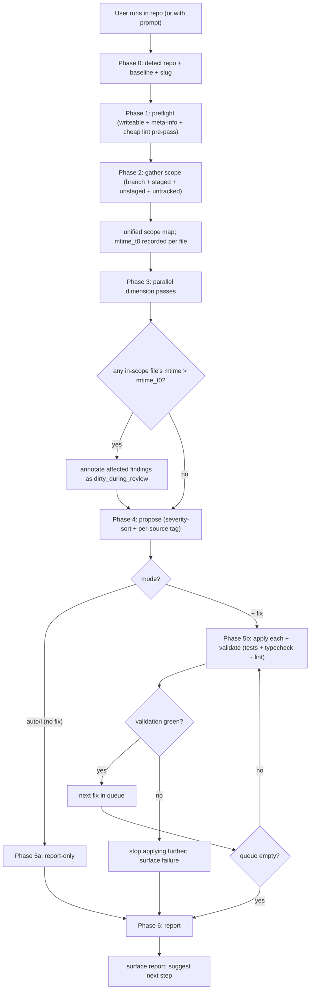
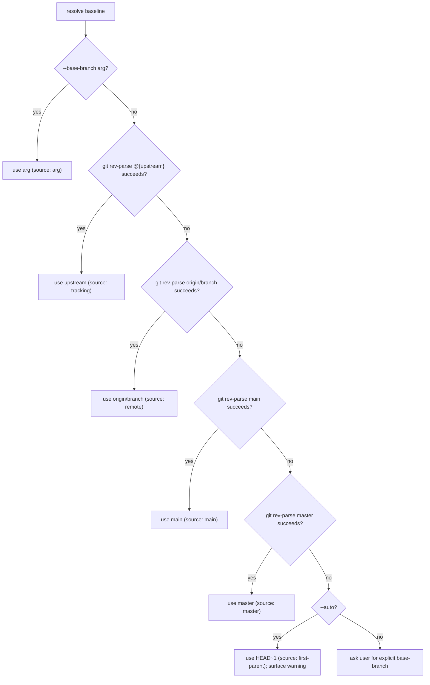
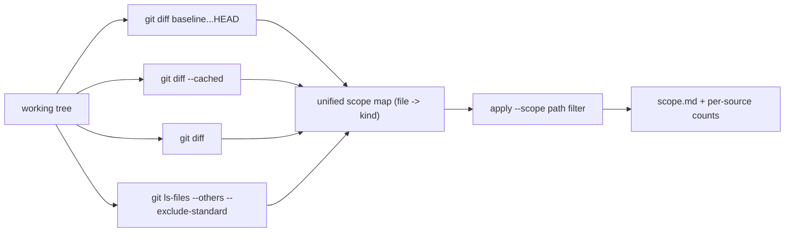
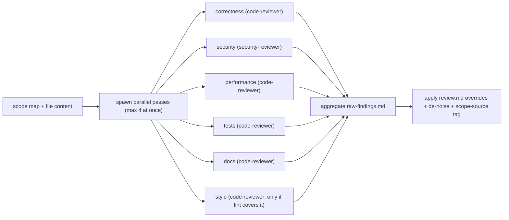
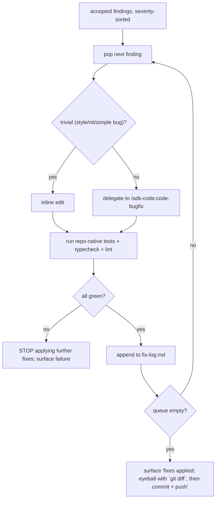

# `review-code-changes` — how it works (diagrams)

## Phase flow

## Baseline detection

## Scope source fan-in

## Dimension fan-out (Phase 3)

## --fix loop (Phase 5b)

Note: NO push step. NO commit step (working tree stays dirty for the user to inspect + commit themselves).
