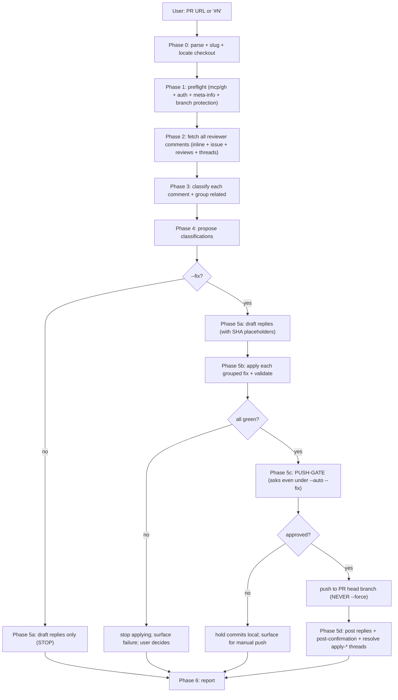
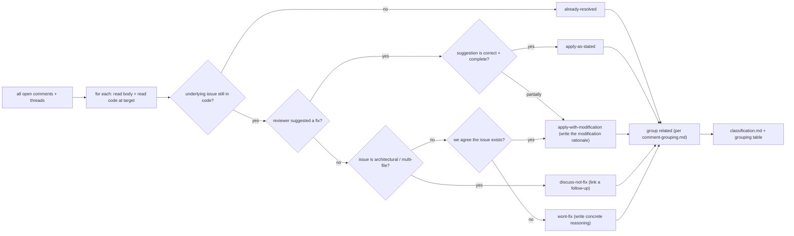
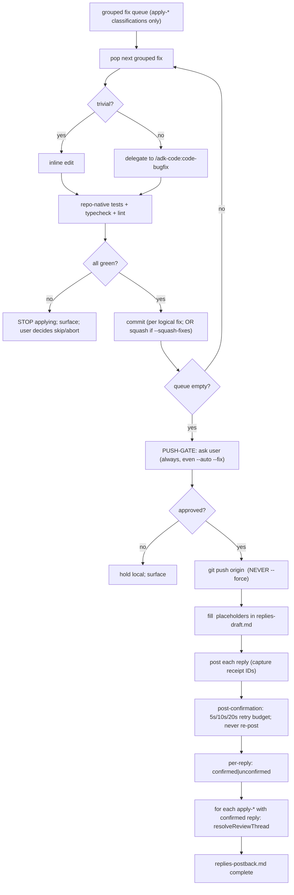
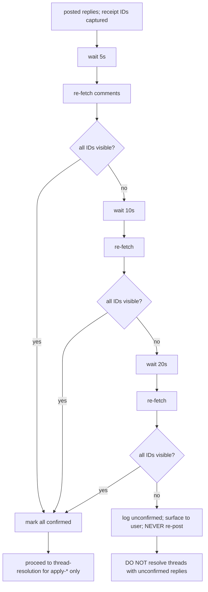
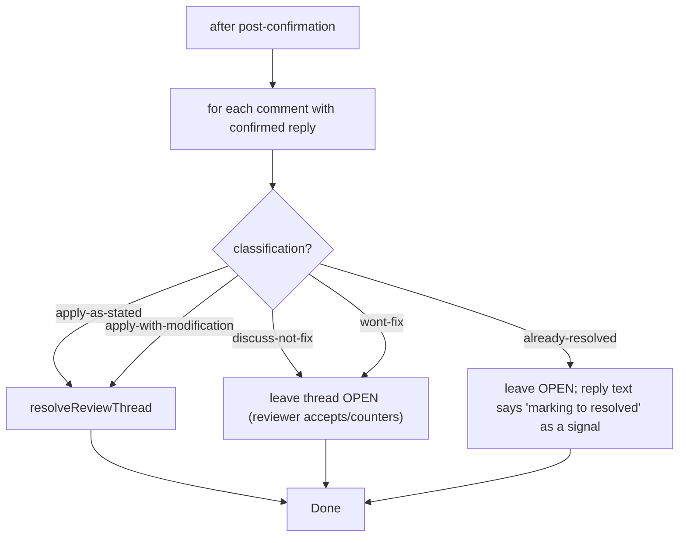

# `review-feedback` — how it works (diagrams)

## Phase flow

## Classification fan-out (Phase 3)

## --fix loop (Phases 5b, 5c, 5d)

## Post-confirmation (delegates to review-pr's protocol)

## Thread-resolution decision

