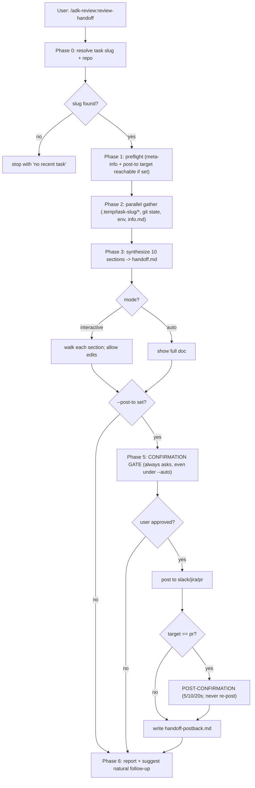
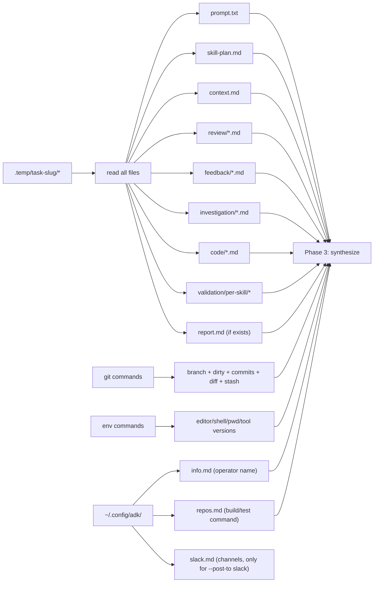
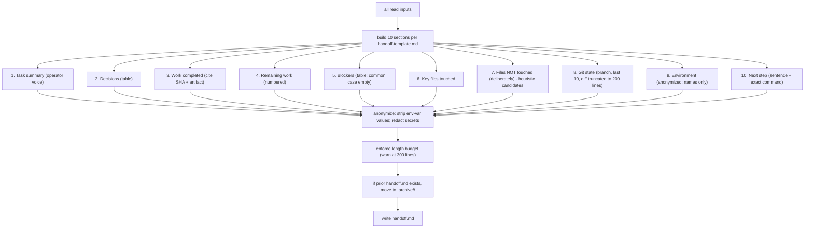
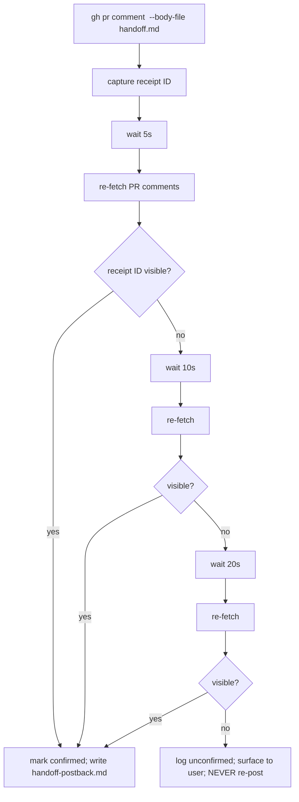
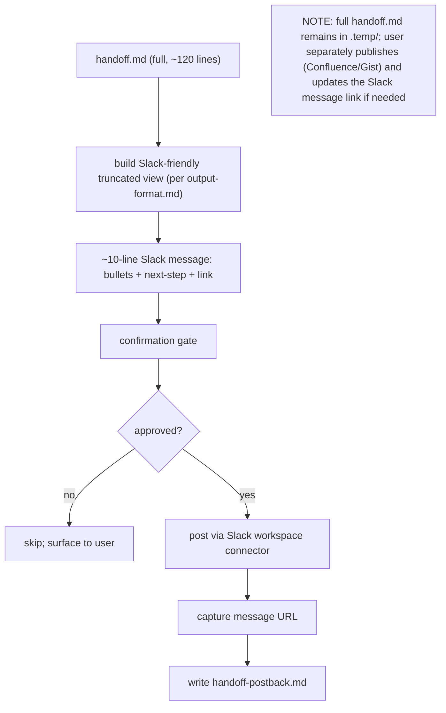

# `review-handoff` — how it works (diagrams)

## Phase flow

## Phase 2 input fan-in

## Synthesis (Phase 3)

## --post-to PR (with post-confirmation)

## --post-to Slack (truncated; full doc separate)

