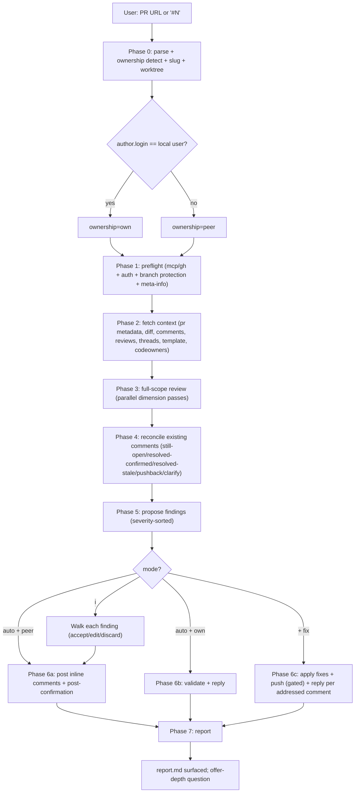
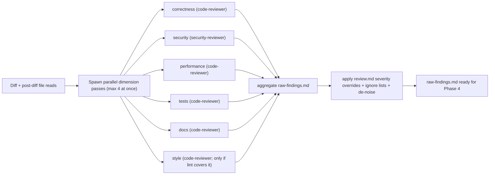
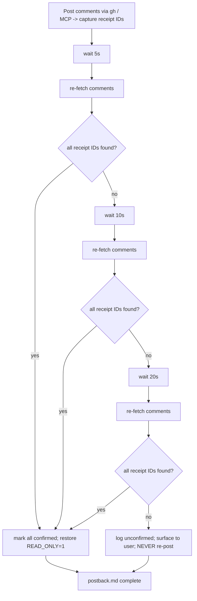
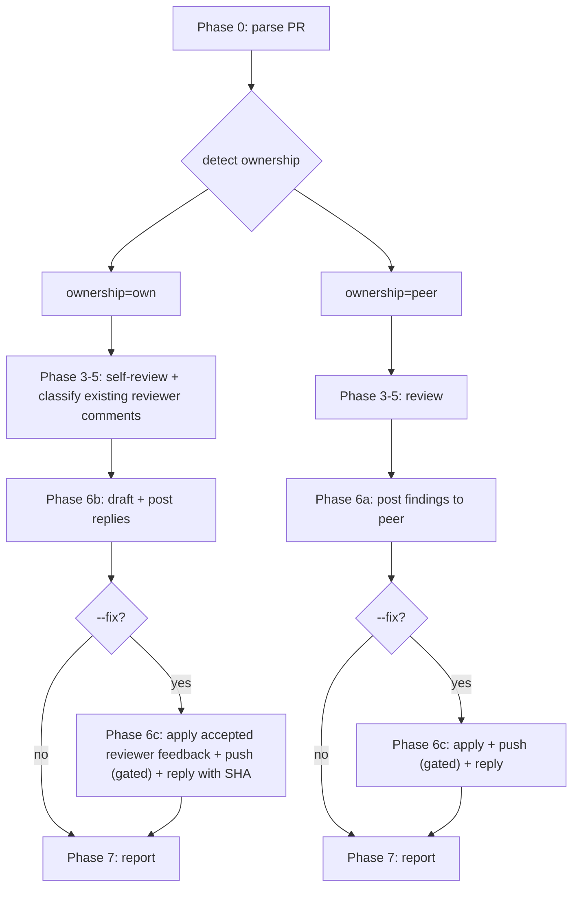
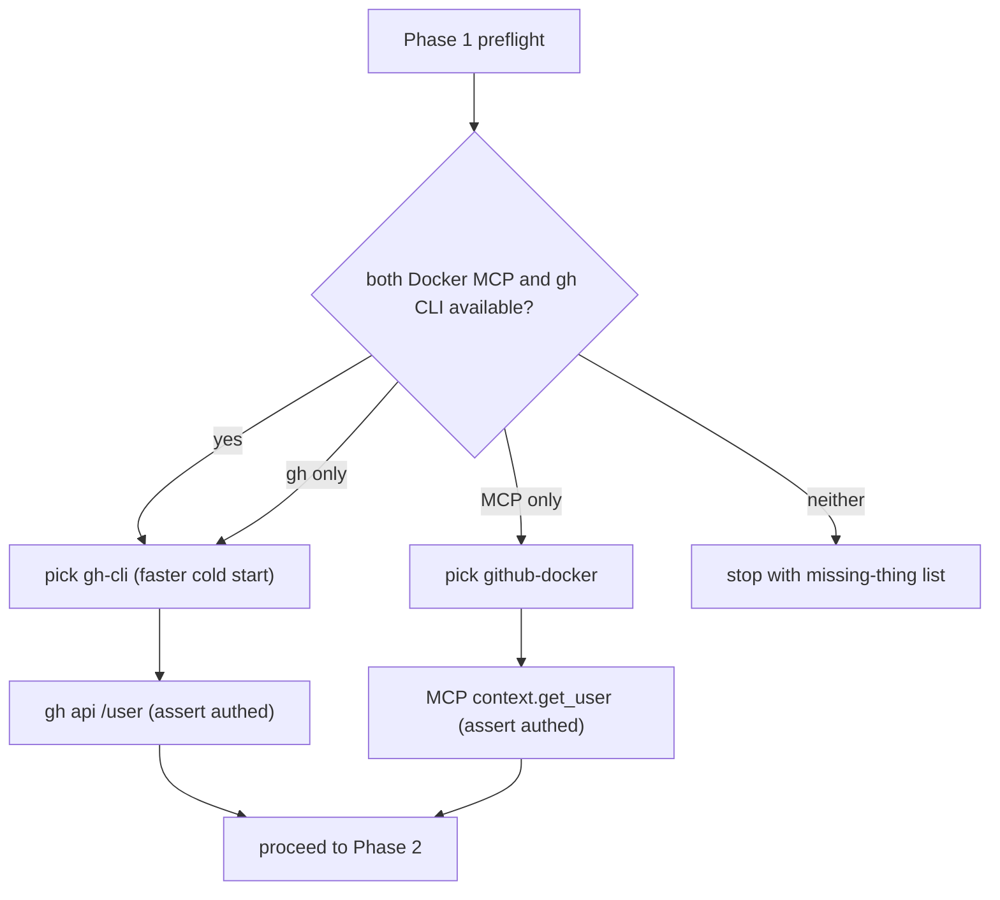
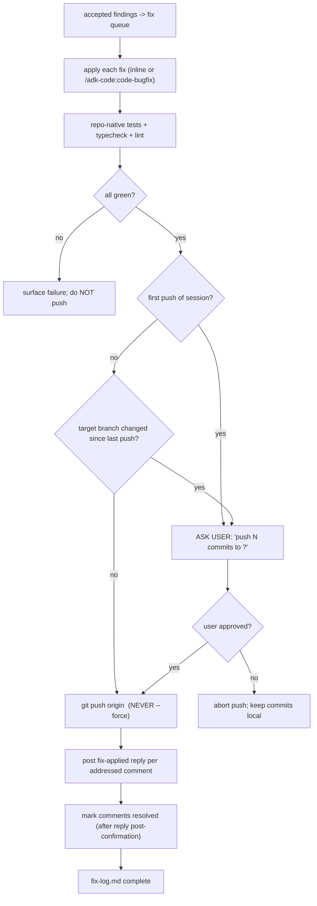

# `review-pr` — how it works (diagrams)

## Phase flow

## Dimension fan-out (Phase 3)

## Post-confirmation loop (Phase 6a)

## Ownership branch (Phase 0 + Phase 6)

## MCP / gh fallback decision

## --fix push gate (Phase 6c)

