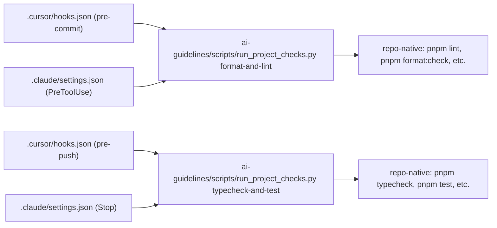

# Hook Bootstrap

How to wire `.cursor/hooks.json` and `.claude/settings.json` so they call Python helpers under `ai-guidelines/scripts/` with real repo-native commands. Hook bootstrap runs ONLY when `wire-hooks` is selected (default; `--no-hooks` to skip).

## Layered design



The Python helper is the single place that knows the actual commands. Hook configs just call the helper. This is what makes the hooks portable across runtimes and refresh-safe.

## `ai-guidelines/scripts/run_project_checks.py`

Skeleton (the skill writes this with the actual commands filled in from `repo-analysis-playbook.md`):

```python
#!/usr/bin/env python3
"""Run repo-native project checks. Single source of truth for hook commands."""

from __future__ import annotations

import argparse
import shlex
import subprocess
import sys
from pathlib import Path

REPO_ROOT = Path(__file__).resolve().parent.parent.parent

# Filled in by adk-adopt-ai-in-repo from the evidence summary.
COMMANDS = {
    "format-and-lint": [
        "pnpm lint",
        "pnpm format:check",
    ],
    "typecheck-and-test": [
        "pnpm typecheck",
        "pnpm test --run",
    ],
    "build": [
        "pnpm build",
    ],
}


def run(cmd: str) -> int:
    print(f"$ {cmd}", flush=True)
    return subprocess.call(shlex.split(cmd), cwd=REPO_ROOT)


def main() -> int:
    parser = argparse.ArgumentParser()
    parser.add_argument("group", choices=sorted(COMMANDS))
    parser.add_argument("--continue-on-error", action="store_true")
    args = parser.parse_args()

    failures = 0
    for cmd in COMMANDS[args.group]:
        rc = run(cmd)
        if rc != 0:
            failures += 1
            if not args.continue_on_error:
                return rc
    return 1 if failures else 0


if __name__ == "__main__":
    sys.exit(main())
```

Key properties:

- argparse-driven; cross-platform (no shell-specific calls).
- Commands live in the `COMMANDS` dict; `--refresh` rewrites this dict from the latest evidence summary.
- `--continue-on-error` lets the user run all checks even if the first fails (useful in CI).
- Exit code 0 on full success, non-zero on first failure (or count of failures if `--continue-on-error`).

## `ai-guidelines/scripts/refresh_ai_guidelines.py`

Skeleton:

```python
#!/usr/bin/env python3
"""Suggest re-running adk-adopt-ai-in-repo --refresh when stack signals change."""

from __future__ import annotations

import sys
from pathlib import Path

REPO_ROOT = Path(__file__).resolve().parent.parent.parent

# Files whose change should trigger an ai-guidelines/ refresh.
TRIGGER_FILES = [
    "package.json",
    "pnpm-lock.yaml",
    "yarn.lock",
    "package-lock.json",
    "pyproject.toml",
    "poetry.lock",
    "go.mod",
    "Cargo.toml",
    "Gemfile",
    "composer.json",
    "turbo.json",
    "nx.json",
    "pnpm-workspace.yaml",
    "tsconfig.json",
]


def main() -> int:
    print("To refresh ai-guidelines/ after a stack change, run:")
    print("    adk-adopt-ai-in-repo . --refresh")
    print()
    print("Trigger files this hook watches:")
    for tf in TRIGGER_FILES:
        if (REPO_ROOT / tf).exists():
            print(f"    {tf}  (present)")
    return 0


if __name__ == "__main__":
    sys.exit(main())
```

This is a notification helper; it does not run the refresh itself (that requires the user's approval and the `adk-adopt-ai-in-repo` skill).

## `.cursor/hooks.json`

```json
{
  "hooks": {
    "preCommit": {
      "command": "python3 ai-guidelines/scripts/run_project_checks.py format-and-lint",
      "blocking": true
    },
    "prePush": {
      "command": "python3 ai-guidelines/scripts/run_project_checks.py typecheck-and-test",
      "blocking": true
    }
  }
}
```

Adjust the schema to the current Cursor version. The skill detects the active Cursor version (or asks) and picks the right schema.

## `.claude/settings.json`

```json
{
  "hooks": {
    "PreToolUse": [
      {
        "matcher": "Edit|Write|StrReplace",
        "hooks": [
          {
            "type": "command",
            "command": "python3 ai-guidelines/scripts/run_project_checks.py format-and-lint"
          }
        ]
      }
    ]
  }
}
```

The exact Claude hook schema varies by version. Detect and adapt; the goal is the same — call the Python helper with the right group.

## Choosing what goes in pre-commit vs pre-push

| Stage | What goes here | Example commands |
| --- | --- | --- |
| pre-commit | FAST checks (<2 sec on a small change). Format / lint on changed files. | `pnpm lint:changed`, `pnpm format:check` |
| pre-push | Medium checks (<30 sec). Typecheck + smallest-relevant tests. | `pnpm typecheck`, `pnpm test --run` |
| CI | Slow / full checks. Build, e2e, coverage, security scan. | NOT in hooks; CI only. |

Wiring an e2e test or a full Docker build as a pre-commit hook is an anti-pattern (per `adopt-ai-anti-patterns.md`). It blocks the user.

## Detection: does this command exist?

Before wiring a hook command, the skill verifies the command actually exists:

- `package.json` scripts: confirm the script is defined.
- task runners: confirm `make <target>`, `just <recipe>`, `turbo run <task>` resolves.
- bare commands (`pnpm`, `cargo`, `pytest`): confirm the binary is on PATH (or installable from the repo's package manager).

If a command does not exist or is not yet implemented in the repo, the skill skips the hook and surfaces a manual follow-up: "consider adding `pnpm typecheck` and re-running `adk-adopt-ai-in-repo --refresh`".

## Existing hook setups

If the repo already uses husky / lefthook / pre-commit / Lefthook / etc., the skill:

1. Detects the existing setup (presence of `.husky/`, `lefthook.yml`, `.pre-commit-config.yaml`).
2. Surfaces the conflict: "this repo uses husky; wiring `.cursor/hooks.json` would create a parallel hook system".
3. Defaults to `--no-hooks` and instead documents the recommended commands in `ai-guidelines/scripts-and-commands.md`.
4. Optionally offers to ADD the format-and-lint group to the existing setup (e.g., as a new husky hook script). Requires explicit user approval.

## Validation

The validator's Phase 3 `pre-handoff` gate:

- parses `.cursor/hooks.json` and `.claude/settings.json` as valid JSON.
- runs every command in `run_project_checks.py` once with `--continue-on-error` and captures the output (stored in the validator log).
- flags any command that exits non-zero on a clean repo as a BLOCKER (the hook will block the user immediately on first commit).
