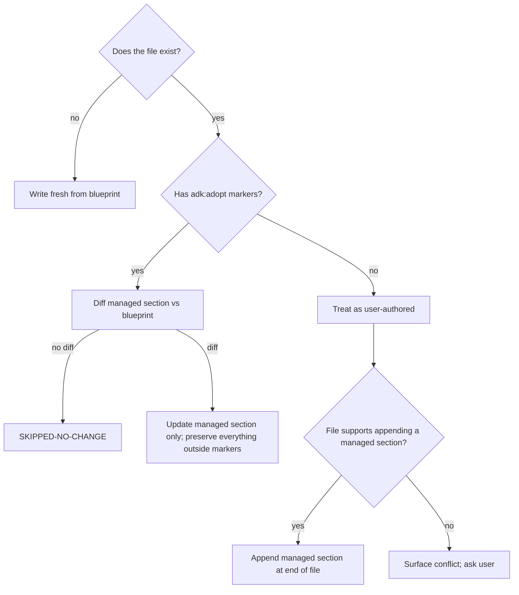

# Merge Strategy

How to preserve user-authored content when refreshing existing AI files. Refresh-safety is a hard rule per `adopt-ai-constitution.md`. Re-running `adk-adopt-ai-in-repo --refresh` on the same repo MUST converge: no churn on unchanged files, no overwrite of user-authored content.

## The marker contract

Every generated file (Markdown, JSON, JSON5) carries opening / closing markers around the managed section:

```
<!-- adk:adopt:start -->
... managed content ...
<!-- adk:adopt:end -->
```

For JSON files that don't allow comments, embed an `_adk_adopt: { managed: true, version: <n> }` key OR use JSON5 (with `// adk:adopt:start` / `// adk:adopt:end` line comments).

The markers are the contract. Without markers, the file is treated as user-authored.

## Per-file decision tree



## Update outcomes (per `adopt-ai-output-format.md`)

Every touched file gets one of:

| Outcome | When |
| --- | --- |
| `NEW` | File did not exist; written fresh. |
| `UPDATED` | File existed with markers; managed section updated. |
| `APPENDED` | File existed without markers; new managed section appended. |
| `SKIPPED-NO-CHANGE` | File existed with markers; managed section already matches the blueprint. |
| `SKIPPED-USER-CONTENT` | File existed without markers and the user opted out of appending. |
| `CONFLICT` | File existed without markers AND the merge strategy is `report-conflicts-only`. Surface in the report. |

## Per-file-type rules

### `ai-guidelines/*.md` (Markdown)

- ALWAYS wrap with `<!-- adk:adopt:start -->` / `<!-- adk:adopt:end -->` markers.
- The whole file content is the managed section.
- If the user added their own sections inside the markers, preserve them by detecting Markdown heading additions that are not in the blueprint.
- If the user added sections OUTSIDE the markers (after `<!-- adk:adopt:end -->`), preserve verbatim.

### `AGENTS.md` and `CLAUDE.md`

- These files commonly already exist with custom content.
- The skill writes ONLY a managed section, wrapped in markers. The rest of the file is preserved.
- If the file is fresh, the managed section IS the whole file (write it cleanly).
- If the file exists without markers, append the managed section at the END of the file, preceded by a one-line note: `<!-- adk-adopt: managed section appended below; safe to move within the file as long as both markers move together. -->`.

### Skill wrappers (`.claude/skills/*/SKILL.md`, `.cursor/skills/*/SKILL.md`)

- These should not have user content (they're thin pointers — see `adopt-ai-skill-wrapper-pattern.md`).
- If a wrapper exists with markers and the content matches: SKIPPED-NO-CHANGE.
- If a wrapper exists with markers and the content differs: UPDATED (overwrite the managed section).
- If a wrapper exists WITHOUT markers (user-authored): SKIPPED-USER-CONTENT and surface in the report. Do not overwrite.

### `.cursor/hooks.json`, `.claude/settings.json`

- JSON; embed `_adk_adopt: { managed: true, version: <n> }` at the top level.
- If the file exists with the marker key: merge (replace ONLY the managed sub-objects; preserve everything else).
- If the file exists WITHOUT the marker key: detect collision with existing hook entries; surface conflict; default to `report-conflicts-only` for hooks.
- NEVER blindly overwrite hooks — the user's existing hook setup may be load-bearing.

### `.cursor/rules/project-ai-guidelines.mdc`

- New file in most repos. Write fresh on first run.
- On refresh: same as Markdown rule above.

### Python helpers (`ai-guidelines/scripts/*.py`)

- The `COMMANDS` dict is the only thing that should change between runs.
- Use Python comment markers around the dict: `# adk:adopt:start` / `# adk:adopt:end`.
- Preserve any user-added functions OUTSIDE the markers.

## Merge aggressiveness modes (per `adopt-ai-clarifying-questions.md` Q5)

| Mode | Behavior |
| --- | --- |
| `preserve-and-merge` (default) | Update only managed sections; leave everything else as-is. Surface a merge diff. |
| `replace-managed-only` | Overwrite only files that have markers (i.e., files generated by a previous run). User-authored files are not touched. |
| `report-conflicts-only` | Produce a merge plan but do NOT write anything. Surface every conflict + every planned change. The user runs again without this flag to apply. |

## Merge diff output

Every touched file's diff is captured under `.temp/notes/adopt-ai-<repo-slug>-merge-diff.md`. Format:

```
## ai-guidelines/coding-guidelines.md  (UPDATED)
- managed-section diff: <unified diff>

## AGENTS.md  (UPDATED)
- managed-section diff: <unified diff>
- user-authored sections preserved: 2 (`## Local conventions`, `## On-call rotation`)

## .cursor/hooks.json  (CONFLICT)
- existing hook: `preCommit` -> `npm test` (user-authored)
- planned hook: `preCommit` -> `python3 ai-guidelines/scripts/run_project_checks.py format-and-lint`
- decision: SKIPPED-USER-CONTENT (manual merge required)
```

The user reads this file before approving the run.

## Idempotency check (post-execution)

Phase 4 of the validator runs the merge once more in dry-run mode after the actual write. If any file would change again, that's a BLOCKER — the merge is not converging and the run cannot be declared idempotent.

## When NOT to merge

- The user passed `--scope <stack>` and a file belongs to a different stack — leave it alone entirely (don't even open it).
- The file is in `.gitignore` (e.g., generated build output) — don't merge into it.
- The file is in a vendored / generated directory (`node_modules/`, `vendor/`, `dist/`, `.next/`) — don't merge into it.
